# 物理任务执行器事件报告器详细分析

## 1. 概述

`PhysicalTaskExecutorLifecycleEventReporter` 是 Worker 端负责将任务执行器的生命周期事件异步报告给 Master 的核心组件。它继承自 `TaskExecutorLifecycleEventRemoteReporter`，实现了 `ITaskExecutorLifecycleEventReporter` 接口。

### 1.1 核心职责

1. **事件收集**: 接收来自 `PhysicalTaskExecutorLifecycleEventListener` 的任务执行器生命周期事件
2. **事件缓存**: 将事件按 `taskInstanceId` 分组存储到 `eventChannels` 中
3. **异步上报**: 通过守护线程定期轮询并发送事件到 Master
4. **重试机制**: 对于未收到 ACK 的事件，按照重试间隔（默认3分钟）重新发送
5. **ACK 处理**: 接收 Master 的 ACK，从缓存中移除已确认的事件

### 1.2 关键组件

- **PhysicalTaskExecutorLifecycleEventReporter**: Worker 端的事件报告器实现
- **TaskExecutorLifecycleEventRemoteReporter**: 事件报告器的基类，包含核心逻辑
- **PhysicalTaskExecutorEventRemoteReporterClient**: RPC 客户端，负责与 Master 通信
- **ReportableTaskExecutorLifecycleEventChannel**: 每个任务实例的事件通道，使用队列存储事件

### 1.3 相关代码链接

- PhysicalTaskEngineDelegator.start: [PhysicalTaskEngineDelegator.java:73-77](../../../src/main/java/org/apache/dolphinscheduler/server/worker/executor/PhysicalTaskEngineDelegator.java#L73-L77)
- PhysicalTaskExecutorLifecycleEventReporter: [PhysicalTaskExecutorLifecycleEventReporter.java](../../../src/main/java/org/apache/dolphinscheduler/server/worker/executor/PhysicalTaskExecutorLifecycleEventReporter.java)
- TaskExecutorLifecycleEventRemoteReporter: [TaskExecutorLifecycleEventRemoteReporter.java](../../../../dolphinscheduler-task-executor/src/main/java/org/apache/dolphinscheduler/task/executor/eventbus/TaskExecutorLifecycleEventRemoteReporter.java)
- ITaskExecutorLifecycleEventReporter接口: [ITaskExecutorLifecycleEventReporter.java](../../../../dolphinscheduler-task-executor/src/main/java/org/apache/dolphinscheduler/task/executor/eventbus/ITaskExecutorLifecycleEventReporter.java)

## 2. 初始化流程

### 2.1 Spring 容器初始化

`PhysicalTaskExecutorLifecycleEventReporter` 通过 Spring 的依赖注入机制进行初始化，整个初始化流程如下：

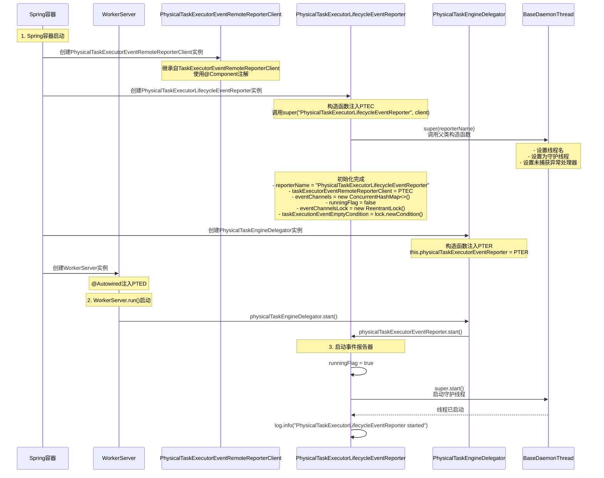
```mermaid
sequenceDiagram
    participant Spring as Spring容器
    participant WS as WorkerServer
    participant PTEC as PhysicalTaskExecutorEventRemoteReporterClient
    participant PTER as PhysicalTaskExecutorLifecycleEventReporter
    participant PTED as PhysicalTaskEngineDelegator
    participant BaseThread as BaseDaemonThread
    
    Note over Spring: 1. Spring容器启动
    Spring->>PTEC: 创建PhysicalTaskExecutorEventRemoteReporterClient实例
    Note over PTEC: 继承自TaskExecutorEventRemoteReporterClient<br/>使用@Component注解
    
    Spring->>PTER: 创建PhysicalTaskExecutorLifecycleEventReporter实例
    Note over PTER: 构造函数注入PTEC<br/>调用super("PhysicalTaskExecutorLifecycleEventReporter", client)
    
    PTER->>BaseThread: super(reporterName)<br/>调用父类构造函数
    Note over BaseThread: - 设置线程名<br/>- 设置为守护线程<br/>- 设置未捕获异常处理器
    
    Note over PTER: 初始化完成<br/>- reporterName = "PhysicalTaskExecutorLifecycleEventReporter"<br/>- taskExecutorEventRemoteReporterClient = PTEC<br/>- eventChannels = new ConcurrentHashMap<>()<br/>- runningFlag = false<br/>- eventChannelsLock = new ReentrantLock()<br/>- taskExecutionEventEmptyCondition = lock.newCondition()
    
    Spring->>PTED: 创建PhysicalTaskEngineDelegator实例
    Note over PTED: 构造函数注入PTER<br/>this.physicalTaskExecutorEventReporter = PTER
    
    Spring->>WS: 创建WorkerServer实例
    Note over WS: @Autowired注入PTED
    
    Note over WS: 2. WorkerServer.run()启动
    WS->>PTED: physicalTaskEngineDelegator.start()
    PTED->>PTER: physicalTaskExecutorEventReporter.start()
    
    Note over PTER: 3. 启动事件报告器
    PTER->>PTER: runningFlag = true
    PTER->>BaseThread: super.start()<br/>启动守护线程
    BaseThread-->>PTER: 线程已启动
    PTER->>PTER: log.info("PhysicalTaskExecutorLifecycleEventReporter started")
```

### 2.2 初始化详细说明

#### 2.2.1 PhysicalTaskExecutorEventRemoteReporterClient 初始化

- **位置**: [PhysicalTaskExecutorEventRemoteReporterClient.java](../../../src/main/java/org/apache/dolphinscheduler/server/worker/executor/PhysicalTaskExecutorEventRemoteReporterClient.java)
- **说明**: 继承自 `TaskExecutorEventRemoteReporterClient`，使用 `@Component` 注解，由 Spring 容器管理
- **职责**: 作为 RPC 客户端，负责将事件通过 RPC 调用发送到 Master 的 `ITaskExecutorEventListener` 服务

#### 2.2.2 PhysicalTaskExecutorLifecycleEventReporter 初始化

- **位置**: [PhysicalTaskExecutorLifecycleEventReporter.java](../../../src/main/java/org/apache/dolphinscheduler/server/worker/executor/PhysicalTaskExecutorLifecycleEventReporter.java)
- **构造函数**:
  ```java
  public PhysicalTaskExecutorLifecycleEventReporter(
      final PhysicalTaskExecutorEventRemoteReporterClient physicalTaskExecutorEventRemoteReporterClient) {
      super("PhysicalTaskExecutorLifecycleEventReporter", physicalTaskExecutorEventRemoteReporterClient);
  }
  ```
- **初始化字段**:
    - `reporterName`: "PhysicalTaskExecutorLifecycleEventReporter"
    - `taskExecutorEventRemoteReporterClient`: 注入的 RPC 客户端
    - `eventChannels`: `new ConcurrentHashMap<>()` - 存储每个任务实例的事件通道
    - `runningFlag`: `false` - 线程运行标志
    - `eventChannelsLock`: `new ReentrantLock()` - 保护 eventChannels 的锁
    - `taskExecutionEventEmptyCondition`: `lock.newCondition()` - 等待条件，用于线程等待和唤醒

#### 2.2.3 BaseDaemonThread 初始化

- **位置**: [BaseDaemonThread.java](../../../../dolphinscheduler-common/src/main/java/org/apache/dolphinscheduler/common/thread/BaseDaemonThread.java)
- **构造函数行为**:
    - 调用 `super(threadName)` 设置线程名称
    - `setDaemon(true)` - 设置为守护线程，JVM 退出时自动终止
    - `setUncaughtExceptionHandler(DefaultUncaughtExceptionHandler.getInstance())` - 设置未捕获异常处理器

## 3. start() 方法详细分析

### 3.1 start() 方法流程

`start()` 方法在 `PhysicalTaskEngineDelegator.start()` 中被调用，负责启动事件报告器的守护线程。

```java
@Override
public void start() {
    // start a thread to send the events
    this.runningFlag = true;
    super.start();
    log.info("{} started", reporterName);
}
```

**执行步骤**:
1. 设置 `runningFlag = true`，标记线程可以运行
2. 调用 `super.start()` 启动守护线程（继承自 `BaseDaemonThread`）
3. 记录启动日志

### 3.2 run() 方法核心逻辑

`run()` 方法是守护线程的主循环，负责定期轮询并发送事件到 Master。

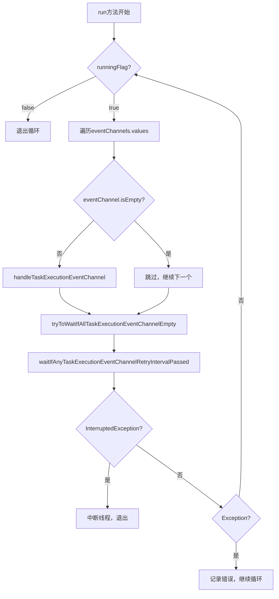
```mermaid
flowchart TD
    A[run方法开始] --> B{runningFlag?}
    B -->|false| Z[退出循环]
    B -->|true| C[遍历eventChannels.values]
    C --> D{eventChannel.isEmpty?}
    D -->|是| E[跳过，继续下一个]
    D -->|否| F[handleTaskExecutionEventChannel]
    F --> G[tryToWaitIfAllTaskExecutionEventChannelEmpty]
    G --> H[waitIfAnyTaskExecutionEventChannelRetryIntervalPassed]
    H --> I{InterruptedException?}
    I -->|是| J[中断线程，退出]
    I -->|否| K{Exception?}
    K -->|是| L[记录错误，继续循环]
    K -->|否| B
    E --> G
```

**核心逻辑**:
1. **循环条件**: `while (runningFlag)` - 只要运行标志为 true，就持续运行
2. **遍历事件通道**: 遍历 `eventChannels.values()`，处理每个任务实例的事件通道
3. **处理事件**: 如果通道不为空，调用 `handleTaskExecutionEventChannel()` 处理
4. **等待机制**:
    - 如果所有通道都为空，等待直到有新事件（`tryToWaitIfAllTaskExecutionEventChannelEmpty()`）
    - 如果有事件但未到重试时间，等待到重试间隔（`waitIfAnyTaskExecutionEventChannelRetryIntervalPassed()`）

### 3.3 相关代码链接

- TaskExecutorLifecycleEventRemoteReporter.start: [TaskExecutorLifecycleEventRemoteReporter.java:67-72](../../../../dolphinscheduler-task-executor/src/main/java/org/apache/dolphinscheduler/task/executor/eventbus/TaskExecutorLifecycleEventRemoteReporter.java#L67-L72)
- TaskExecutorLifecycleEventRemoteReporter.run: [TaskExecutorLifecycleEventRemoteReporter.java:75-95](../../../../dolphinscheduler-task-executor/src/main/java/org/apache/dolphinscheduler/task/executor/eventbus/TaskExecutorLifecycleEventRemoteReporter.java#L75-L95)
- BaseDaemonThread: [BaseDaemonThread.java](../../../../dolphinscheduler-common/src/main/java/org/apache/dolphinscheduler/common/thread/BaseDaemonThread.java)

## 4. eventChannels 填充机制

### 4.1 eventChannels 数据结构

`eventChannels` 是一个 `ConcurrentHashMap<Integer, ReportableTaskExecutorLifecycleEventChannel>`，用于存储每个任务实例的事件通道。

- **Key**: `taskInstanceId` (Integer) - 任务实例ID
- **Value**: `ReportableTaskExecutorLifecycleEventChannel` - 该任务实例的事件通道，包含一个 `LinkedBlockingQueue<IReportableTaskExecutorLifecycleEvent>`

### 4.2 eventChannels 填充流程

`eventChannels` 通过 `reportTaskExecutorLifecycleEvent()` 方法填充，该方法在以下场景被调用：

1. **任务分发完成**: `TaskExecutorDispatchedLifecycleEvent` 发布后
2. **任务开始执行**: `TaskExecutorStartedLifecycleEvent` 发布后
3. **运行时上下文变更**: `TaskExecutorRuntimeContextChangedLifecycleEvent` 发布后
4. **任务暂停**: `TaskExecutorPausedLifecycleEvent` 发布后
5. **任务杀死**: `TaskExecutorKilledLifecycleEvent` 发布后
6. **任务成功**: `TaskExecutorSuccessLifecycleEvent` 发布后
7. **任务失败**: `TaskExecutorFailedLifecycleEvent` 发布后

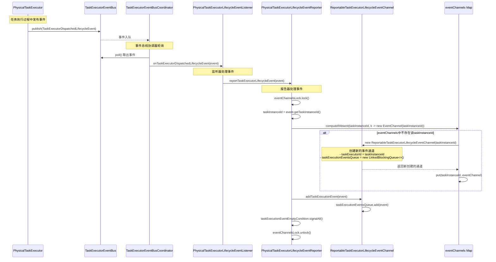
```mermaid
sequenceDiagram
    participant PTE as PhysicalTaskExecutor
    participant TEB as TaskExecutorEventBus
    participant TEC as TaskExecutorEventBusCoordinator
    participant Listener as PhysicalTaskExecutorLifecycleEventListener
    participant Reporter as PhysicalTaskExecutorLifecycleEventReporter
    participant EventChannel as ReportableTaskExecutorLifecycleEventChannel
    participant EventChannels as eventChannels Map
    
    Note over PTE: 任务执行过程中发布事件
    PTE->>TEB: publish(TaskExecutorDispatchedLifecycleEvent)
    TEB-->>TEC: 事件入队
    
    Note over TEC: 事件总线协调器轮询
    TEC->>TEB: poll() 取出事件
    TEC->>Listener: onTaskExecutorDispatchedLifecycleEvent(event)
    
    Note over Listener: 监听器处理事件
    Listener->>Reporter: reportTaskExecutorLifecycleEvent(event)
    
    Note over Reporter: 报告器处理事件
    Reporter->>Reporter: eventChannelsLock.lock()
    Reporter->>Reporter: taskInstanceId = event.getTaskInstanceId()
    Reporter->>EventChannels: computeIfAbsent(taskInstanceId, k -> new EventChannel(taskInstanceId))
    
    alt eventChannels中不存在该taskInstanceId
        EventChannels->>EventChannel: new ReportableTaskExecutorLifecycleEventChannel(taskInstanceId)
        Note over EventChannel: 创建新的事件通道<br/>- taskExecutorId = taskInstanceId<br/>- taskExecutionEventsQueue = new LinkedBlockingQueue<>()
        EventChannel-->>EventChannels: 返回新创建的通道
        EventChannels->>EventChannels: put(taskInstanceId, eventChannel)
    end
    
    Reporter->>EventChannel: addTaskExecutionEvent(event)
    EventChannel->>EventChannel: taskExecutionEventsQueue.add(event)
    
    Reporter->>Reporter: taskExecutionEventEmptyCondition.signalAll()
    Reporter->>Reporter: eventChannelsLock.unlock()
```

### 4.3 reportTaskExecutorLifecycleEvent() 方法详解

```java
@Override
public void reportTaskExecutorLifecycleEvent(final IReportableTaskExecutorLifecycleEvent reportableTaskExecutorLifecycleEvent) {
    eventChannelsLock.lock();
    try {
        log.debug("Report : {}", JSONUtils.toPrettyJsonString(reportableTaskExecutorLifecycleEvent));
        int taskInstanceId = reportableTaskExecutorLifecycleEvent.getTaskInstanceId();
        eventChannels.computeIfAbsent(
                taskInstanceId,
                k -> new ReportableTaskExecutorLifecycleEventChannel(taskInstanceId))
                .addTaskExecutionEvent(reportableTaskExecutorLifecycleEvent);
        taskExecutionEventEmptyCondition.signalAll();
    } finally {
        eventChannelsLock.unlock();
    }
}
```

**执行步骤**:
1. **加锁**: 获取 `eventChannelsLock`，确保线程安全
2. **获取任务实例ID**: 从事件中提取 `taskInstanceId`
3. **获取或创建事件通道**:
    - 使用 `computeIfAbsent()` 方法，如果 `eventChannels` 中不存在该 `taskInstanceId`，则创建新的 `ReportableTaskExecutorLifecycleEventChannel`
    - 如果已存在，直接返回现有的通道
4. **添加事件**: 调用 `addTaskExecutionEvent()` 将事件添加到通道的队列中
5. **唤醒等待线程**: 调用 `taskExecutionEventEmptyCondition.signalAll()` 唤醒可能正在等待的 `run()` 线程
6. **释放锁**: 在 `finally` 块中释放锁

### 4.4 相关代码链接

- reportTaskExecutorLifecycleEvent: [TaskExecutorLifecycleEventRemoteReporter.java:98-112](../../../../dolphinscheduler-task-executor/src/main/java/org/apache/dolphinscheduler/task/executor/eventbus/TaskExecutorLifecycleEventRemoteReporter.java#L98-L112)
- ReportableTaskExecutorLifecycleEventChannel: [TaskExecutorLifecycleEventRemoteReporter.java:253-294](../../../../dolphinscheduler-task-executor/src/main/java/org/apache/dolphinscheduler/task/executor/eventbus/TaskExecutorLifecycleEventRemoteReporter.java#L253-L294)
- PhysicalTaskExecutorLifecycleEventListener: [PhysicalTaskExecutorLifecycleEventListener.java](../../../src/main/java/org/apache/dolphinscheduler/server/worker/executor/PhysicalTaskExecutorLifecycleEventListener.java)
- TaskExecutorLifecycleEventListener: [TaskExecutorLifecycleEventListener.java](../../../../dolphinscheduler-task-executor/src/main/java/org/apache/dolphinscheduler/task/executor/listener/TaskExecutorLifecycleEventListener.java)

## 5. 事件报告流程

### 5.1 事件处理流程

当 `run()` 方法遍历到非空的事件通道时，会调用 `handleTaskExecutionEventChannel()` 方法处理该通道中的事件。

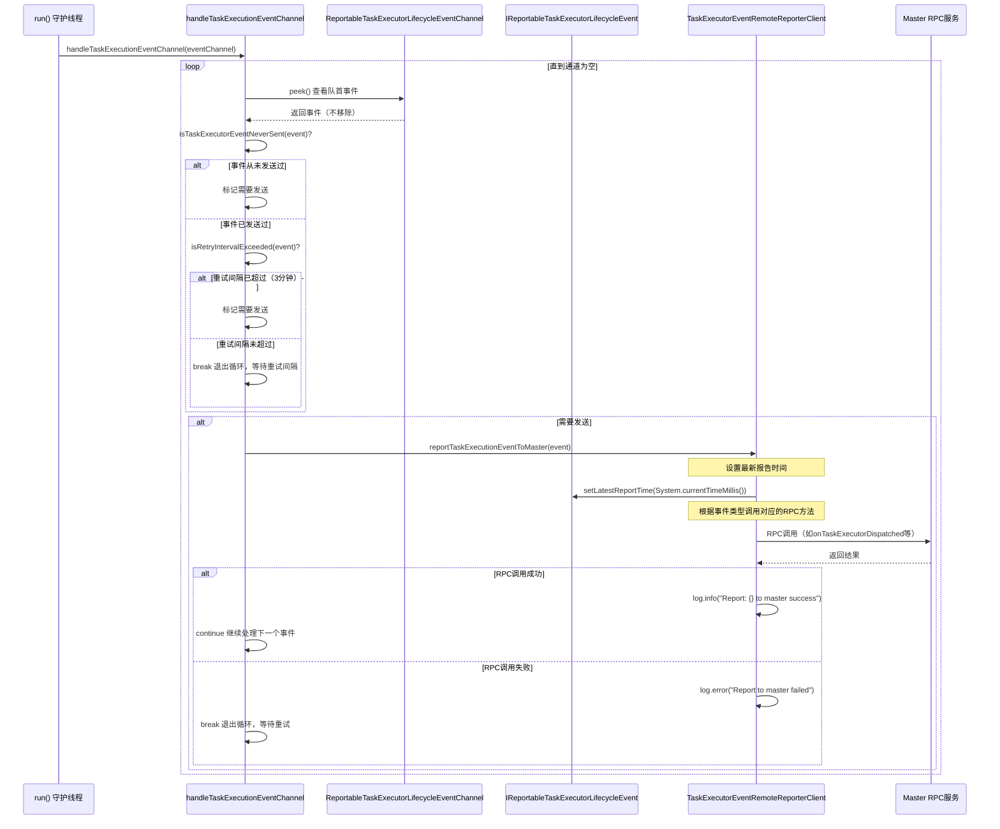
```mermaid
sequenceDiagram
    participant RunThread as run() 守护线程
    participant Handler as handleTaskExecutionEventChannel
    participant EventChannel as ReportableTaskExecutorLifecycleEventChannel
    participant Event as IReportableTaskExecutorLifecycleEvent
    participant Client as TaskExecutorEventRemoteReporterClient
    participant Master as Master RPC服务
    
    RunThread->>Handler: handleTaskExecutionEventChannel(eventChannel)
    
    loop 直到通道为空
        Handler->>EventChannel: peek() 查看队首事件
        EventChannel-->>Handler: 返回事件（不移除）
        
        Handler->>Handler: isTaskExecutorEventNeverSent(event)?
        
        alt 事件从未发送过
            Handler->>Handler: 标记需要发送
        else 事件已发送过
            Handler->>Handler: isRetryIntervalExceeded(event)?
            
            alt 重试间隔已超过（3分钟）
                Handler->>Handler: 标记需要发送
            else 重试间隔未超过
                Handler->>Handler: break 退出循环，等待重试间隔
            end
        end
        
        alt 需要发送
            Handler->>Client: reportTaskExecutionEventToMaster(event)
            
            Note over Client: 设置最新报告时间
            Client->>Event: setLatestReportTime(System.currentTimeMillis())
            
            Note over Client: 根据事件类型调用对应的RPC方法
            Client->>Master: RPC调用（如onTaskExecutorDispatched等）
            Master-->>Client: 返回结果
            
            alt RPC调用成功
                Client->>Client: log.info("Report: {} to master success")
                Handler->>Handler: continue 继续处理下一个事件
            else RPC调用失败
                Client->>Client: log.error("Report to master failed")
                Handler->>Handler: break 退出循环，等待重试
            end
        end
    end
```

### 5.2 handleTaskExecutionEventChannel() 方法详解

```java
private void handleTaskExecutionEventChannel(final ReportableTaskExecutorLifecycleEventChannel reportableTaskExecutorLifecycleEventChannel) {
    if (reportableTaskExecutorLifecycleEventChannel.isEmpty()) {
        return;
    }
    while (!reportableTaskExecutorLifecycleEventChannel.isEmpty()) {
        final IReportableTaskExecutorLifecycleEvent headEvent = reportableTaskExecutorLifecycleEventChannel.peek();
        try (
                final TaskExecutorMDCUtils.MDCAutoClosable ignore =
                        TaskExecutorMDCUtils.logWithMDC(headEvent.getTaskInstanceId())) {
            try {
                if (isTaskExecutorEventNeverSent(headEvent) || isRetryIntervalExceeded(headEvent)) {
                    taskExecutorEventRemoteReporterClient.reportTaskExecutionEventToMaster(headEvent);
                    continue;
                }
                if (log.isDebugEnabled()) {
                    log.debug(
                            "The ReportableTaskExecutorLifecycleEvent: {} latest send time: {} doesn't exceeded retry interval",
                            headEvent,
                            headEvent.getLatestReportTime());
                }
                break;
            } catch (Exception ex) {
                log.error("Send TaskExecutionEvent: {} to master error will retry after {} mills",
                        headEvent,
                        DEFAULT_TASK_EXECUTOR_EVENT_RETRY_INTERVAL,
                        ex);
                break;
            }
        }
    }
}
```

**执行逻辑**:
1. **检查通道是否为空**: 如果为空，直接返回
2. **循环处理事件**: 只要通道不为空，就持续处理
3. **查看队首事件**: 使用 `peek()` 查看队首事件（不移除）
4. **设置 MDC**: 使用 `TaskExecutorMDCUtils.logWithMDC()` 设置日志上下文
5. **判断是否需要发送**:
    - 如果事件从未发送过（`isTaskExecutorEventNeverSent()` 返回 true，即 `getLatestReportTime() == null`）
    - 或者重试间隔已超过（`isRetryIntervalExceeded()` 返回 true，即距离上次发送时间超过 3 分钟）
    - 满足任一条件，则调用 `taskExecutorEventRemoteReporterClient.reportTaskExecutionEventToMaster()` 发送事件
    - 发送后使用 `continue` 继续处理下一个事件
6. **重试间隔未到**: 如果事件已发送过且重试间隔未到，记录 debug 日志并 `break` 退出循环
7. **异常处理**: 如果发送过程中发生异常，记录错误日志并 `break` 退出循环，等待下次轮询时重试
8. **MDC 自动清理**: `try-with-resources` 确保 MDC 上下文在方法结束时自动清理

**关键方法说明**:

- `isTaskExecutorEventNeverSent()`: [TaskExecutorLifecycleEventRemoteReporter.java:218-220](../../../../dolphinscheduler-task-executor/src/main/java/org/apache/dolphinscheduler/task/executor/eventbus/TaskExecutorLifecycleEventRemoteReporter.java#L218-L220)
  - 判断事件是否从未发送过（`getLatestReportTime() == null`）
  
- `isRetryIntervalExceeded()`: [TaskExecutorLifecycleEventRemoteReporter.java:222-229](../../../../dolphinscheduler-task-executor/src/main/java/org/apache/dolphinscheduler/task/executor/eventbus/TaskExecutorLifecycleEventRemoteReporter.java#L222-L229)
  - 判断重试间隔是否已超过（默认 3 分钟）
  - 计算逻辑：`currentTime - latestReportTime > DEFAULT_TASK_EXECUTOR_EVENT_RETRY_INTERVAL`
  
- `reportTaskExecutionEventToMaster()`: [TaskExecutorEventRemoteReporterClient.java:36-70](../../../../dolphinscheduler-extract/dolphinscheduler-extract-master/src/main/java/org/apache/dolphinscheduler/extract/master/TaskExecutorEventRemoteReporterClient.java#L36-L70)
  - 设置 `latestReportTime` 为当前时间
  - 根据事件类型调用对应的 RPC 方法发送到 Master

### 3.3.2 等待机制

`run()` 方法包含两个等待机制，用于优化性能和资源使用：

#### 3.3.2.1 等待所有通道为空

```java
private void tryToWaitIfAllTaskExecutionEventChannelEmpty() throws InterruptedException {
    eventChannelsLock.lock();
    while (isAllTaskExecutorEventChannelEmpty()) {
        taskExecutionEventEmptyCondition.await();
    }
    eventChannelsLock.unlock();
}
```

**执行逻辑**:
1. **获取锁**: 获取 `eventChannelsLock` 锁
2. **检查所有通道**: 调用 `isAllTaskExecutorEventChannelEmpty()` 检查所有通道是否为空
3. **等待条件**: 如果所有通道都为空，调用 `taskExecutionEventEmptyCondition.await()` 等待
4. **被唤醒**: 当有新事件到达时（`reportTaskExecutorLifecycleEvent()` 中调用 `signalAll()`），线程被唤醒
5. **释放锁**: 退出循环后释放锁

**唤醒时机**: 当 `reportTaskExecutorLifecycleEvent()` 方法添加新事件到通道时，会调用 `taskExecutionEventEmptyCondition.signalAll()` 唤醒等待的线程。

#### 3.3.2.2 等待重试间隔

```java
private void waitIfAnyTaskExecutionEventChannelRetryIntervalPassed() throws InterruptedException {
    eventChannelsLock.lock();
    try {
        final long waitInterval =
                (getOldestReportTime() + DEFAULT_TASK_EXECUTOR_EVENT_RETRY_INTERVAL) - System.currentTimeMillis();
        if (waitInterval <= 0) {
            return;
        }
        taskExecutionEventEmptyCondition.await(waitInterval, TimeUnit.MILLISECONDS);
    } finally {
        eventChannelsLock.unlock();
    }
}
```

**执行逻辑**:
1. **获取锁**: 获取 `eventChannelsLock` 锁
2. **计算等待时间**: 
   - 调用 `getOldestReportTime()` 获取所有通道中最老的事件发送时间
   - 计算等待时间：`(最老事件发送时间 + 3分钟) - 当前时间`
3. **判断是否需要等待**: 如果等待时间 <= 0，说明已经有事件可以重试，直接返回
4. **等待**: 否则调用 `await(waitInterval, TimeUnit.MILLISECONDS)` 等待指定时间
5. **释放锁**: 在 `finally` 块中释放锁

**关键方法说明**:

- `getOldestReportTime()`: [TaskExecutorLifecycleEventRemoteReporter.java:207-216](../../../../dolphinscheduler-task-executor/src/main/java/org/apache/dolphinscheduler/task/executor/eventbus/TaskExecutorLifecycleEventRemoteReporter.java#L207-L216)
  - 遍历所有非空的通道，找到所有已发送事件中最老的 `latestReportTime`
  - 返回最小值，如果没有已发送的事件，返回 0L

## 4. eventChannels 的填充机制

### 4.1 eventChannels 的数据结构

`eventChannels` 是一个 `ConcurrentHashMap<Integer, ReportableTaskExecutorLifecycleEventChannel>`，用于按任务实例ID分组存储待报告的事件。

**数据结构**:
- **Key**: `Integer` - 任务实例ID（`taskInstanceId`）
- **Value**: `ReportableTaskExecutorLifecycleEventChannel` - 该任务实例的事件通道，内部使用 `LinkedBlockingQueue` 存储事件

### 4.2 事件填充流程

事件通过 `reportTaskExecutorLifecycleEvent()` 方法填充到 `eventChannels` 中：

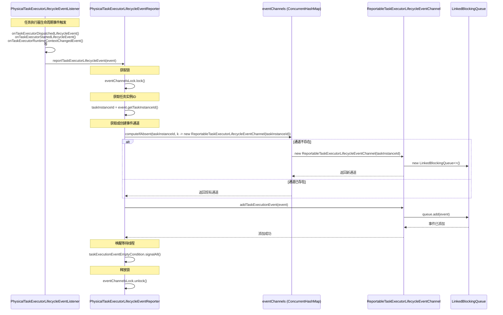
```mermaid
sequenceDiagram
    participant Listener as PhysicalTaskExecutorLifecycleEventListener
    participant Reporter as PhysicalTaskExecutorLifecycleEventReporter
    participant Channels as eventChannels (ConcurrentHashMap)
    participant Channel as ReportableTaskExecutorLifecycleEventChannel
    participant Queue as LinkedBlockingQueue
    
    Note over Listener: 任务执行器生命周期事件触发
    Listener->>Listener: onTaskExecutorDispatchedLifecycleEvent()<br/>onTaskExecutorStartedLifecycleEvent()<br/>onTaskExecutorRuntimeContextChangedEvent()<br/>等
    
    Listener->>Reporter: reportTaskExecutorLifecycleEvent(event)
    
    Note over Reporter: 获取锁
    Reporter->>Reporter: eventChannelsLock.lock()
    
    Note over Reporter: 获取任务实例ID
    Reporter->>Reporter: taskInstanceId = event.getTaskInstanceId()
    
    Note over Reporter: 获取或创建事件通道
    Reporter->>Channels: computeIfAbsent(taskInstanceId, k -> new ReportableTaskExecutorLifecycleEventChannel(taskInstanceId))
    
    alt 通道不存在
        Channels->>Channel: new ReportableTaskExecutorLifecycleEventChannel(taskInstanceId)
        Channel->>Queue: new LinkedBlockingQueue<>()
        Channel-->>Channels: 返回新通道
    else 通道已存在
        Channels-->>Reporter: 返回现有通道
    end
    
    Reporter->>Channel: addTaskExecutionEvent(event)
    Channel->>Queue: queue.add(event)
    Queue-->>Channel: 事件已添加
    Channel-->>Reporter: 添加成功
    
    Note over Reporter: 唤醒等待线程
    Reporter->>Reporter: taskExecutionEventEmptyCondition.signalAll()
    
    Note over Reporter: 释放锁
    Reporter->>Reporter: eventChannelsLock.unlock()
```

### 4.3 事件来源

事件主要来自 `PhysicalTaskExecutorLifecycleEventListener`，该监听器监听任务执行器的生命周期事件：

**事件类型及来源**:

1. **TaskExecutorDispatchedLifecycleEvent**: 
   - 来源: `TaskEngine.submitTask()` 中发布
   - 处理: `onTaskExecutorDispatchedLifecycleEvent()` → `reportTaskExecutorLifecycleEventToMaster()`

2. **TaskExecutorStartedLifecycleEvent**:
   - 来源: `PhysicalTaskExecutor.start()` → `publishTaskRunningEvent()` 中发布
   - 处理: `onTaskExecutorStartedLifecycleEvent()` → `reportTaskExecutorLifecycleEventToMaster()`

3. **TaskExecutorRuntimeContextChangedLifecycleEvent**:
   - 来源: `PhysicalTaskExecutor.doTriggerTaskPlugin()` 中的回调更新运行时信息时发布
   - 处理: `onTaskExecutorRuntimeContextChangedEvent()` → `reportTaskExecutorLifecycleEventToMaster()`

4. **TaskExecutorPausedLifecycleEvent**:
   - 来源: 任务暂停后发布
   - 处理: `onTaskExecutorPausedLifecycleEvent()` → `reportTaskExecutorLifecycleEvent()`

5. **TaskExecutorKilledLifecycleEvent**:
   - 来源: 任务被杀死后发布
   - 处理: `onTaskExecutorKilledLifecycleEvent()` → `reportTaskExecutorLifecycleEvent()`

6. **TaskExecutorSuccessLifecycleEvent**:
   - 来源: 任务执行成功后发布
   - 处理: `onTaskExecutorSuccessLifecycleEvent()` → `reportTaskExecutorLifecycleEvent()`

7. **TaskExecutorFailedLifecycleEvent**:
   - 来源: 任务执行失败后发布
   - 处理: `onTaskExecutorFailLifecycleEvent()` → `reportTaskExecutorLifecycleEvent()`

**相关代码链接**:

- `reportTaskExecutorLifecycleEvent()`: [TaskExecutorLifecycleEventRemoteReporter.java:98-112](../../../../dolphinscheduler-task-executor/src/main/java/org/apache/dolphinscheduler/task/executor/eventbus/TaskExecutorLifecycleEventRemoteReporter.java#L98-L112)
- `ReportableTaskExecutorLifecycleEventChannel`: [TaskExecutorLifecycleEventRemoteReporter.java:253-294](../../../../dolphinscheduler-task-executor/src/main/java/org/apache/dolphinscheduler/task/executor/eventbus/TaskExecutorLifecycleEventRemoteReporter.java#L253-L294)
- `TaskExecutorLifecycleEventListener`: [TaskExecutorLifecycleEventListener.java](../../../../dolphinscheduler-task-executor/src/main/java/org/apache/dolphinscheduler/task/executor/listener/TaskExecutorLifecycleEventListener.java)

### 4.4 事件移除机制

事件通过以下两种方式从 `eventChannels` 中移除：

#### 4.4.1 收到 ACK 后移除

当 Master 发送 ACK 确认收到事件后，会调用 `receiveTaskExecutorLifecycleEventACK()` 方法：

```java
@Override
public void receiveTaskExecutorLifecycleEventACK(final TaskExecutorLifecycleEventAck eventAck) {
    final int taskExecutorId = eventAck.getTaskExecutorId();
    eventChannelsLock.lock();
    try {
        final ReportableTaskExecutorLifecycleEventChannel eventChannel = eventChannels.get(taskExecutorId);
        if (eventChannel == null) {
            return;
        }
        final IReportableTaskExecutorLifecycleEvent removed =
                eventChannel.remove(eventAck.getTaskExecutorLifecycleEventType());
        if (removed != null) {
            log.info("Success removed {} by ack: {}", removed, eventAck);
        } else {
            log.info("Failed removed ReportableTaskExecutorLifecycleEvent by ack: {}", eventAck);
        }
        if (eventChannel.isEmpty()) {
            eventChannels.remove(taskExecutorId);
            log.debug("Removed ReportableTaskExecutorLifecycleEventChannel: {}", taskExecutorId);
        }
        taskExecutionEventEmptyCondition.signalAll();
    } finally {
        eventChannelsLock.unlock();
    }
}
```

**执行逻辑**:
1. **获取任务实例ID**: 从 ACK 中获取 `taskExecutorId`
2. **获取锁**: 获取 `eventChannelsLock` 锁
3. **查找通道**: 根据 `taskExecutorId` 查找对应的事件通道
4. **移除事件**: 调用 `eventChannel.remove(eventType)` 从队列中移除对应类型的事件
5. **清理空通道**: 如果通道为空，从 `eventChannels` 中移除该通道
6. **唤醒线程**: 调用 `signalAll()` 唤醒等待的线程
7. **释放锁**: 在 `finally` 块中释放锁

**相关代码链接**:

- `receiveTaskExecutorLifecycleEventACK()`: [TaskExecutorLifecycleEventRemoteReporter.java:115-138](../../../../dolphinscheduler-task-executor/src/main/java/org/apache/dolphinscheduler/task/executor/eventbus/TaskExecutorLifecycleEventRemoteReporter.java#L115-L138)
- `ReportableTaskExecutorLifecycleEventChannel.remove()`: [TaskExecutorLifecycleEventRemoteReporter.java:274-284](../../../../dolphinscheduler-task-executor/src/main/java/org/apache/dolphinscheduler/task/executor/eventbus/TaskExecutorLifecycleEventRemoteReporter.java#L274-L284)

## 5. 完整事件报告流程

### 5.1 事件报告完整时序图

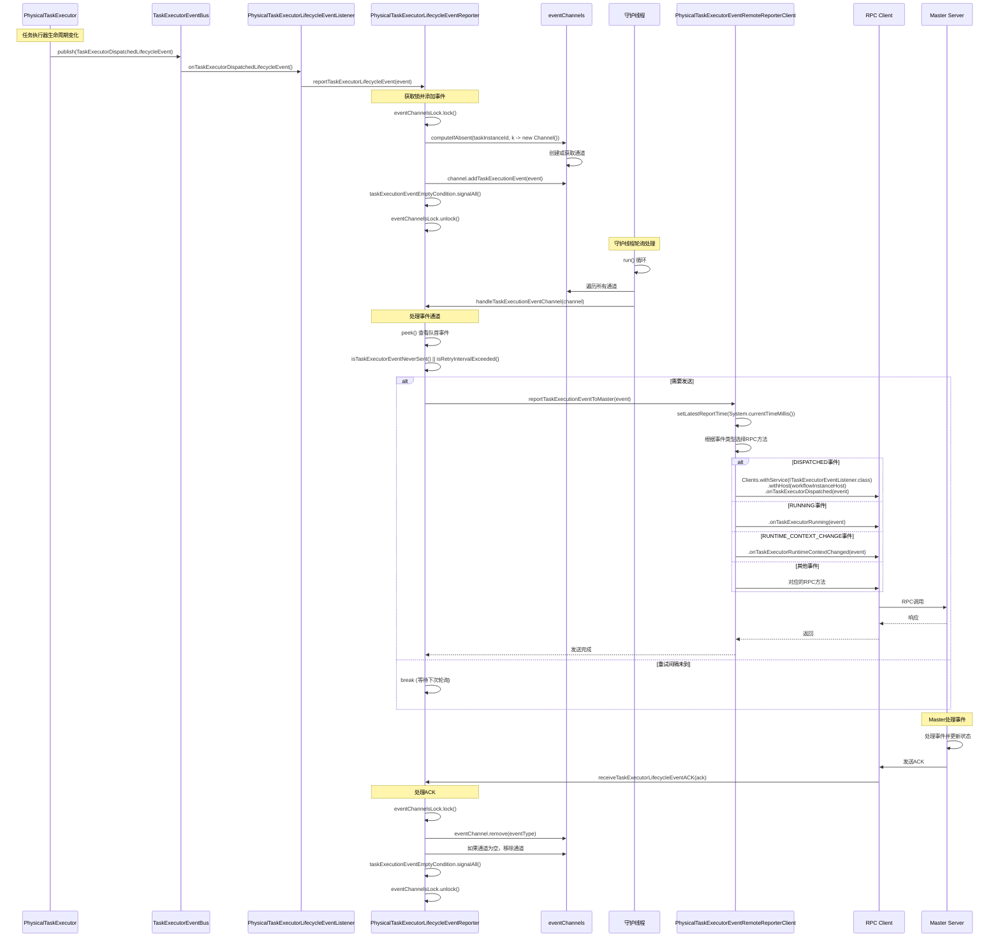
```mermaid
sequenceDiagram
    participant PTE as PhysicalTaskExecutor
    participant TEB as TaskExecutorEventBus
    participant Listener as PhysicalTaskExecutorLifecycleEventListener
    participant Reporter as PhysicalTaskExecutorLifecycleEventReporter
    participant Channels as eventChannels
    participant Thread as 守护线程
    participant Client as PhysicalTaskExecutorEventRemoteReporterClient
    participant RPC as RPC Client
    participant Master as Master Server
    
    Note over PTE: 任务执行器生命周期变化
    PTE->>TEB: publish(TaskExecutorDispatchedLifecycleEvent)
    TEB->>Listener: onTaskExecutorDispatchedLifecycleEvent()
    
    Listener->>Reporter: reportTaskExecutorLifecycleEvent(event)
    
    Note over Reporter: 获取锁并添加事件
    Reporter->>Reporter: eventChannelsLock.lock()
    Reporter->>Channels: computeIfAbsent(taskInstanceId, k -> new Channel())
    Channels->>Channels: 创建或获取通道
    Reporter->>Channels: channel.addTaskExecutionEvent(event)
    Reporter->>Reporter: taskExecutionEventEmptyCondition.signalAll()
    Reporter->>Reporter: eventChannelsLock.unlock()
    
    Note over Thread: 守护线程轮询处理
    Thread->>Thread: run() 循环
    Thread->>Channels: 遍历所有通道
    Thread->>Reporter: handleTaskExecutionEventChannel(channel)
    
    Note over Reporter: 处理事件通道
    Reporter->>Reporter: peek() 查看队首事件
    Reporter->>Reporter: isTaskExecutorEventNeverSent() || isRetryIntervalExceeded()
    
    alt 需要发送
        Reporter->>Client: reportTaskExecutionEventToMaster(event)
        Client->>Client: setLatestReportTime(System.currentTimeMillis())
        Client->>Client: 根据事件类型选择RPC方法
        
        alt DISPATCHED事件
            Client->>RPC: Clients.withService(ITaskExecutorEventListener.class)<br/>.withHost(workflowInstanceHost)<br/>.onTaskExecutorDispatched(event)
        else RUNNING事件
            Client->>RPC: .onTaskExecutorRunning(event)
        else RUNTIME_CONTEXT_CHANGE事件
            Client->>RPC: .onTaskExecutorRuntimeContextChanged(event)
        else 其他事件
            Client->>RPC: 对应的RPC方法
        end
        
        RPC->>Master: RPC调用
        Master-->>RPC: 响应
        RPC-->>Client: 返回
        Client-->>Reporter: 发送完成
    else 重试间隔未到
        Reporter->>Reporter: break (等待下次轮询)
    end
    
    Note over Master: Master处理事件
    Master->>Master: 处理事件并更新状态
    Master->>RPC: 发送ACK
    RPC->>Reporter: receiveTaskExecutorLifecycleEventACK(ack)
    
    Note over Reporter: 处理ACK
    Reporter->>Reporter: eventChannelsLock.lock()
    Reporter->>Channels: eventChannel.remove(eventType)
    Reporter->>Channels: 如果通道为空，移除通道
    Reporter->>Reporter: taskExecutionEventEmptyCondition.signalAll()
    Reporter->>Reporter: eventChannelsLock.unlock()
```

### 5.2 事件报告状态流转

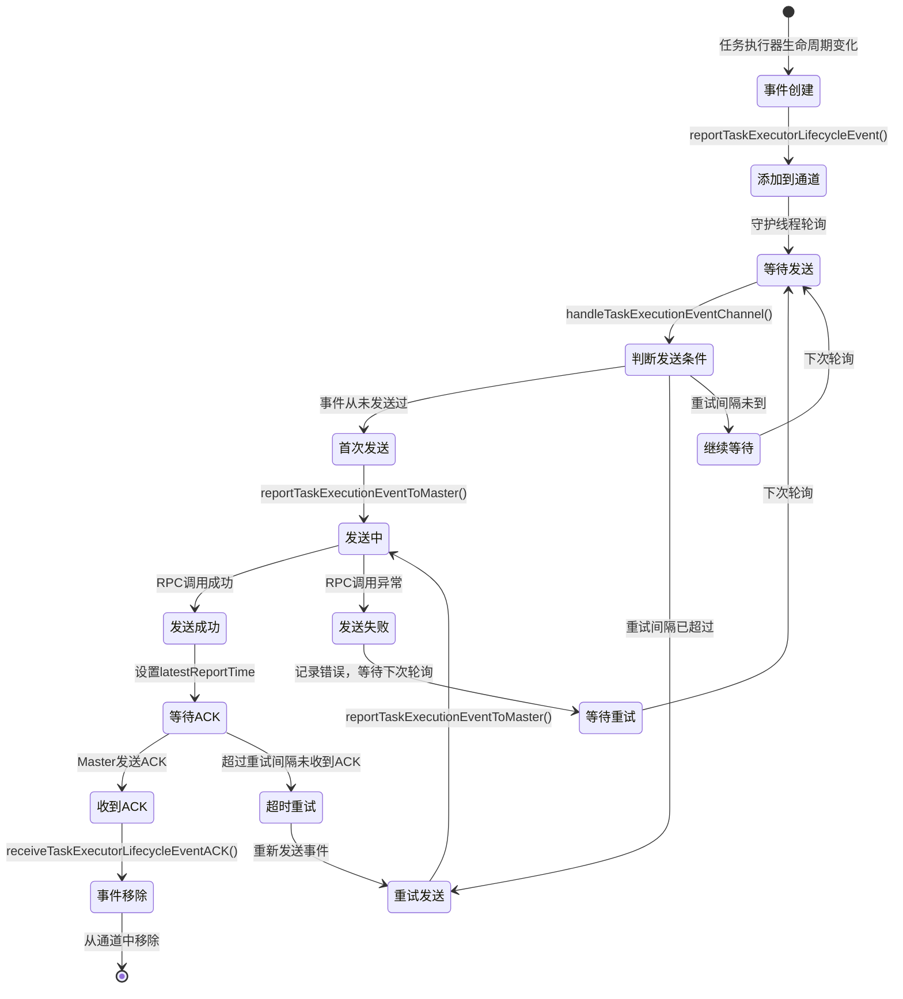
```mermaid
stateDiagram-v2
    [*] --> 事件创建: 任务执行器生命周期变化
    事件创建 --> 添加到通道: reportTaskExecutorLifecycleEvent()
    添加到通道 --> 等待发送: 守护线程轮询
    等待发送 --> 判断发送条件: handleTaskExecutionEventChannel()
    
    判断发送条件 --> 首次发送: 事件从未发送过
    判断发送条件 --> 重试发送: 重试间隔已超过
    判断发送条件 --> 继续等待: 重试间隔未到
    
    首次发送 --> 发送中: reportTaskExecutionEventToMaster()
    重试发送 --> 发送中: reportTaskExecutionEventToMaster()
    
    发送中 --> 发送成功: RPC调用成功
    发送中 --> 发送失败: RPC调用异常
    
    发送成功 --> 等待ACK: 设置latestReportTime
    发送失败 --> 等待重试: 记录错误，等待下次轮询
    
    等待ACK --> 收到ACK: Master发送ACK
    等待ACK --> 超时重试: 超过重试间隔未收到ACK
    
    收到ACK --> 事件移除: receiveTaskExecutorLifecycleEventACK()
    超时重试 --> 重试发送: 重新发送事件
    
    事件移除 --> [*]: 从通道中移除
    继续等待 --> 等待发送: 下次轮询
    等待重试 --> 等待发送: 下次轮询
```

## 6. 组件交互图

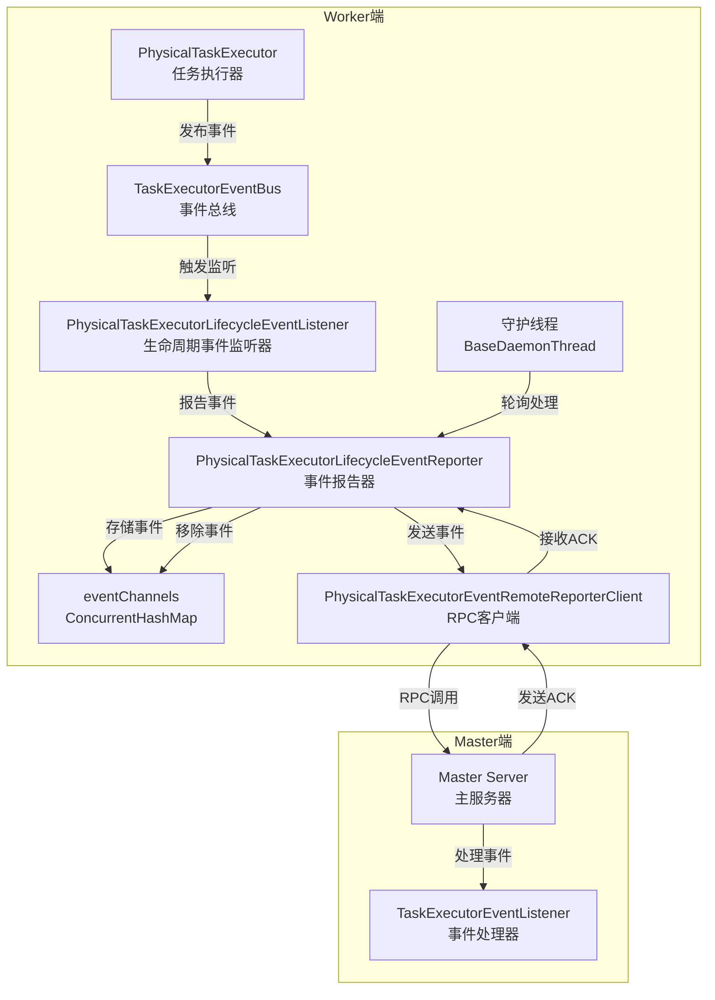
```mermaid
graph TB
    subgraph "Worker端"
        PTE[PhysicalTaskExecutor<br/>任务执行器]
        TEB[TaskExecutorEventBus<br/>事件总线]
        Listener[PhysicalTaskExecutorLifecycleEventListener<br/>生命周期事件监听器]
        Reporter[PhysicalTaskExecutorLifecycleEventReporter<br/>事件报告器]
        Channels[eventChannels<br/>ConcurrentHashMap]
        Thread[守护线程<br/>BaseDaemonThread]
        Client[PhysicalTaskExecutorEventRemoteReporterClient<br/>RPC客户端]
    end
    
    subgraph "Master端"
        Master[Master Server<br/>主服务器]
        Handler[TaskExecutorEventListener<br/>事件处理器]
    end
    
    PTE -->|发布事件| TEB
    TEB -->|触发监听| Listener
    Listener -->|报告事件| Reporter
    Reporter -->|存储事件| Channels
    Thread -->|轮询处理| Reporter
    Reporter -->|发送事件| Client
    Client -->|RPC调用| Master
    Master -->|处理事件| Handler
    Master -->|发送ACK| Client
    Client -->|接收ACK| Reporter
    Reporter -->|移除事件| Channels
```

## 7. 类图

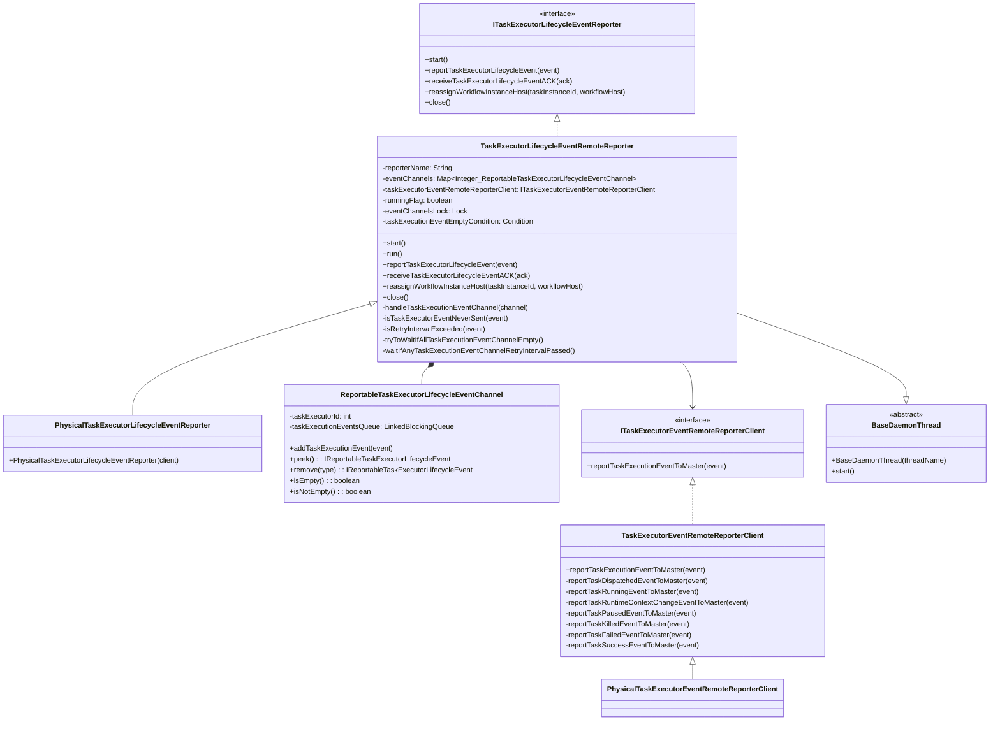
```mermaid
classDiagram
    class ITaskExecutorLifecycleEventReporter {
        <<interface>>
        +start()
        +reportTaskExecutorLifecycleEvent(event)
        +receiveTaskExecutorLifecycleEventACK(ack)
        +reassignWorkflowInstanceHost(taskInstanceId, workflowHost)
        +close()
    }
    
    class TaskExecutorLifecycleEventRemoteReporter {
        -reporterName: String
        -eventChannels: Map~Integer_ReportableTaskExecutorLifecycleEventChannel~
        -taskExecutorEventRemoteReporterClient: ITaskExecutorEventRemoteReporterClient
        -runningFlag: boolean
        -eventChannelsLock: Lock
        -taskExecutionEventEmptyCondition: Condition
        +start()
        +run()
        +reportTaskExecutorLifecycleEvent(event)
        +receiveTaskExecutorLifecycleEventACK(ack)
        +reassignWorkflowInstanceHost(taskInstanceId, workflowHost)
        +close()
        -handleTaskExecutionEventChannel(channel)
        -isTaskExecutorEventNeverSent(event)
        -isRetryIntervalExceeded(event)
        -tryToWaitIfAllTaskExecutionEventChannelEmpty()
        -waitIfAnyTaskExecutionEventChannelRetryIntervalPassed()
    }
    
    class PhysicalTaskExecutorLifecycleEventReporter {
        +PhysicalTaskExecutorLifecycleEventReporter(client)
    }
    
    class ReportableTaskExecutorLifecycleEventChannel {
        -taskExecutorId: int
        -taskExecutionEventsQueue: LinkedBlockingQueue
        +addTaskExecutionEvent(event)
        +peek(): IReportableTaskExecutorLifecycleEvent
        +remove(type): IReportableTaskExecutorLifecycleEvent
        +isEmpty(): boolean
        +isNotEmpty(): boolean
    }
    
    class ITaskExecutorEventRemoteReporterClient {
        <<interface>>
        +reportTaskExecutionEventToMaster(event)
    }
    
    class TaskExecutorEventRemoteReporterClient {
        +reportTaskExecutionEventToMaster(event)
        -reportTaskDispatchedEventToMaster(event)
        -reportTaskRunningEventToMaster(event)
        -reportTaskRuntimeContextChangeEventToMaster(event)
        -reportTaskPausedEventToMaster(event)
        -reportTaskKilledEventToMaster(event)
        -reportTaskFailedEventToMaster(event)
        -reportTaskSuccessEventToMaster(event)
    }
    
    class PhysicalTaskExecutorEventRemoteReporterClient {
    }
    
    class BaseDaemonThread {
        <<abstract>>
        +BaseDaemonThread(threadName)
        +start()
    }
    
    ITaskExecutorLifecycleEventReporter <|.. TaskExecutorLifecycleEventRemoteReporter
    TaskExecutorLifecycleEventRemoteReporter <|-- PhysicalTaskExecutorLifecycleEventReporter
    TaskExecutorLifecycleEventRemoteReporter *-- ReportableTaskExecutorLifecycleEventChannel
    TaskExecutorLifecycleEventRemoteReporter --> ITaskExecutorEventRemoteReporterClient
    ITaskExecutorEventRemoteReporterClient <|.. TaskExecutorEventRemoteReporterClient
    TaskExecutorEventRemoteReporterClient <|-- PhysicalTaskExecutorEventRemoteReporterClient
    TaskExecutorLifecycleEventRemoteReporter --|> BaseDaemonThread
```

## 8. 关键设计点

### 8.1 异步非阻塞设计

- **事件收集**: `reportTaskExecutorLifecycleEvent()` 方法只是将事件添加到队列，立即返回，不阻塞调用线程
- **异步发送**: 守护线程独立处理事件发送，不影响任务执行器的正常执行
- **条件等待**: 使用 `Condition` 机制实现高效等待，避免忙等待

### 8.2 重试机制

- **首次发送**: 事件首次创建时立即发送
- **重试间隔**: 默认 3 分钟，如果未收到 ACK，会重新发送
- **重试判断**: 通过 `latestReportTime` 和当前时间比较判断是否需要重试

### 8.3 线程安全

- **ConcurrentHashMap**: `eventChannels` 使用 `ConcurrentHashMap` 保证并发安全
- **ReentrantLock**: 使用 `ReentrantLock` 和 `Condition` 实现精确的线程同步
- **LinkedBlockingQueue**: 每个通道内部使用 `LinkedBlockingQueue` 保证线程安全

### 8.4 资源管理

- **自动清理**: 收到 ACK 后自动从通道中移除事件
- **空通道清理**: 当通道为空时，自动从 `eventChannels` 中移除
- **MDC 清理**: 使用 `try-with-resources` 确保 MDC 上下文自动清理

### 8.5 性能优化

- **批量处理**: 守护线程一次处理一个通道的所有可发送事件
- **智能等待**: 根据最老事件的发送时间计算等待时间，避免不必要的轮询
- **条件唤醒**: 使用 `Condition.signalAll()` 精确唤醒等待线程

## 9. 相关代码链接汇总

- PhysicalTaskEngineDelegator.start: [PhysicalTaskEngineDelegator.java:73-77](../../../src/main/java/org/apache/dolphinscheduler/server/worker/executor/PhysicalTaskEngineDelegator.java#L73-L77)
- PhysicalTaskExecutorLifecycleEventReporter: [PhysicalTaskExecutorLifecycleEventReporter.java](../../../src/main/java/org/apache/dolphinscheduler/server/worker/executor/PhysicalTaskExecutorLifecycleEventReporter.java)
- TaskExecutorLifecycleEventRemoteReporter: [TaskExecutorLifecycleEventRemoteReporter.java](../../../../dolphinscheduler-task-executor/src/main/java/org/apache/dolphinscheduler/task/executor/eventbus/TaskExecutorLifecycleEventRemoteReporter.java)
- ITaskExecutorLifecycleEventReporter接口: [ITaskExecutorLifecycleEventReporter.java](../../../../dolphinscheduler-task-executor/src/main/java/org/apache/dolphinscheduler/task/executor/eventbus/ITaskExecutorLifecycleEventReporter.java)
- PhysicalTaskExecutorEventRemoteReporterClient: [PhysicalTaskExecutorEventRemoteReporterClient.java](../../../src/main/java/org/apache/dolphinscheduler/server/worker/executor/PhysicalTaskExecutorEventRemoteReporterClient.java)
- TaskExecutorEventRemoteReporterClient: [TaskExecutorEventRemoteReporterClient.java](../../../../dolphinscheduler-extract/dolphinscheduler-extract-master/src/main/java/org/apache/dolphinscheduler/extract/master/TaskExecutorEventRemoteReporterClient.java)
- TaskExecutorLifecycleEventListener: [TaskExecutorLifecycleEventListener.java](../../../../dolphinscheduler-task-executor/src/main/java/org/apache/dolphinscheduler/task/executor/listener/TaskExecutorLifecycleEventListener.java)
- PhysicalTaskExecutorLifecycleEventListener: [PhysicalTaskExecutorLifecycleEventListener.java](../../../src/main/java/org/apache/dolphinscheduler/server/worker/executor/PhysicalTaskExecutorLifecycleEventListener.java)
- BaseDaemonThread: [BaseDaemonThread.java](../../../../dolphinscheduler-common/src/main/java/org/apache/dolphinscheduler/common/thread/BaseDaemonThread.java)

## 10. taskExecutorRepository 共享机制分析

### 10.1 问题背景

在代码中，`TaskEngine.submitTask()` 方法（第70行）调用 `taskExecutorRepository.put(taskExecutor)` 将任务执行器存储到仓库中，而在 `TaskExecutorEventBusCoordinator.fireTaskExecutorEventBus()` 方法（第359行）中调用 `taskExecutorRepository.getAll()` 能够获取到这些任务执行器。

从表面上看，`TaskEngine` 和 `TaskExecutorEventBusCoordinator` 是两个不同的类，它们各自持有 `taskExecutorRepository` 字段，似乎应该是不同的对象。但实际上，它们共享的是**同一个 Spring 单例 Bean 实例**。

### 10.2 共享机制原理

#### 10.2.1 Spring 单例模式

`PhysicalTaskExecutorRepository` 使用 `@Component` 注解，由 Spring 容器管理，默认是**单例（Singleton）模式**：

```java
@Component
public class PhysicalTaskExecutorRepository extends TaskExecutorRepository {
    // 继承自 TaskExecutorRepository，内部有 ConcurrentHashMap 存储
}
```

这意味着在整个 Spring 容器中，**只有一个 `PhysicalTaskExecutorRepository` 实例**。

#### 10.2.2 依赖注入流程

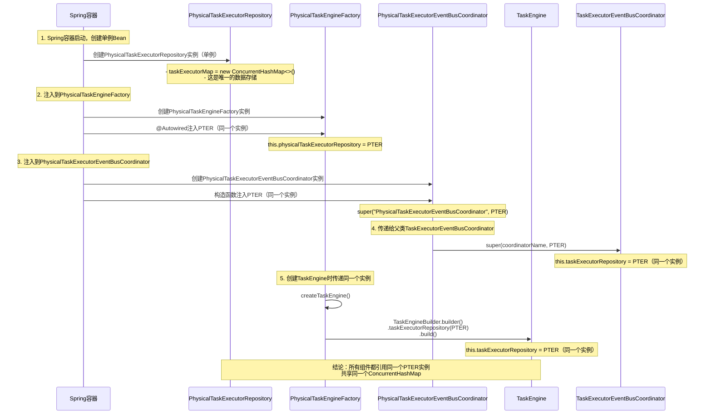
```mermaid
sequenceDiagram
    participant Spring as Spring容器
    participant PTER as PhysicalTaskExecutorRepository
    participant PTEF as PhysicalTaskEngineFactory
    participant PTEC as PhysicalTaskExecutorEventBusCoordinator
    participant TE as TaskEngine
    participant TEC as TaskExecutorEventBusCoordinator
    
    Note over Spring: 1. Spring容器启动，创建单例Bean
    Spring->>PTER: 创建PhysicalTaskExecutorRepository实例（单例）
    Note over PTER: - taskExecutorMap = new ConcurrentHashMap<>()<br/>- 这是唯一的数据存储
    
    Note over Spring: 2. 注入到PhysicalTaskEngineFactory
    Spring->>PTEF: 创建PhysicalTaskEngineFactory实例
    Spring->>PTEF: @Autowired注入PTER（同一个实例）
    Note over PTEF: this.physicalTaskExecutorRepository = PTER
    
    Note over Spring: 3. 注入到PhysicalTaskExecutorEventBusCoordinator
    Spring->>PTEC: 创建PhysicalTaskExecutorEventBusCoordinator实例
    Spring->>PTEC: 构造函数注入PTER（同一个实例）
    Note over PTEC: super("PhysicalTaskExecutorEventBusCoordinator", PTER)
    
    Note over PTEC: 4. 传递给父类TaskExecutorEventBusCoordinator
    PTEC->>TEC: super(coordinatorName, PTER)
    Note over TEC: this.taskExecutorRepository = PTER（同一个实例）
    
    Note over PTEF: 5. 创建TaskEngine时传递同一个实例
    PTEF->>PTEF: createTaskEngine()
    PTEF->>TE: TaskEngineBuilder.builder()<br/>.taskExecutorRepository(PTER)<br/>.build()
    Note over TE: this.taskExecutorRepository = PTER（同一个实例）
    
    Note over PTER,TE: 结论：所有组件都引用同一个PTER实例<br/>共享同一个ConcurrentHashMap
```

#### 10.2.3 数据存储结构

`TaskExecutorRepository` 内部使用 `ConcurrentHashMap` 存储任务执行器：

```java
public class TaskExecutorRepository implements ITaskExecutorRepository {
    // 这是实际的数据存储，所有实例共享这个 Map
    private final Map<Integer, ITaskExecutor> taskExecutorMap = new ConcurrentHashMap<>();
    
    @Override
    public void put(final ITaskExecutor taskExecutor) {
        taskExecutorMap.put(taskExecutor.getId(), taskExecutor);
    }
    
    @Override
    public Collection<ITaskExecutor> getAll() {
        return taskExecutorMap.values();
    }
}
```

**关键点**：
- `taskExecutorMap` 是 `TaskExecutorRepository` 的**实例字段**
- `PhysicalTaskExecutorRepository` 继承自 `TaskExecutorRepository`，**共享同一个 `taskExecutorMap`**
- 由于 Spring 单例模式，所有组件注入的都是**同一个 `PhysicalTaskExecutorRepository` 实例**
- 因此，所有组件访问的是**同一个 `ConcurrentHashMap`**

### 10.3 完整的对象引用链

```mermaid
graph TB
    subgraph "Spring容器（单例）"
        PTER[PhysicalTaskExecutorRepository<br/>@Component 单例Bean]
        Map[taskExecutorMap<br/>ConcurrentHashMap]
    end
    
    subgraph "PhysicalTaskEngineFactory"
        PTEF[PhysicalTaskEngineFactory<br/>@Autowired PTER]
    end
    
    subgraph "PhysicalTaskExecutorEventBusCoordinator"
        PTEC[PhysicalTaskExecutorEventBusCoordinator<br/>构造函数注入PTER]
        TEC[TaskExecutorEventBusCoordinator<br/>taskExecutorRepository字段]
    end
    
    subgraph "TaskEngine"
        TE[TaskEngine<br/>taskExecutorRepository字段]
    end
    
    PTER -->|包含| Map
    PTEF -->|引用| PTER
    PTEC -->|引用| PTER
    TEC -->|引用| PTER
    TE -->|引用| PTER
    
    style PTER fill:#ff9999
    style Map fill:#99ff99
```

### 10.4 代码执行流程验证

#### 10.4.1 TaskEngine.put() 执行流程

```java
// TaskEngine.java:70
public void submitTask(final ITaskExecutor taskExecutor) {
    // ...
    taskExecutorRepository.put(taskExecutor);  // 这里的 taskExecutorRepository 是 PTER 实例
    // ...
}
```

**执行路径**：
1. `TaskEngine.taskExecutorRepository` → 引用 `PhysicalTaskExecutorRepository` 实例（PTER）
2. `PTER.put(taskExecutor)` → 调用父类 `TaskExecutorRepository.put()`
3. `taskExecutorMap.put(taskExecutor.getId(), taskExecutor)` → 存储到共享的 `ConcurrentHashMap`

#### 10.4.2 TaskExecutorEventBusCoordinator.getAll() 执行流程

```java
// TaskExecutorEventBusCoordinator.java:359
private void fireTaskExecutorEventBus() {
    final Collection<ITaskExecutor> taskExecutors = taskExecutorRepository.getAll();  // 这里的 taskExecutorRepository 也是 PTER 实例
    // ...
}
```

**执行路径**：
1. `TaskExecutorEventBusCoordinator.taskExecutorRepository` → 引用 `PhysicalTaskExecutorRepository` 实例（PTER）
2. `PTER.getAll()` → 调用父类 `TaskExecutorRepository.getAll()`
3. `taskExecutorMap.values()` → 从共享的 `ConcurrentHashMap` 获取所有值

### 10.5 为什么看起来像不同的对象？

虽然 `TaskEngine` 和 `TaskExecutorEventBusCoordinator` 中的 `taskExecutorRepository` 字段看起来像是不同的对象，但实际上：

1. **字段名相同但对象引用相同**：
   - `TaskEngine.taskExecutorRepository` → 引用 PTER 实例
   - `TaskExecutorEventBusCoordinator.taskExecutorRepository` → 引用同一个 PTER 实例

2. **Spring 单例保证**：
   - `@Component` 注解默认是单例模式
   - Spring 容器在整个应用生命周期中只创建一个 `PhysicalTaskExecutorRepository` 实例
   - 所有需要注入的地方都注入的是这个**同一个实例**

3. **数据共享**：
   - 由于是同一个实例，内部的 `taskExecutorMap` 也是同一个 `ConcurrentHashMap`
   - 因此，`TaskEngine.put()` 存储的数据，`TaskExecutorEventBusCoordinator.getAll()` 能够读取到

### 10.6 初始化时序图

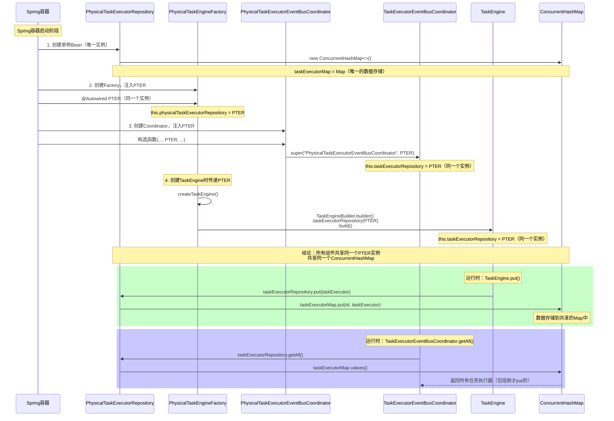
```mermaid
sequenceDiagram
    participant Spring as Spring容器
    participant PTER as PhysicalTaskExecutorRepository
    participant PTEF as PhysicalTaskEngineFactory
    participant PTEC as PhysicalTaskExecutorEventBusCoordinator
    participant TEC as TaskExecutorEventBusCoordinator
    participant TE as TaskEngine
    participant Map as ConcurrentHashMap
    
    Note over Spring: Spring容器启动阶段
    
    Spring->>PTER: 1. 创建单例Bean（唯一实例）
    PTER->>Map: new ConcurrentHashMap<>()
    Note over PTER,Map: taskExecutorMap = Map（唯一的数据存储）
    
    Spring->>PTEF: 2. 创建Factory，注入PTER
    Spring->>PTEF: @Autowired PTER（同一个实例）
    Note over PTEF: this.physicalTaskExecutorRepository = PTER
    
    Spring->>PTEC: 3. 创建Coordinator，注入PTER
    Spring->>PTEC: 构造函数(..., PTER, ...)
    PTEC->>TEC: super("PhysicalTaskExecutorEventBusCoordinator", PTER)
    Note over TEC: this.taskExecutorRepository = PTER（同一个实例）
    
    Note over PTEF: 4. 创建TaskEngine时传递PTER
    PTEF->>PTEF: createTaskEngine()
    PTEF->>TE: TaskEngineBuilder.builder()<br/>.taskExecutorRepository(PTER)<br/>.build()
    Note over TE: this.taskExecutorRepository = PTER（同一个实例）
    
    Note over PTER,Map: 结论：所有组件共享同一个PTER实例<br/>共享同一个ConcurrentHashMap
    
    rect rgb(200, 255, 200)
        Note over TE: 运行时：TaskEngine.put()
        TE->>PTER: taskExecutorRepository.put(taskExecutor)
        PTER->>Map: taskExecutorMap.put(id, taskExecutor)
        Note over Map: 数据存储到共享的Map中
    end
    
    rect rgb(200, 200, 255)
        Note over TEC: 运行时：TaskExecutorEventBusCoordinator.getAll()
        TEC->>PTER: taskExecutorRepository.getAll()
        PTER->>Map: taskExecutorMap.values()
        Map-->>TEC: 返回所有任务执行器（包括刚才put的）
    end
```

### 10.7 关键代码位置

- **PhysicalTaskExecutorRepository**: [PhysicalTaskExecutorRepository.java](../../../src/main/java/org/apache/dolphinscheduler/server/worker/executor/PhysicalTaskExecutorRepository.java)
  - 使用 `@Component` 注解，Spring 单例 Bean
  
- **TaskExecutorRepository**: [TaskExecutorRepository.java](../../../../dolphinscheduler-task-executor/src/main/java/org/apache/dolphinscheduler/task/executor/TaskExecutorRepository.java)
  - 内部使用 `ConcurrentHashMap` 存储任务执行器
  
- **PhysicalTaskEngineFactory**: [PhysicalTaskEngineFactory.java](../../../src/main/java/org/apache/dolphinscheduler/server/worker/executor/PhysicalTaskEngineFactory.java:29-45)
  - `@Autowired` 注入 `PhysicalTaskExecutorRepository`
  - 在 `createTaskEngine()` 中传递给 `TaskEngineBuilder`
  
- **PhysicalTaskExecutorEventBusCoordinator**: [PhysicalTaskExecutorEventBusCoordinator.java](../../../src/main/java/org/apache/dolphinscheduler/server/worker/executor/PhysicalTaskExecutorEventBusCoordinator.java:27-31)
  - 构造函数接收 `PhysicalTaskExecutorRepository` 参数
  - 传递给父类 `TaskExecutorEventBusCoordinator`
  
- **TaskEngine.put()**: [TaskEngine.java:70](../../../../dolphinscheduler-task-executor/src/main/java/org/apache/dolphinscheduler/task/executor/TaskEngine.java#L70)
  - 调用 `taskExecutorRepository.put()` 存储任务执行器
  
- **TaskExecutorEventBusCoordinator.getAll()**: [TaskExecutorEventBusCoordinator.java:359](../../../../dolphinscheduler-task-executor/src/main/java/org/apache/dolphinscheduler/task/executor/eventbus/TaskExecutorEventBusCoordinator.java#L359)
  - 调用 `taskExecutorRepository.getAll()` 获取所有任务执行器

### 10.8 总结

**为什么 `TaskEngine.put()` 的数据能被 `TaskExecutorEventBusCoordinator.getAll()` 获取到？**

**答案**：虽然 `TaskEngine` 和 `TaskExecutorEventBusCoordinator` 是两个不同的类，但它们持有的 `taskExecutorRepository` 字段引用的是**同一个 Spring 单例 Bean 实例**（`PhysicalTaskExecutorRepository`）。这个实例内部使用 `ConcurrentHashMap` 存储数据，因此：

1. **同一个实例**：Spring 容器只创建一个 `PhysicalTaskExecutorRepository` 实例
2. **共享存储**：所有组件注入的都是这个实例，共享同一个 `ConcurrentHashMap`
3. **数据可见性**：`TaskEngine.put()` 存储的数据，`TaskExecutorEventBusCoordinator.getAll()` 能够读取到

这是 **Spring 依赖注入 + 单例模式** 的典型应用，确保了数据的一致性和共享性。

## 11. Condition 等待/唤醒机制详细分析

### 11.1 问题背景

在 `TaskExecutorLifecycleEventRemoteReporter` 中，使用了 `ReentrantLock` 和 `Condition` 实现线程等待和唤醒机制。第292行的 `eventChannelsLock.lock()` 和第302行的 `taskExecutionEventEmptyCondition.signalAll()` 是唤醒操作，而 `taskExecutionEventEmptyCondition.await()` 是等待操作。

### 11.2 Condition 机制概述

`Condition` 是 Java 并发包中用于实现线程等待和唤醒的机制，它必须与 `Lock` 配合使用。在 `TaskExecutorLifecycleEventRemoteReporter` 中：

- **Lock**: `eventChannelsLock` (ReentrantLock)
- **Condition**: `taskExecutionEventEmptyCondition` (从 `eventChannelsLock.newCondition()` 创建)
- **用途**: 当守护线程发现所有事件通道都为空时，等待直到有新事件到达；当有新事件到达时，唤醒等待的线程

### 11.3 核心代码位置

#### 11.3.1 唤醒操作：signalAll()

**位置**: [TaskExecutorLifecycleEventRemoteReporter.java:302](../../../../dolphinscheduler-task-executor/src/main/java/org/apache/dolphinscheduler/task/executor/eventbus/TaskExecutorLifecycleEventRemoteReporter.java#L302)

```java
@Override
public void reportTaskExecutorLifecycleEvent(final IReportableTaskExecutorLifecycleEvent reportableTaskExecutorLifecycleEvent) {
    eventChannelsLock.lock();  // 第292行：获取锁
    try {
        log.debug("Report : {}", JSONUtils.toPrettyJsonString(reportableTaskExecutorLifecycleEvent));
        int taskInstanceId = reportableTaskExecutorLifecycleEvent.getTaskInstanceId();
        eventChannels.computeIfAbsent(
                taskInstanceId,
                k -> new ReportableTaskExecutorLifecycleEventChannel(taskInstanceId))
                .addTaskExecutionEvent(reportableTaskExecutorLifecycleEvent);
        taskExecutionEventEmptyCondition.signalAll();  // 第302行：唤醒所有等待的线程
    } finally {
        eventChannelsLock.unlock();
    }
}
```

**执行时机**：
- 当有新事件通过 `reportTaskExecutorLifecycleEvent()` 方法添加到通道时
- 当收到 ACK 通过 `receiveTaskExecutorLifecycleEventACK()` 方法处理时

#### 11.3.2 等待操作：await()

**位置1**: [TaskExecutorLifecycleEventRemoteReporter.java:292-302](../../../../dolphinscheduler-task-executor/src/main/java/org/apache/dolphinscheduler/task/executor/eventbus/TaskExecutorLifecycleEventRemoteReporter.java#L292-L302) (tryToWaitIfAllTaskExecutionEventChannelEmpty)

**位置2**: [TaskExecutorLifecycleEventRemoteReporter.java:450-470](../../../../dolphinscheduler-task-executor/src/main/java/org/apache/dolphinscheduler/task/executor/eventbus/TaskExecutorLifecycleEventRemoteReporter.java#L450-L470) (waitIfAnyTaskExecutionEventChannelRetryIntervalPassed)

### 11.4 等待机制详细分析

#### 11.4.1 等待所有通道为空：tryToWaitIfAllTaskExecutionEventChannelEmpty()

```java
private void tryToWaitIfAllTaskExecutionEventChannelEmpty() throws InterruptedException {
    eventChannelsLock.lock();  // 获取锁
    while (isAllTaskExecutorEventChannelEmpty()) {  // 检查所有通道是否都为空
        taskExecutionEventEmptyCondition.await();  // 等待，直到被唤醒
    }
    eventChannelsLock.unlock();  // 释放锁
}
```

**执行流程**：

1. **获取锁**: `eventChannelsLock.lock()` - 必须持有锁才能调用 `await()`
2. **检查条件**: `isAllTaskExecutorEventChannelEmpty()` - 检查所有通道是否都为空
3. **等待**: `taskExecutionEventEmptyCondition.await()` - 如果所有通道都为空，线程进入等待状态
   - **关键点**: `await()` 方法会**自动释放锁**，允许其他线程获取锁
   - 线程进入 `WAITING` 状态，等待被唤醒
4. **被唤醒**: 当其他线程调用 `signalAll()` 时，线程被唤醒
   - 唤醒后，线程会**重新获取锁**（可能等待其他线程释放锁）
   - 重新检查条件 `isAllTaskExecutorEventChannelEmpty()`
   - 如果条件仍为 true，继续等待；如果为 false，退出循环
5. **释放锁**: `eventChannelsLock.unlock()` - 退出循环后释放锁

**为什么使用 `while` 而不是 `if`？**

这是 **条件等待的标准模式**（Guarded Suspension Pattern）：
- `await()` 可能因为**虚假唤醒（spurious wakeup）**而返回
- 即使被唤醒，条件可能仍然不满足（例如，其他线程可能已经处理了事件）
- 使用 `while` 循环确保只有在条件真正满足时才退出

#### 11.4.2 等待重试间隔：waitIfAnyTaskExecutionEventChannelRetryIntervalPassed()

```java
private void waitIfAnyTaskExecutionEventChannelRetryIntervalPassed() throws InterruptedException {
    eventChannelsLock.lock();  // 获取锁
    try {
        final long waitInterval =
                (getOldestReportTime() + DEFAULT_TASK_EXECUTOR_EVENT_RETRY_INTERVAL) - System.currentTimeMillis();
        if (waitInterval <= 0) {
            return;  // 已经有事件可以重试，不需要等待
        }
        taskExecutionEventEmptyCondition.await(waitInterval, TimeUnit.MILLISECONDS);  // 等待指定时间
    } finally {
        eventChannelsLock.unlock();  // 释放锁
    }
}
```

**执行流程**：

1. **获取锁**: `eventChannelsLock.lock()`
2. **计算等待时间**: 
   - `getOldestReportTime()` - 获取所有已发送事件中最老的发送时间
   - `waitInterval = (最老事件发送时间 + 3分钟) - 当前时间`
3. **判断是否需要等待**:
   - 如果 `waitInterval <= 0`，说明已经有事件可以重试，直接返回
   - 否则，需要等待到重试时间
4. **定时等待**: `await(waitInterval, TimeUnit.MILLISECONDS)`
   - 等待指定时间，或者被提前唤醒（如果有新事件到达）
   - 如果在指定时间内被唤醒，返回 true；如果超时，返回 false
5. **释放锁**: 在 `finally` 块中释放锁

### 11.5 完整的等待/唤醒流程

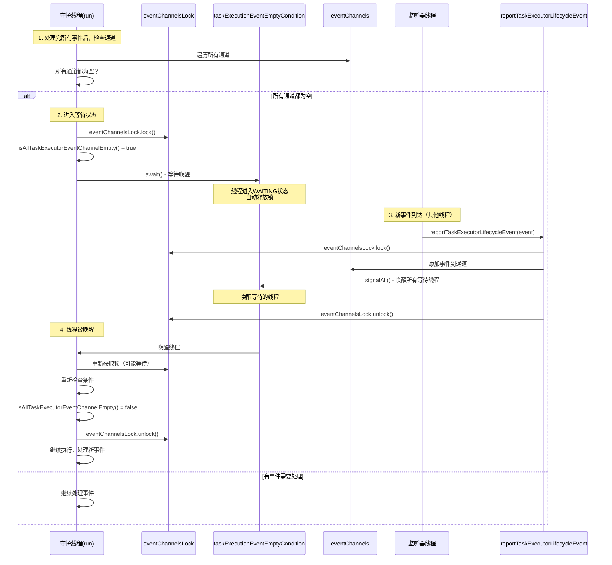
```mermaid
sequenceDiagram
    participant Thread as 守护线程(run)
    participant Lock as eventChannelsLock
    participant Condition as taskExecutionEventEmptyCondition
    participant Channels as eventChannels
    participant Listener as 监听器线程
    participant Reporter as reportTaskExecutorLifecycleEvent
    
    Note over Thread: 1. 处理完所有事件后，检查通道
    Thread->>Channels: 遍历所有通道
    Thread->>Thread: 所有通道都为空？
    
    alt 所有通道都为空
        Note over Thread: 2. 进入等待状态
        Thread->>Lock: eventChannelsLock.lock()
        Thread->>Thread: isAllTaskExecutorEventChannelEmpty() = true
        Thread->>Condition: await() - 等待唤醒
        Note over Condition: 线程进入WAITING状态<br/>自动释放锁
        
        Note over Listener: 3. 新事件到达（其他线程）
        Listener->>Reporter: reportTaskExecutorLifecycleEvent(event)
        Reporter->>Lock: eventChannelsLock.lock()
        Reporter->>Channels: 添加事件到通道
        Reporter->>Condition: signalAll() - 唤醒所有等待线程
        Note over Condition: 唤醒等待的线程
        Reporter->>Lock: eventChannelsLock.unlock()
        
        Note over Thread: 4. 线程被唤醒
        Condition->>Thread: 唤醒线程
        Thread->>Lock: 重新获取锁（可能等待）
        Thread->>Thread: 重新检查条件
        Thread->>Thread: isAllTaskExecutorEventChannelEmpty() = false
        Thread->>Lock: eventChannelsLock.unlock()
        Thread->>Thread: 继续执行，处理新事件
    else 有事件需要处理
        Thread->>Thread: 继续处理事件
    end
```

### 11.6 await() 方法的工作原理

#### 11.6.1 await() 的内部机制

`Condition.await()` 方法执行以下步骤：

1. **检查锁**: 确保当前线程持有与 Condition 关联的 Lock
2. **创建等待节点**: 将当前线程包装成等待节点，加入 Condition 的等待队列
3. **释放锁**: **自动释放锁**，允许其他线程获取锁
4. **阻塞线程**: 线程进入 `WAITING` 状态，等待被唤醒
5. **被唤醒**: 当其他线程调用 `signal()` 或 `signalAll()` 时：
   - 将等待节点从等待队列移到同步队列
   - 线程从 `WAITING` 状态转为 `BLOCKED` 状态
6. **重新获取锁**: 线程尝试重新获取锁（可能等待其他线程释放）
7. **检查中断**: 如果线程被中断，抛出 `InterruptedException`

#### 11.6.2 await() 与 signalAll() 的配合

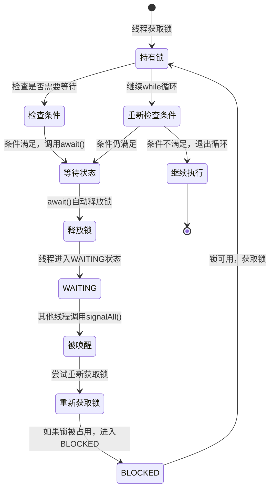
```mermaid
stateDiagram-v2
    [*] --> 持有锁: 线程获取锁
    持有锁 --> 检查条件: 检查是否需要等待
    检查条件 --> 等待状态: 条件满足，调用await()
    等待状态 --> 释放锁: await()自动释放锁
    释放锁 --> WAITING: 线程进入WAITING状态
    
    WAITING --> 被唤醒: 其他线程调用signalAll()
    被唤醒 --> 重新获取锁: 尝试重新获取锁
    重新获取锁 --> BLOCKED: 如果锁被占用，进入BLOCKED
    BLOCKED --> 持有锁: 锁可用，获取锁
    持有锁 --> 重新检查条件: 继续while循环
    重新检查条件 --> 等待状态: 条件仍满足
    重新检查条件 --> 继续执行: 条件不满足，退出循环
    继续执行 --> [*]
```

### 11.7 关键设计点

#### 11.7.1 为什么必须在持有锁时调用 await()？

`Condition.await()` 必须在持有锁时调用，原因：

1. **线程安全**: 检查条件和进入等待必须是原子操作
2. **防止竞态条件**: 如果先检查条件再获取锁，可能出现：
   - 线程A检查条件为true，准备等待
   - 线程B在A等待前添加了事件并调用signalAll()
   - 线程A进入等待，但事件已经到达，导致错过唤醒

3. **自动释放锁**: `await()` 会自动释放锁，允许其他线程操作共享资源

#### 11.7.2 为什么使用 signalAll() 而不是 signal()？

`signalAll()` 唤醒所有等待的线程，而 `signal()` 只唤醒一个线程。

**使用 `signalAll()` 的原因**：

1. **简单可靠**: 不需要精确控制唤醒哪个线程
2. **避免死锁**: 如果使用 `signal()`，可能唤醒的线程条件不满足，导致其他线程永久等待
3. **性能影响**: 虽然可能唤醒多个线程，但只有一个线程能获取锁，其他线程会重新进入等待，开销可接受

#### 11.7.3 为什么使用 while 循环检查条件？

这是 **Guarded Suspension Pattern** 的标准实现：

1. **虚假唤醒**: `await()` 可能因为系统原因（如信号）而返回，即使没有调用 `signal()`
2. **条件变化**: 被唤醒时，条件可能已经被其他线程改变
3. **确保正确性**: `while` 循环确保只有在条件真正满足时才退出

### 11.8 完整的等待/唤醒时序图

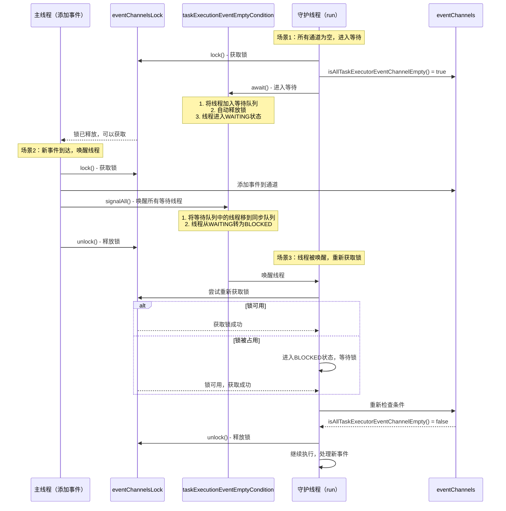
```mermaid
sequenceDiagram
    participant MainThread as 主线程（添加事件）
    participant Lock as eventChannelsLock
    participant Condition as taskExecutionEventEmptyCondition
    participant WorkerThread as 守护线程（run）
    participant Channels as eventChannels
    
    Note over WorkerThread: 场景1：所有通道为空，进入等待
    WorkerThread->>Lock: lock() - 获取锁
    WorkerThread->>Channels: isAllTaskExecutorEventChannelEmpty() = true
    WorkerThread->>Condition: await() - 进入等待
    Note over Condition: 1. 将线程加入等待队列<br/>2. 自动释放锁<br/>3. 线程进入WAITING状态
    Lock-->>MainThread: 锁已释放，可以获取
    
    Note over MainThread: 场景2：新事件到达，唤醒线程
    MainThread->>Lock: lock() - 获取锁
    MainThread->>Channels: 添加事件到通道
    MainThread->>Condition: signalAll() - 唤醒所有等待线程
    Note over Condition: 1. 将等待队列中的线程移到同步队列<br/>2. 线程从WAITING转为BLOCKED
    MainThread->>Lock: unlock() - 释放锁
    
    Note over WorkerThread: 场景3：线程被唤醒，重新获取锁
    Condition->>WorkerThread: 唤醒线程
    WorkerThread->>Lock: 尝试重新获取锁
    alt 锁可用
        Lock-->>WorkerThread: 获取锁成功
    else 锁被占用
        WorkerThread->>WorkerThread: 进入BLOCKED状态，等待锁
        Lock-->>WorkerThread: 锁可用，获取成功
    end
    
    WorkerThread->>Channels: 重新检查条件
    Channels-->>WorkerThread: isAllTaskExecutorEventChannelEmpty() = false
    WorkerThread->>Lock: unlock() - 释放锁
    WorkerThread->>WorkerThread: 继续执行，处理新事件
```

### 11.9 多线程并发场景分析

#### 11.9.1 场景1：多个线程同时添加事件

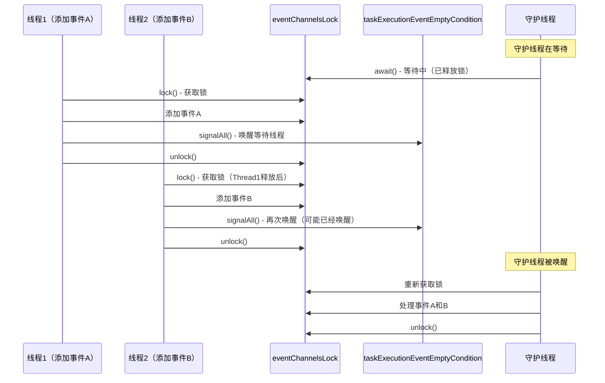
```mermaid
sequenceDiagram
    participant Thread1 as 线程1（添加事件A）
    participant Thread2 as 线程2（添加事件B）
    participant Lock as eventChannelsLock
    participant Condition as taskExecutionEventEmptyCondition
    participant WorkerThread as 守护线程
    
    Note over WorkerThread: 守护线程在等待
    WorkerThread->>Lock: await() - 等待中（已释放锁）
    
    Thread1->>Lock: lock() - 获取锁
    Thread1->>Lock: 添加事件A
    Thread1->>Condition: signalAll() - 唤醒等待线程
    Thread1->>Lock: unlock()
    
    Thread2->>Lock: lock() - 获取锁（Thread1释放后）
    Thread2->>Lock: 添加事件B
    Thread2->>Condition: signalAll() - 再次唤醒（可能已经唤醒）
    Thread2->>Lock: unlock()
    
    Note over WorkerThread: 守护线程被唤醒
    WorkerThread->>Lock: 重新获取锁
    WorkerThread->>Lock: 处理事件A和B
    WorkerThread->>Lock: unlock()
```

**关键点**：
- 多个线程可以并发添加事件，通过锁保证线程安全
- 每次添加事件都会调用 `signalAll()`，可能多次唤醒守护线程
- 守护线程被唤醒后会处理所有待处理的事件

#### 11.9.2 场景2：守护线程等待时，收到ACK

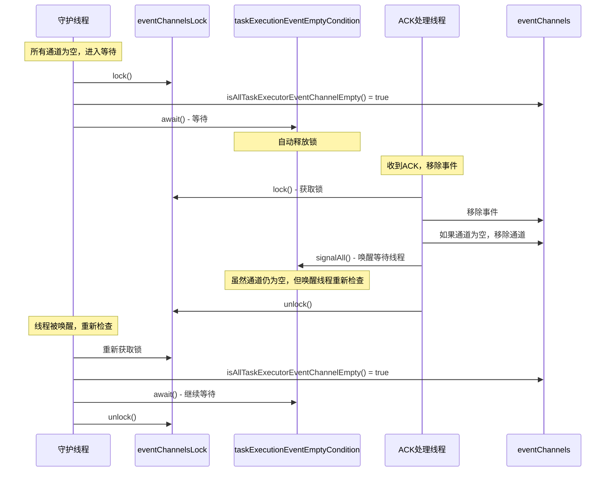
```mermaid
sequenceDiagram
    participant WorkerThread as 守护线程
    participant Lock as eventChannelsLock
    participant Condition as taskExecutionEventEmptyCondition
    participant ACKThread as ACK处理线程
    participant Channels as eventChannels
    
    Note over WorkerThread: 所有通道为空，进入等待
    WorkerThread->>Lock: lock()
    WorkerThread->>Channels: isAllTaskExecutorEventChannelEmpty() = true
    WorkerThread->>Condition: await() - 等待
    Note over Condition: 自动释放锁
    
    Note over ACKThread: 收到ACK，移除事件
    ACKThread->>Lock: lock() - 获取锁
    ACKThread->>Channels: 移除事件
    ACKThread->>Channels: 如果通道为空，移除通道
    ACKThread->>Condition: signalAll() - 唤醒等待线程
    Note over Condition: 虽然通道仍为空，但唤醒线程重新检查
    ACKThread->>Lock: unlock()
    
    Note over WorkerThread: 线程被唤醒，重新检查
    WorkerThread->>Lock: 重新获取锁
    WorkerThread->>Channels: isAllTaskExecutorEventChannelEmpty() = true
    WorkerThread->>Condition: await() - 继续等待
    WorkerThread->>Lock: unlock()
```

**关键点**：
- 即使收到ACK后通道仍为空，`signalAll()` 也会唤醒线程
- 线程被唤醒后会重新检查条件，如果仍为空，继续等待
- 这确保了线程不会错过新事件的到达

### 11.10 性能优化考虑

#### 11.10.1 为什么使用 Condition 而不是 Object.wait()/notify()？

1. **更灵活**: `Condition` 可以关联多个等待条件，`Object.wait()` 只能有一个
2. **更安全**: `Condition` 必须与 `Lock` 配合使用，编译时检查
3. **更强大**: 支持超时等待 `await(timeout, unit)`
4. **更清晰**: 代码意图更明确，可读性更好

#### 11.10.2 为什么使用 try-finally 确保释放锁？

```java
eventChannelsLock.lock();
try {
    // 业务逻辑
    taskExecutionEventEmptyCondition.signalAll();
} finally {
    eventChannelsLock.unlock();  // 确保无论是否异常都释放锁
}
```

**原因**：
- 如果业务逻辑抛出异常，锁必须被释放，否则会导致死锁
- `finally` 块确保无论正常返回还是异常，锁都会被释放

#### 11.10.3 为什么 await() 会自动释放锁？

这是 `Condition.await()` 的设计特性：

1. **避免死锁**: 如果等待时不释放锁，其他线程无法添加事件，导致永久等待
2. **允许并发**: 释放锁后，其他线程可以操作共享资源
3. **重新获取**: 被唤醒后会自动尝试重新获取锁

### 11.11 相关代码链接

- `reportTaskExecutorLifecycleEvent()` (唤醒): [TaskExecutorLifecycleEventRemoteReporter.java:291-307](../../../../dolphinscheduler-task-executor/src/main/java/org/apache/dolphinscheduler/task/executor/eventbus/TaskExecutorLifecycleEventRemoteReporter.java#L291-L307)
- `receiveTaskExecutorLifecycleEventACK()` (唤醒): [TaskExecutorLifecycleEventRemoteReporter.java:330-352](../../../../dolphinscheduler-task-executor/src/main/java/org/apache/dolphinscheduler/task/executor/eventbus/TaskExecutorLifecycleEventRemoteReporter.java#L330-L352)
- `tryToWaitIfAllTaskExecutionEventChannelEmpty()` (等待): [TaskExecutorLifecycleEventRemoteReporter.java:420-428](../../../../dolphinscheduler-task-executor/src/main/java/org/apache/dolphinscheduler/task/executor/eventbus/TaskExecutorLifecycleEventRemoteReporter.java#L420-L428)
- `waitIfAnyTaskExecutionEventChannelRetryIntervalPassed()` (定时等待): [TaskExecutorLifecycleEventRemoteReporter.java:450-470](../../../../dolphinscheduler-task-executor/src/main/java/org/apache/dolphinscheduler/task/executor/eventbus/TaskExecutorLifecycleEventRemoteReporter.java#L450-L470)
- `run()` 方法（调用等待）: [TaskExecutorLifecycleEventRemoteReporter.java:247-265](../../../../dolphinscheduler-task-executor/src/main/java/org/apache/dolphinscheduler/task/executor/eventbus/TaskExecutorLifecycleEventRemoteReporter.java#L247-L265)

### 11.12 总结

**Condition 等待/唤醒机制的核心要点**：

1. **必须在持有锁时调用**: `await()` 和 `signalAll()` 都必须在持有锁时调用
2. **自动释放锁**: `await()` 会自动释放锁，允许其他线程操作
3. **使用 while 循环**: 确保条件真正满足时才退出等待
4. **使用 signalAll()**: 唤醒所有等待线程，简单可靠
5. **try-finally 保护**: 确保锁在异常情况下也能释放

这种设计确保了：
- **线程安全**: 通过锁保护共享资源
- **高效等待**: 避免忙等待，节省 CPU 资源
- **及时响应**: 新事件到达时立即唤醒处理线程
- **避免死锁**: 等待时释放锁，唤醒时重新获取

### 11.13 await() 不会导致死锁的原因详解

#### 11.13.1 常见误解

很多开发者担心以下代码会导致死锁：

```java
private void tryToWaitIfAllTaskExecutionEventChannelEmpty() throws InterruptedException {
    eventChannelsLock.lock();  // 第533行：获取锁
    while (isAllTaskExecutorEventChannelEmpty()) {  // 第534行：检查条件
        taskExecutionEventEmptyCondition.await();  // 第535行：等待
    }
    eventChannelsLock.unlock();  // 第537行：释放锁
}
```

**误解**：如果 `isAllTaskExecutorEventChannelEmpty()` 一直返回 `true`，会一直循环调用 `await()`，导致 `unlock()` 执行不到，主线程一直等待，造成死锁。

#### 11.13.2 实际情况：await() 会自动释放锁

**关键点**：`Condition.await()` 方法会**自动释放锁**，这是它的核心特性。

**执行流程**：

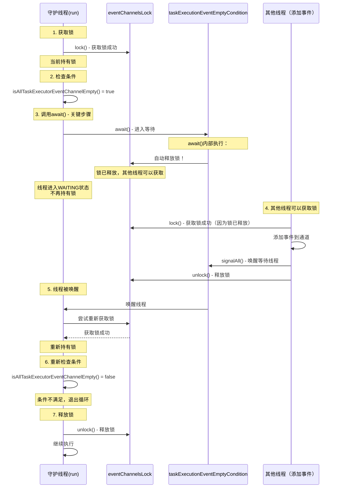
```mermaid
sequenceDiagram
    participant WorkerThread as 守护线程(run)
    participant Lock as eventChannelsLock
    participant Condition as taskExecutionEventEmptyCondition
    participant OtherThread as 其他线程（添加事件）
    
    Note over WorkerThread: 1. 获取锁
    WorkerThread->>Lock: lock() - 获取锁成功
    Note over WorkerThread: 当前持有锁
    
    Note over WorkerThread: 2. 检查条件
    WorkerThread->>WorkerThread: isAllTaskExecutorEventChannelEmpty() = true
    
    Note over WorkerThread: 3. 调用await() - 关键步骤
    WorkerThread->>Condition: await() - 进入等待
    Note over Condition: await()内部执行：
    Condition->>Lock: 自动释放锁！
    Note over Lock: 锁已释放，其他线程可以获取
    Note over WorkerThread: 线程进入WAITING状态<br/>不再持有锁
    
    Note over OtherThread: 4. 其他线程可以获取锁
    OtherThread->>Lock: lock() - 获取锁成功（因为锁已释放）
    OtherThread->>OtherThread: 添加事件到通道
    OtherThread->>Condition: signalAll() - 唤醒等待线程
    OtherThread->>Lock: unlock() - 释放锁
    
    Note over WorkerThread: 5. 线程被唤醒
    Condition->>WorkerThread: 唤醒线程
    WorkerThread->>Lock: 尝试重新获取锁
    Lock-->>WorkerThread: 获取锁成功
    Note over WorkerThread: 重新持有锁
    
    Note over WorkerThread: 6. 重新检查条件
    WorkerThread->>WorkerThread: isAllTaskExecutorEventChannelEmpty() = false
    Note over WorkerThread: 条件不满足，退出循环
    
    Note over WorkerThread: 7. 释放锁
    WorkerThread->>Lock: unlock() - 释放锁
    WorkerThread->>WorkerThread: 继续执行
```

#### 11.13.3 await() 的内部实现原理

`Condition.await()` 方法内部执行以下步骤：

```java
// 伪代码，展示 await() 的内部逻辑
public void await() throws InterruptedException {
    // 1. 检查当前线程是否持有锁
    if (!isHeldByCurrentThread()) {
        throw new IllegalMonitorStateException();
    }
    
    // 2. 创建等待节点，加入等待队列
    Node node = addConditionWaiter();
    
    // 3. 完全释放锁（释放所有重入次数）
    int savedState = fullyRelease(node);
    
    // 4. 阻塞线程，等待被唤醒
    while (!isOnSyncQueue(node)) {
        LockSupport.park(this);  // 线程进入 WAITING 状态
        if (Thread.interrupted()) {
            throw new InterruptedException();
        }
    }
    
    // 5. 被唤醒后，重新获取锁
    acquireQueued(node, savedState);
}
```

**关键步骤**：

1. **完全释放锁**：`fullyRelease(node)` - 释放锁，即使有重入也会完全释放
2. **阻塞线程**：`LockSupport.park(this)` - 线程进入 `WAITING` 状态，不占用 CPU
3. **重新获取锁**：被唤醒后，`acquireQueued(node, savedState)` - 尝试重新获取锁

#### 11.13.4 为什么不会死锁？

**原因1：await() 自动释放锁**

```java
eventChannelsLock.lock();  // 获取锁
while (isAllTaskExecutorEventChannelEmpty()) {
    taskExecutionEventEmptyCondition.await();  // 这里会自动释放锁！
    // 执行到这里时，锁已经被重新获取了
}
eventChannelsLock.unlock();  // 释放锁
```

- 当 `await()` 被调用时，锁**立即被释放**
- 其他线程可以获取锁并添加事件
- 当事件被添加后，调用 `signalAll()` 唤醒等待线程
- 被唤醒的线程会**重新获取锁**，然后继续执行

**原因2：唤醒机制保证退出**

```java
// 其他线程添加事件时
public void reportTaskExecutorLifecycleEvent(...) {
    eventChannelsLock.lock();
    try {
        // 添加事件到通道
        eventChannels.computeIfAbsent(...).addTaskExecutionEvent(...);
        taskExecutionEventEmptyCondition.signalAll();  // 唤醒等待线程
    } finally {
        eventChannelsLock.unlock();
    }
}
```

- 当有新事件添加时，`signalAll()` 会唤醒等待的线程
- 被唤醒的线程重新获取锁后，`isAllTaskExecutorEventChannelEmpty()` 会返回 `false`
- 循环退出，执行 `unlock()` 释放锁

#### 11.13.5 完整的执行时序

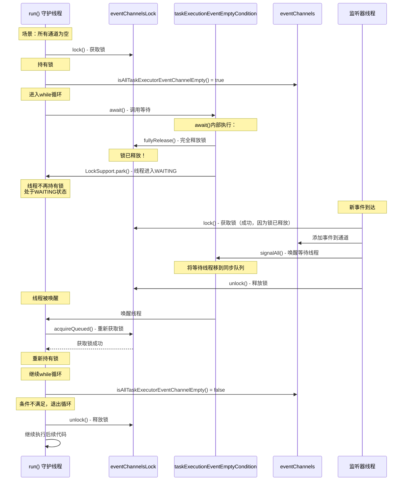
```mermaid
sequenceDiagram
    participant RunThread as run() 守护线程
    participant Lock as eventChannelsLock
    participant Condition as taskExecutionEventEmptyCondition
    participant Channels as eventChannels
    participant ListenerThread as 监听器线程
    
    Note over RunThread: 场景：所有通道为空
    RunThread->>Lock: lock() - 获取锁
    Note over RunThread: 持有锁
    
    RunThread->>Channels: isAllTaskExecutorEventChannelEmpty() = true
    
    Note over RunThread: 进入while循环
    RunThread->>Condition: await() - 调用等待
    Note over Condition: await()内部执行：
    Condition->>Lock: fullyRelease() - 完全释放锁
    Note over Lock: 锁已释放！
    Condition->>RunThread: LockSupport.park() - 线程进入WAITING
    Note over RunThread: 线程不再持有锁<br/>处于WAITING状态
    
    Note over ListenerThread: 新事件到达
    ListenerThread->>Lock: lock() - 获取锁（成功，因为锁已释放）
    ListenerThread->>Channels: 添加事件到通道
    ListenerThread->>Condition: signalAll() - 唤醒等待线程
    Note over Condition: 将等待线程移到同步队列
    ListenerThread->>Lock: unlock() - 释放锁
    
    Note over RunThread: 线程被唤醒
    Condition->>RunThread: 唤醒线程
    RunThread->>Lock: acquireQueued() - 重新获取锁
    Lock-->>RunThread: 获取锁成功
    Note over RunThread: 重新持有锁
    
    Note over RunThread: 继续while循环
    RunThread->>Channels: isAllTaskExecutorEventChannelEmpty() = false
    Note over RunThread: 条件不满足，退出循环
    
    RunThread->>Lock: unlock() - 释放锁
    RunThread->>RunThread: 继续执行后续代码
```

#### 11.13.6 关键理解点

**1. await() 会释放锁**

```java
eventChannelsLock.lock();  // 获取锁
// ... 此时持有锁

taskExecutionEventEmptyCondition.await();  
// ↑ 执行到这里时，锁已经被释放了！
// 线程进入 WAITING 状态，不持有锁

// 当被唤醒后，锁会被重新获取
// 然后继续执行后续代码
```

**2. 唤醒后会重新获取锁**

```java
while (isAllTaskExecutorEventChannelEmpty()) {
    taskExecutionEventEmptyCondition.await();
    // ↑ 从 await() 返回时，锁已经被重新获取了
    // 可以安全地访问共享资源
}
// 退出循环时，仍然持有锁
eventChannelsLock.unlock();  // 释放锁
```

**3. 如果条件一直为 true 会怎样？**

如果 `isAllTaskExecutorEventChannelEmpty()` 一直返回 `true`：

- 线程会**反复进入等待状态**（每次 `await()` 都会释放锁）
- 其他线程可以**正常添加事件**（因为锁被释放了）
- 当有新事件添加时，`signalAll()` 会唤醒线程
- 线程被唤醒后，重新检查条件，如果仍为 `true`，继续等待
- **不会导致死锁**，因为锁在等待时被释放了

#### 11.13.7 对比：如果 await() 不释放锁会怎样？

**假设 await() 不释放锁（实际不会这样）**：

```java
// 错误示例（实际 await() 会释放锁）
eventChannelsLock.lock();
while (isAllTaskExecutorEventChannelEmpty()) {
    taskExecutionEventEmptyCondition.await();  // 假设不释放锁
    // 问题：锁一直被持有，其他线程无法添加事件
    // 结果：死锁！线程永远等待，其他线程永远无法获取锁
}
eventChannelsLock.unlock();
```

**实际情况（await() 会释放锁）**：

```java
// 正确实现
eventChannelsLock.lock();
while (isAllTaskExecutorEventChannelEmpty()) {
    taskExecutionEventEmptyCondition.await();  // 自动释放锁
    // 锁已释放，其他线程可以添加事件
    // 当事件添加后，signalAll() 唤醒线程
    // 线程重新获取锁，检查条件，退出循环
}
eventChannelsLock.unlock();  // 正常执行到这里
```

#### 11.13.8 验证：代码执行路径

**路径1：条件为 true，进入等待**

```
1. lock() - 获取锁 ✓
2. isAllTaskExecutorEventChannelEmpty() = true
3. await() - 进入等待，自动释放锁 ✓
   - 线程进入 WAITING 状态
   - 锁被释放，其他线程可以获取
4. 其他线程添加事件，调用 signalAll()
5. 线程被唤醒，重新获取锁 ✓
   - 在 await() 方法内部，线程被唤醒后会尝试重新获取 eventChannelsLock
   - 重新获取锁的过程发生在 await() 方法返回之前
   - 如果锁被其他线程持有，当前线程会阻塞等待，直到锁可用
6. await() 方法返回，此时线程已经重新持有锁 ✓
7. 重新检查条件，isAllTaskExecutorEventChannelEmpty() = false
8. 退出循环
9. unlock() - 释放锁 ✓
```

**路径2：条件为 false，直接退出**

```
1. lock() - 获取锁 ✓
2. isAllTaskExecutorEventChannelEmpty() = false
3. 不进入 while 循环
4. unlock() - 释放锁 ✓
```

**路径3：条件一直为 true（极端情况）**

```
1. lock() - 获取锁 ✓
2. isAllTaskExecutorEventChannelEmpty() = true
3. await() - 进入等待，自动释放锁 ✓
4. 等待中...（锁已释放，其他线程可以操作）
5. 如果一直没有新事件：
   - 线程一直等待（但锁已释放，不会阻塞其他线程）
   - 当有新事件时，会被唤醒
6. 如果有新事件：
   - signalAll() 唤醒线程
   - 线程重新获取锁
   - 检查条件，退出循环
   - unlock() - 释放锁 ✓
```

#### 11.13.9 总结

**回答用户的问题**：

> 是不是如果 `isAllTaskExecutorEventChannelEmpty=true`，就会一直循环调用 `taskExecutionEventEmptyCondition.await()`，执行不到 `eventChannelsLock.unlock()`，那主线程 run 就一直在等待？

**答案**：

1. **会循环调用 await()**：是的，如果条件一直为 `true`，会反复调用 `await()`
2. **但不会执行不到 unlock()**：`await()` 会**自动释放锁**，当有新事件到达时，线程会被唤醒，条件变为 `false`，退出循环，执行 `unlock()`
3. **不会一直等待导致死锁**：因为 `await()` 释放了锁，其他线程可以添加事件并唤醒等待线程

**关键理解**：
- `await()` **不是阻塞在持有锁的状态**，而是**释放锁后进入等待状态**
- 其他线程可以正常获取锁并添加事件
- 当事件添加后，`signalAll()` 会唤醒等待线程
- 被唤醒的线程会重新获取锁，检查条件，如果条件不满足，退出循环并释放锁

这是 **Condition 机制的核心特性**：等待时释放锁，唤醒时重新获取，确保不会死锁。

#### 11.13.10 "重新获取锁"详细机制解析

**用户问题**：重新获取锁指的是什么、怎么获取锁、在哪里重新获取锁？

##### 11.13.10.1 什么是"重新获取锁"

"重新获取锁"指的是：线程在调用 `await()` 进入等待状态时，锁被自动释放；当线程被 `signalAll()` 唤醒后，在 `await()` 方法返回之前，需要重新获取之前释放的锁。

##### 11.13.10.2 await() 方法的完整执行流程

`Condition.await()` 方法的执行分为三个阶段：

**阶段1：释放锁并进入等待队列**

```java
// 伪代码展示 await() 的内部逻辑
public final void await() throws InterruptedException {
    // 1. 检查中断状态
    if (Thread.interrupted())
        throw new InterruptedException();
    
    // 2. 将当前线程添加到条件等待队列
    Node node = addConditionWaiter();
    
    // 3. 完全释放当前线程持有的锁（包括重入次数）
    int savedState = fullyRelease(node);
    
    // 4. 线程进入 WAITING 状态，等待被唤醒
    //    此时锁已经被释放，其他线程可以获取锁
    LockSupport.park(this);
    
    // 5. 线程被唤醒后，尝试重新获取锁
    //    如果锁被其他线程持有，当前线程会阻塞在这里，直到锁可用
    acquireQueued(node, savedState);
    
    // 6. 重新获取锁成功后，await() 方法返回
    //    此时线程已经重新持有锁，可以安全地访问共享资源
}
```

**阶段2：等待被唤醒**

- 线程在 `LockSupport.park(this)` 处进入 `WAITING` 状态
- 此时锁已经完全释放（`fullyRelease`），其他线程可以获取锁
- 其他线程可以调用 `signalAll()` 唤醒等待的线程

**阶段3：被唤醒后重新获取锁**

- 当 `signalAll()` 被调用时，等待队列中的线程被唤醒
- 线程从 `LockSupport.park(this)` 返回
- 调用 `acquireQueued(node, savedState)` 尝试重新获取锁
- **重新获取锁的过程发生在 `await()` 方法内部，在方法返回之前完成**

##### 11.13.10.3 重新获取锁的具体位置

**在代码中的位置**：

```java
private void tryToWaitIfAllTaskExecutionEventChannelEmpty() throws InterruptedException {
    eventChannelsLock.lock();  // ← 位置1：首次获取锁
    
    try {
        while (isAllTaskExecutorEventChannelEmpty()) {
            taskExecutionEventEmptyCondition.await();
            // ↑ 位置2：await() 方法内部
            //    - 进入 await() 时：释放锁
            //    - 在 await() 内部：被唤醒后重新获取锁（acquireQueued）
            //    - 从 await() 返回时：已经重新持有锁 ✓
            
            // ↑ 位置3：await() 返回后
            //    此时线程已经重新持有锁，可以安全地检查条件
        }
    } finally {
        eventChannelsLock.unlock();  // ← 位置4：释放锁
    }
}
```

**重新获取锁发生在**：
- **位置**：`await()` 方法内部，在方法返回之前
- **时机**：线程被 `signalAll()` 唤醒后，从 `LockSupport.park()` 返回，然后调用 `acquireQueued()` 重新获取锁
- **结果**：当 `await()` 方法返回时，线程已经重新持有锁

##### 11.13.10.4 重新获取锁的详细时序图

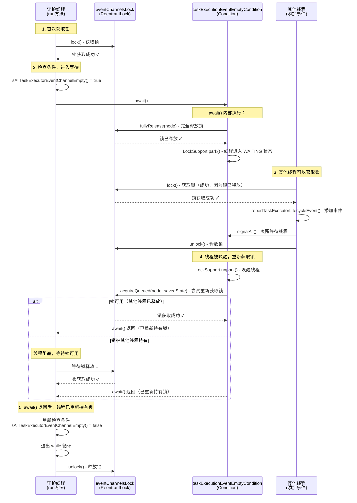
```mermaid
sequenceDiagram
    participant Thread1 as 守护线程<br/>(run方法)
    participant Lock as eventChannelsLock<br/>(ReentrantLock)
    participant Condition as taskExecutionEventEmptyCondition<br/>(Condition)
    participant Thread2 as 其他线程<br/>(添加事件)

    Note over Thread1: 1. 首次获取锁
    Thread1->>Lock: lock() - 获取锁
    Lock-->>Thread1: 锁获取成功 ✓
    
    Note over Thread1: 2. 检查条件，进入等待
    Thread1->>Thread1: isAllTaskExecutorEventChannelEmpty() = true
    Thread1->>Condition: await()
    
    Note over Condition: await() 内部执行：
    Condition->>Lock: fullyRelease(node) - 完全释放锁
    Lock-->>Condition: 锁已释放 ✓
    Condition->>Condition: LockSupport.park() - 线程进入 WAITING 状态
    
    Note over Thread2: 3. 其他线程可以获取锁
    Thread2->>Lock: lock() - 获取锁（成功，因为锁已释放）
    Lock-->>Thread2: 锁获取成功 ✓
    Thread2->>Thread2: reportTaskExecutorLifecycleEvent() - 添加事件
    Thread2->>Condition: signalAll() - 唤醒等待线程
    Thread2->>Lock: unlock() - 释放锁
    
    Note over Condition: 4. 线程被唤醒，重新获取锁
    Condition->>Condition: LockSupport.unpark() - 唤醒线程
    Condition->>Lock: acquireQueued(node, savedState) - 尝试重新获取锁
    
    alt 锁可用（其他线程已释放）
        Lock-->>Condition: 锁获取成功 ✓
        Condition-->>Thread1: await() 返回（已重新持有锁）
    else 锁被其他线程持有
        Note over Thread1: 线程阻塞，等待锁可用
        Thread1->>Lock: 等待锁释放...
        Lock-->>Thread1: 锁获取成功 ✓
        Condition-->>Thread1: await() 返回（已重新持有锁）
    end
    
    Note over Thread1: 5. await() 返回后，线程已重新持有锁
    Thread1->>Thread1: 重新检查条件<br/>isAllTaskExecutorEventChannelEmpty() = false
    Thread1->>Thread1: 退出 while 循环
    Thread1->>Lock: unlock() - 释放锁
```

##### 11.13.10.5 acquireQueued() 方法的作用

`acquireQueued()` 是 `AbstractQueuedSynchronizer` (AQS) 的核心方法，用于在等待队列中获取锁：

```java
// AQS 中的 acquireQueued 方法（简化版）
final boolean acquireQueued(final Node node, int arg) {
    boolean failed = true;
    try {
        boolean interrupted = false;
        for (;;) {  // 自旋循环
            final Node p = node.predecessor();
            // 如果前驱节点是头节点，尝试获取锁
            if (p == head && tryAcquire(arg)) {
                setHead(node);
                p.next = null; // help GC
                failed = false;
                return interrupted;
            }
            // 如果获取锁失败，检查是否需要阻塞
            if (shouldParkAfterFailedAcquire(p, node) &&
                parkAndCheckInterrupt())
                interrupted = true;
        }
    } finally {
        if (failed)
            cancelAcquire(node);
    }
}
```

**执行流程**：
1. **自旋尝试获取锁**：如果锁可用且当前节点是队列中的第一个等待节点，直接获取锁
2. **如果锁不可用**：将线程加入等待队列，并调用 `LockSupport.park()` 阻塞
3. **被唤醒后**：继续自旋尝试获取锁，直到成功

##### 11.13.10.6 重新获取锁可能遇到的阻塞情况

**情况1：锁立即可用**

```
时间线：
1. Thread2 调用 signalAll() 唤醒 Thread1
2. Thread2 释放锁（unlock()）
3. Thread1 的 acquireQueued() 立即获取锁成功
4. await() 立即返回
```

**情况2：锁被其他线程持有**

```
时间线：
1. Thread2 调用 signalAll() 唤醒 Thread1
2. Thread3 正在持有锁执行操作
3. Thread1 的 acquireQueued() 尝试获取锁，但锁被 Thread3 持有
4. Thread1 进入阻塞状态，等待 Thread3 释放锁
5. Thread3 释放锁后，Thread1 获取锁成功
6. await() 返回
```

**关键点**：
- 即使重新获取锁时发生阻塞，也不会导致死锁，因为锁最终会被释放
- 阻塞发生在 `await()` 方法内部，对调用者透明
- 当 `await()` 返回时，线程一定已经重新持有锁

##### 11.13.10.7 完整的状态转换图

```mermaid
stateDiagram-v2
    [*] --> 持有锁: lock()
    持有锁 --> 检查条件: 进入 tryToWaitIfAllTaskExecutionEventChannelEmpty()
    
    检查条件 --> 条件为false: isAllTaskExecutorEventChannelEmpty() = false
    检查条件 --> 条件为true: isAllTaskExecutorEventChannelEmpty() = true
    
    条件为false --> 释放锁: unlock()
    释放锁 --> [*]
    
    条件为true --> 调用await: await()
    调用await --> 释放锁: fullyRelease() - 在 await() 内部
    释放锁 --> WAITING状态: LockSupport.park() - 在 await() 内部
    
    WAITING状态 --> 被唤醒: signalAll()
    被唤醒 --> 尝试重新获取锁: acquireQueued() - 在 await() 内部
    
    尝试重新获取锁 --> 锁立即可用: 锁可用
    尝试重新获取锁 --> 等待锁释放: 锁被其他线程持有
    
    等待锁释放 --> 锁可用: 其他线程释放锁
    锁可用 --> 重新持有锁: 获取锁成功
    锁立即可用 --> 重新持有锁: 获取锁成功
    
    重新持有锁 --> await返回: await() 方法返回
    await返回 --> 重新检查条件: 继续 while 循环
    
    重新检查条件 --> 条件为false: 有新事件，条件变为 false
    重新检查条件 --> 条件为true: 仍无事件，条件仍为 true
    
    条件仍为true --> 调用await: 再次调用 await()
```

##### 11.13.10.8 总结

**"重新获取锁"的含义**：
1. **什么**：线程在 `await()` 等待期间释放了锁，被唤醒后需要重新获取同一个锁
2. **怎么获取**：通过 `acquireQueued()` 方法，在 AQS 的等待队列中排队获取锁
3. **在哪里获取**：在 `await()` 方法内部，在方法返回之前完成，对调用者透明

**关键特性**：
- ✅ **自动释放**：`await()` 会自动释放锁，无需手动调用 `unlock()`
- ✅ **自动重新获取**：`await()` 返回前会自动重新获取锁，无需手动调用 `lock()`
- ✅ **线程安全**：当 `await()` 返回时，线程一定已经重新持有锁
- ✅ **不会死锁**：即使重新获取锁时发生阻塞，锁最终会被释放，不会导致死锁

**代码位置**：
- 重新获取锁发生在：[`TaskExecutorLifecycleEventRemoteReporter.java:535`](dolphinscheduler-task-executor/src/main/java/org/apache/dolphinscheduler/task/executor/eventbus/TaskExecutorLifecycleEventRemoteReporter.java:535) 的 `await()` 方法内部
- 调用位置：[`TaskExecutorLifecycleEventRemoteReporter.java:532-541`](dolphinscheduler-task-executor/src/main/java/org/apache/dolphinscheduler/task/executor/eventbus/TaskExecutorLifecycleEventRemoteReporter.java:532-541)