# Worker 服务任务执行完整流程汇总

## 1. 概述

本文档详细描述了从 Master 通过 RPC 请求 Worker 执行任务开始，到 Worker 端最终执行任务（以 SQL 任务为例）的完整执行流程。

**流程范围**：
- Master RPC 请求 → Worker RPC 接收
- 任务执行器创建 → 任务引擎提交
- 任务容器分发 → 任务执行器启动
- 事件总线协调 → 事件报告处理
- 任务插件初始化 → 任务实际执行（SQL 任务）

**关键组件**：
- `PhysicalTaskExecutorOperatorImpl`: Worker 端 RPC 服务实现
- `PhysicalTaskEngineDelegator`: 任务引擎委托器
- `TaskEngine`: 任务引擎核心
- `ExclusiveThreadTaskExecutorContainer`: 独占线程任务容器
- `TaskExecutorWorker`: 任务执行工作线程
- `PhysicalTaskExecutor`: 物理任务执行器
- `TaskExecutorEventBusCoordinator`: 事件总线协调器
- `PhysicalTaskExecutorLifecycleEventReporter`: 事件报告器
- `SqlTask`: SQL 任务插件

## 2. 任务执行器生命周期事件转换详细分析

### 2.1 概述

在 Worker 执行任务的过程中，任务执行器会发布一系列生命周期事件，这些事件都继承自 `AbstractTaskExecutorLifecycleEvent`。本文档详细分析了这 10 个事件的转换流程、发布时机、处理机制以及它们之间的关系。

**10 个生命周期事件**：
1. **TaskExecutorDispatchedLifecycleEvent** (DISPATCHED) - 任务已分发
2. **TaskExecutorStartedLifecycleEvent** (RUNNING) - 任务已启动
3. **TaskExecutorRuntimeContextChangedLifecycleEvent** (RUNTIME_CONTEXT_CHANGE) - 运行时上下文变更
4. **TaskExecutorPauseLifecycleEvent** (PAUSE) - 暂停操作请求
5. **TaskExecutorPausedLifecycleEvent** (PAUSED) - 任务已暂停
6. **TaskExecutorKillLifecycleEvent** (KILL) - 终止操作请求
7. **TaskExecutorKilledLifecycleEvent** (KILLED) - 任务已终止
8. **TaskExecutorSuccessLifecycleEvent** (SUCCESS) - 任务成功完成
9. **TaskExecutorFailedLifecycleEvent** (FAILED) - 任务执行失败
10. **TaskExecutorFinalizeLifecycleEvent** (FINALIZE) - 任务最终化

**事件分类**：
- **可报告事件** (`IReportableTaskExecutorLifecycleEvent`): DISPATCHED, RUNNING, RUNTIME_CONTEXT_CHANGE, PAUSED, KILLED, SUCCESS, FAILED
- **操作事件** (`IOperableTaskExecutorLifecycleEvent`): PAUSE, KILL
- **内部事件**: FINALIZE

### 2.2 事件转换完整时序图

**重要说明**：
- **事件报告是异步的**：Worker 向 Master 报告事件不会阻塞任务执行，任务会继续执行
- **ACK 的作用**：
  1. **确认事件已收到**：Master 确认已收到并处理了事件
  2. **清理事件队列**：Worker 收到 ACK 后，从 `eventChannels` 中移除事件，避免重复发送
  3. **重试机制**：如果没有收到 ACK，事件会保留在队列中，等待重试（默认3分钟）
  4. **不影响任务执行**：任务执行不依赖于 ACK，即使没有收到 ACK，任务也会继续执行
- **并行执行**：任务执行和事件报告是并行进行的，互不影响

```mermaid
sequenceDiagram
    participant TE as TaskEngine
    participant TEB as TaskExecutorEventBus
    participant PTE as PhysicalTaskExecutor
    participant TEW as TaskExecutorWorker
    participant TEC as TaskExecutorEventBusCoordinator
    participant Listener as PhysicalTaskExecutorLifecycleEventListener
    participant PER as PhysicalTaskExecutorLifecycleEventReporter
    participant Master as Master
    participant MasterHandler as TaskDispatchedLifecycleEventHandler

    Note over TE: 1. 任务提交阶段
    TE->>TEB: publish(TaskExecutorDispatchedLifecycleEvent)
    TEB->>TEB: eventQueue.offer(DISPATCHED)
    
    Note over TEC: 2. 事件总线协调器处理（定时轮询，每10秒）
    Note over TEC: 【异步处理，不阻塞任务执行】
    TEC->>TEB: poll() 取出 DISPATCHED 事件
    TEC->>Listener: handle(DISPATCHED)
    Listener->>PER: reportTaskExecutorLifecycleEvent(DISPATCHED)
    PER->>PER: 添加到 eventChannels<br/>（事件保留在队列中，等待发送）
    
    Note over PER,Master: 【事件报告是异步的，不阻塞任务执行】
    PER->>Master: RPC reportTaskExecutionEventToMaster(DISPATCHED)<br/>【异步发送，立即返回】
    
    Note over Master: Master 端处理事件（异步）
    Master->>MasterHandler: handle(TaskDispatchedLifecycleEvent)
    MasterHandler->>MasterHandler: taskStateAction.dispatchedEventAction()<br/>更新任务状态为 DISPATCH
    MasterHandler->>Master: taskExecutorClient.ackTaskExecutorLifecycleEvent()<br/>发送 ACK
    Master-->>PER: RPC ACK (异步返回)<br/>【ACK 可能延迟到达，不影响任务执行】
    
    Note over PER: Worker 收到 ACK 后处理
    PER->>PER: receiveTaskExecutorLifecycleEventACK(ack)
    PER->>PER: eventChannel.remove(DISPATCHED)<br/>【从队列中移除事件，避免重复发送】
    
    Note over PTE: 3. 任务启动阶段
    Note over PTE: 【任务执行不等待 ACK，继续执行】
    TEW->>PTE: start()
    PTE->>PTE: initializeTaskContext()
    PTE->>PTE: publishTaskRunningEvent()
    PTE->>PTE: transitTaskExecutorState(RUNNING)
    PTE->>TEB: publish(TaskExecutorStartedLifecycleEvent)
    TEB->>TEB: eventQueue.offer(RUNNING)
    
    Note over TEC: 4. 事件总线协调器处理 RUNNING 事件
    Note over TEC: 【异步处理，不阻塞任务执行】
    TEC->>TEB: poll() 取出 RUNNING 事件
    TEC->>Listener: handle(RUNNING)
    Listener->>PER: reportTaskExecutorLifecycleEvent(RUNNING)
    PER->>PER: 添加到 eventChannels<br/>（事件保留在队列中，等待发送）
    
    Note over PER,Master: 【事件报告是异步的，不阻塞任务执行】
    PER->>Master: RPC reportTaskExecutionEventToMaster(RUNNING)<br/>【异步发送，立即返回】
    
    Note over Master: Master 端处理事件（异步）
    Master->>MasterHandler: handle(TaskRunningLifecycleEvent)
    MasterHandler->>MasterHandler: taskStateAction.runningEventAction()<br/>更新任务状态为 RUNNING
    MasterHandler->>Master: taskExecutorClient.ackTaskExecutorLifecycleEvent()<br/>发送 ACK
    Master-->>PER: RPC ACK (异步返回)<br/>【ACK 可能延迟到达，不影响任务执行】
    
    Note over PER: Worker 收到 ACK 后处理
    PER->>PER: receiveTaskExecutorLifecycleEventACK(ack)
    PER->>PER: eventChannel.remove(RUNNING)<br/>【从队列中移除事件，避免重复发送】
    
    Note over PTE: 5. 任务执行阶段（可能多次发布）
    Note over PTE: 【任务执行和事件报告并行进行】
    PTE->>PTE: doTriggerTaskPlugin()
    PTE->>PhysicalTask: handle(TaskCallBack)
    
    par 任务执行（主流程）
        PhysicalTask->>PhysicalTask: 执行实际业务逻辑<br/>（如执行 SQL）
    and 事件报告（异步，不阻塞）
        alt 更新远程应用信息
            PhysicalTask->>PTE: updateRemoteApplicationInfo(appIds)
            PTE->>PTE: taskExecutionContext.setAppIds(appIds)
            PTE->>TEB: publish(TaskExecutorRuntimeContextChangedLifecycleEvent)
            TEB->>TEB: eventQueue.offer(RUNTIME_CONTEXT_CHANGE)
            
            Note over TEC: 处理 RUNTIME_CONTEXT_CHANGE 事件（异步）
            TEC->>TEB: poll() 取出 RUNTIME_CONTEXT_CHANGE 事件
            TEC->>Listener: handle(RUNTIME_CONTEXT_CHANGE)
            Listener->>PER: reportTaskExecutorLifecycleEvent(RUNTIME_CONTEXT_CHANGE)
            PER->>PER: 添加到 eventChannels
            PER->>Master: RPC 报告 RUNTIME_CONTEXT_CHANGE 事件<br/>【异步发送，立即返回】
            
            Note over Master: Master 处理事件并发送 ACK（异步）
            Master->>MasterHandler: handle(TaskRuntimeContextChangedLifecycleEvent)
            MasterHandler->>Master: taskExecutorClient.ackTaskExecutorLifecycleEvent()
            Master-->>PER: RPC ACK (异步返回)
            PER->>PER: receiveTaskExecutorLifecycleEventACK(ack)
            PER->>PER: eventChannel.remove(RUNTIME_CONTEXT_CHANGE)
        end
        
        alt 更新任务实例信息
            PhysicalTask->>PTE: updateTaskInstanceInfo()
            PTE->>TEB: publish(TaskExecutorRuntimeContextChangedLifecycleEvent)
            TEB->>TEB: eventQueue.offer(RUNTIME_CONTEXT_CHANGE)
            
            Note over TEC: 处理 RUNTIME_CONTEXT_CHANGE 事件（异步）
            TEC->>TEB: poll() 取出 RUNTIME_CONTEXT_CHANGE 事件
            TEC->>Listener: handle(RUNTIME_CONTEXT_CHANGE)
            Listener->>PER: reportTaskExecutorLifecycleEvent(RUNTIME_CONTEXT_CHANGE)
            PER->>PER: 添加到 eventChannels
            PER->>Master: RPC 报告 RUNTIME_CONTEXT_CHANGE 事件<br/>【异步发送，立即返回】
            
            Note over Master: Master 处理事件并发送 ACK（异步）
            Master->>MasterHandler: handle(TaskRuntimeContextChangedLifecycleEvent)
            MasterHandler->>Master: taskExecutorClient.ackTaskExecutorLifecycleEvent()
            Master-->>PER: RPC ACK (异步返回)
            PER->>PER: receiveTaskExecutorLifecycleEventACK(ack)
            PER->>PER: eventChannel.remove(RUNTIME_CONTEXT_CHANGE)
        end
    end
    
    Note over TEW: 6. 状态跟踪阶段（定时轮询）
    loop 每10秒跟踪一次
        TEW->>PTE: trackTaskExecutorState()
        PTE->>PTE: doTrackTaskPluginStatus()
        PTE-->>TEW: TaskExecutorState
    end
    
    Note over TEW: 7. 任务完成阶段（根据状态发布不同事件）
    alt 任务成功
        TEW->>TEW: onTaskExecutorSuccess()
        TEW->>PTE: taskExecutionContext.setEndTime()
        TEW->>TEB: publish(TaskExecutorSuccessLifecycleEvent)
        TEB->>TEB: eventQueue.offer(SUCCESS)
        
        Note over TEC: 处理 SUCCESS 事件（异步）
        TEC->>TEB: poll() 取出 SUCCESS 事件
        TEC->>Listener: handle(SUCCESS)
        Listener->>PER: reportTaskExecutorLifecycleEvent(SUCCESS)
        PER->>PER: 添加到 eventChannels
        PER->>Master: RPC 报告 SUCCESS 事件<br/>【异步发送，立即返回】
        
        Note over Master: Master 处理事件并发送 ACK（异步）
        Master->>MasterHandler: handle(TaskSuccessLifecycleEvent)
        MasterHandler->>MasterHandler: taskStateAction.successEventAction()<br/>更新任务状态为 SUCCESS
        MasterHandler->>Master: taskExecutorClient.ackTaskExecutorLifecycleEvent()
        Master-->>PER: RPC ACK (异步返回)
        PER->>PER: receiveTaskExecutorLifecycleEventACK(ack)
        PER->>PER: eventChannel.remove(SUCCESS)
        
        TEW->>TEW: onTaskExecutorFinished()
        TEW->>TEB: publish(TaskExecutorFinalizeLifecycleEvent)
        TEB->>TEB: eventQueue.offer(FINALIZE)
        
    else 任务失败
        TEW->>TEW: onTaskExecutorFailed()
        TEW->>PTE: taskExecutionContext.setEndTime()
        TEW->>TEB: publish(TaskExecutorFailedLifecycleEvent)
        TEB->>TEB: eventQueue.offer(FAILED)
        
        Note over TEC: 处理 FAILED 事件（异步）
        TEC->>TEB: poll() 取出 FAILED 事件
        TEC->>Listener: handle(FAILED)
        Listener->>PER: reportTaskExecutorLifecycleEvent(FAILED)
        PER->>PER: 添加到 eventChannels
        PER->>Master: RPC 报告 FAILED 事件<br/>【异步发送，立即返回】
        
        Note over Master: Master 处理事件并发送 ACK（异步）
        Master->>MasterHandler: handle(TaskFailedLifecycleEvent)
        MasterHandler->>MasterHandler: taskStateAction.failedEventAction()<br/>更新任务状态为 FAILED
        MasterHandler->>Master: taskExecutorClient.ackTaskExecutorLifecycleEvent()
        Master-->>PER: RPC ACK (异步返回)
        PER->>PER: receiveTaskExecutorLifecycleEventACK(ack)
        PER->>PER: eventChannel.remove(FAILED)
        
        TEW->>TEW: onTaskExecutorFinished()
        TEW->>TEB: publish(TaskExecutorFinalizeLifecycleEvent)
        TEB->>TEB: eventQueue.offer(FINALIZE)
        
    else 任务被终止
        TEW->>TEW: onTaskExecutorKilled()
        TEW->>PTE: taskExecutionContext.setEndTime()
        TEW->>TEB: publish(TaskExecutorKilledLifecycleEvent)
        TEB->>TEB: eventQueue.offer(KILLED)
        
        Note over TEC: 处理 KILLED 事件（异步）
        TEC->>TEB: poll() 取出 KILLED 事件
        TEC->>Listener: handle(KILLED)
        Listener->>PER: reportTaskExecutorLifecycleEvent(KILLED)
        PER->>PER: 添加到 eventChannels
        PER->>Master: RPC 报告 KILLED 事件<br/>【异步发送，立即返回】
        
        Note over Master: Master 处理事件并发送 ACK（异步）
        Master->>MasterHandler: handle(TaskKilledLifecycleEvent)
        MasterHandler->>MasterHandler: taskStateAction.killedEventAction()<br/>更新任务状态为 KILLED
        MasterHandler->>Master: taskExecutorClient.ackTaskExecutorLifecycleEvent()
        Master-->>PER: RPC ACK (异步返回)
        PER->>PER: receiveTaskExecutorLifecycleEventACK(ack)
        PER->>PER: eventChannel.remove(KILLED)
        
        TEW->>TEW: onTaskExecutorFinished()
        TEW->>TEB: publish(TaskExecutorFinalizeLifecycleEvent)
        TEB->>TEB: eventQueue.offer(FINALIZE)
        
    else 任务被暂停
        TEW->>TEW: onTaskExecutorPaused()
        TEW->>PTE: taskExecutionContext.setEndTime()
        TEW->>TEB: publish(TaskExecutorPausedLifecycleEvent)
        TEB->>TEB: eventQueue.offer(PAUSED)
        
        Note over TEC: 处理 PAUSED 事件（异步）
        TEC->>TEB: poll() 取出 PAUSED 事件
        TEC->>Listener: handle(PAUSED)
        Listener->>PER: reportTaskExecutorLifecycleEvent(PAUSED)
        PER->>PER: 添加到 eventChannels
        PER->>Master: RPC 报告 PAUSED 事件<br/>【异步发送，立即返回】
        
        Note over Master: Master 处理事件并发送 ACK（异步）
        Master->>MasterHandler: handle(TaskPausedLifecycleEvent)
        MasterHandler->>MasterHandler: taskStateAction.pausedEventAction()<br/>更新任务状态为 PAUSED
        MasterHandler->>Master: taskExecutorClient.ackTaskExecutorLifecycleEvent()
        Master-->>PER: RPC ACK (异步返回)
        PER->>PER: receiveTaskExecutorLifecycleEventACK(ack)
        PER->>PER: eventChannel.remove(PAUSED)
        
        TEW->>TEW: onTaskExecutorFinished()
        TEW->>TEB: publish(TaskExecutorFinalizeLifecycleEvent)
        TEB->>TEB: eventQueue.offer(FINALIZE)
    end
    
    Note over PER: 【重要】如果没有收到 ACK 的处理机制
    Note over PER: 1. 事件保留在 eventChannels 中
    Note over PER: 2. 事件报告器会定期重试（默认3分钟间隔）
    Note over PER: 3. 重试不会影响任务执行，任务已继续执行或已完成
    Note over PER: 4. 只有当收到 ACK 后，事件才会从队列中移除
    
    Note over TEB,PER: 【⚠️ 事件丢失风险】
    Note over TEB,PER: 1. TaskExecutorEventBus 使用 DelayQueue（内存存储）
    Note over TEB,PER: 2. eventChannels 使用 ConcurrentHashMap（内存存储）
    Note over TEB,PER: 3. Worker 重启会导致内存中的事件全部丢失
    Note over TEB,PER: 4. 如果 Master 和 Worker 同时故障，可能导致状态不一致
    Note over TEB,PER: 5. Master 恢复后会从数据库恢复状态，但可能不是最新状态
    
    Note over Master: 【Master 端状态持久化】
    Note over Master: 1. Master 收到事件后，立即更新数据库状态
    Note over Master: 2. 例如：dispatchedEventAction() → taskInstanceDao.updateById()
    Note over Master: 3. 但如果 Master 在收到事件后、更新数据库前挂了，状态不会更新
    Note over Master: 4. Master 恢复后会从数据库恢复状态，可能触发故障转移
    
    Note over TE: 8. 外部操作事件（Master 请求）
    alt Master 请求暂停任务
        Master->>TE: pauseTask(taskInstanceId)
        TE->>TEB: publish(TaskExecutorPauseLifecycleEvent)
        TEB->>TEB: eventQueue.offer(PAUSE)
        
        Note over TEC: 处理 PAUSE 事件
        TEC->>TEB: poll() 取出 PAUSE 事件
        TEC->>Listener: handle(PAUSE)
        Listener->>PTE: pause()
        Note over PTE: PhysicalTaskExecutor 不支持暂停<br/>状态会通过 trackTaskExecutorState() 检测到 PAUSED
    end
    
    alt Master 请求终止任务
        Master->>TE: killTask(taskInstanceId)
        TE->>TEB: publish(TaskExecutorKillLifecycleEvent)
        TEB->>TEB: eventQueue.offer(KILL)
        
        Note over TEC: 处理 KILL 事件
        TEC->>TEB: poll() 取出 KILL 事件
        TEC->>Listener: handle(KILL)
        Listener->>PTE: kill()
        PTE->>PhysicalTask: cancel()
        Note over PTE: 状态会通过 trackTaskExecutorState() 检测到 KILLED
    end
```

### 2.2.1 事件报告与 ACK 机制详细说明

#### 2.2.1.1 为什么任务执行不等待 ACK？

**核心原因**：任务执行和事件报告是**完全解耦**的两个流程，它们并行执行，互不影响。

**设计原理**：
1. **异步非阻塞**：事件报告是异步的，Worker 发送事件后立即返回，不会阻塞任务执行
2. **最终一致性**：通过重试机制确保事件最终能够被 Master 接收，而不是通过阻塞等待
3. **性能优化**：如果等待 ACK，会导致任务执行被阻塞，影响系统吞吐量
4. **容错能力**：即使 Master 暂时不可用，任务也能继续执行，事件会在 Master 恢复后重试

#### 2.2.1.2 ACK 的作用是什么？

**ACK 的核心作用**：

1. **确认事件已收到并处理**
   - Master 收到事件后，会更新任务状态（如 DISPATCH → RUNNING → SUCCESS）
   - 发送 ACK 表示 Master 已经成功处理了该事件
   - 确保 Master 端的状态与 Worker 端的事件保持一致

2. **清理事件队列，避免重复发送**
   - Worker 收到 ACK 后，从 `eventChannels` 中移除对应事件
   - 如果没有收到 ACK，事件会保留在队列中，等待重试（默认3分钟间隔）
   - 避免因网络问题导致的事件丢失

3. **实现最终一致性**
   - 通过重试机制，确保事件最终能够被 Master 接收
   - 即使 Master 暂时不可用，事件也会在 Master 恢复后重试
   - 保证 Master 端能够最终获得任务的所有状态变化

4. **不影响任务执行**
   - **重要**：ACK 的延迟或丢失不会影响任务执行
   - 任务会继续执行，即使没有收到 ACK
   - 这是**最终一致性**而非**强一致性**的设计

#### 2.2.1.3 如果没有收到 ACK 会怎样？

**场景**：Worker 发送事件后，Master 没有返回 ACK（可能原因：网络问题、Master 处理慢、Master 故障等）

**处理机制**：

1. **事件保留在队列中**
   - 事件会保留在 `eventChannels` 中，不会被移除
   - 使用 `peek()` 查看事件，而不是 `poll()` 移除事件

2. **定期重试**
   - 事件报告器会定期检查所有事件通道
   - 如果事件的重试间隔已到（默认3分钟），会重新发送事件
   - 重试间隔通过 `latestReportTime` 和当前时间计算

3. **任务继续执行**
   - **关键**：任务执行不受影响，会继续执行或已完成
   - 即使没有收到 ACK，任务也会正常完成
   - 事件报告和任务执行是完全独立的流程

4. **最终一致性**
   - 当 Master 恢复或网络恢复后，事件会被重新发送
   - Master 最终会收到所有事件，实现最终一致性

#### 2.2.1.4 事件报告流程示例

**正常流程**：
```
1. Worker 发布事件 → 事件进入 eventChannels
2. 事件报告器发送事件到 Master（异步，立即返回）
3. Master 处理事件，更新任务状态
4. Master 发送 ACK（异步）
5. Worker 收到 ACK，从 eventChannels 移除事件
```

**异常流程（没有收到 ACK）**：
```
1. Worker 发布事件 → 事件进入 eventChannels
2. 事件报告器发送事件到 Master（异步，立即返回）
3. Master 处理事件，但 ACK 丢失或延迟
4. Worker 没有收到 ACK，事件保留在 eventChannels 中
5. 3分钟后，事件报告器重新发送事件（重试）
6. Master 收到重试事件，再次处理并发送 ACK
7. Worker 收到 ACK，从 eventChannels 移除事件
```

**关键点**：
- 任务执行不等待步骤 2-7，会继续执行
- 即使步骤 2-7 失败，任务也会正常完成
- 重试机制确保事件最终能够被 Master 接收

#### 2.2.1.5 为什么使用最终一致性而不是强一致性？

**最终一致性的优势**：

1. **性能**：不阻塞任务执行，提高系统吞吐量
2. **容错**：即使 Master 暂时不可用，任务也能继续执行
3. **可扩展性**：Worker 和 Master 可以独立扩展，不受对方性能影响
4. **用户体验**：任务执行不会被网络延迟或 Master 处理速度影响

**强一致性的劣势**：

1. **性能**：需要等待 ACK，会阻塞任务执行
2. **容错**：如果 Master 不可用，任务无法执行
3. **可扩展性**：Worker 和 Master 必须同步，难以独立扩展
4. **用户体验**：任务执行会被网络延迟或 Master 处理速度影响

**设计权衡**：
- 对于任务执行这种**关键路径**，使用**最终一致性**更合适
- 对于状态同步这种**非关键路径**，使用**最终一致性**可以接受
- 通过重试机制，确保事件最终能够被 Master 接收

#### 2.2.1.6 事件丢失与最终一致性问题分析

**问题场景**：用户提出了一个重要的容错问题

**场景1：Worker 重启导致事件丢失**

```
时间线：
T1: Worker 发布 DISPATCHED 事件 → 事件进入 TaskExecutorEventBus (内存队列)
T2: Worker 发布 RUNNING 事件 → 事件进入 TaskExecutorEventBus (内存队列)
T3: Worker 重启 → 内存中的事件全部丢失
T4: Worker 恢复后，事件报告器重新启动，但之前的事件已丢失
```

**问题**：
- `TaskExecutorEventBus` 使用 `DelayQueue`，存储在内存中
- `eventChannels` 使用 `ConcurrentHashMap`，存储在内存中
- Worker 重启会导致这些内存中的事件全部丢失

**场景2：Master 和 Worker 同时故障导致状态不一致**

```
时间线：
T1: Worker 任务已执行，发布 DISPATCHED 事件
T2: Worker 发送事件到 Master（RPC 调用）
T3: Master 收到事件，但处理前 Master 挂了 → 数据库状态未更新（仍为 SUBMITTED_SUCCESS）
T4: Worker 继续执行任务，任务完成，发布 SUCCESS 事件
T5: Worker 发送 SUCCESS 事件到 Master，但 Master 已挂 → 事件未收到
T6: Worker 执行完任务后也挂了
T7: Master 恢复，从数据库恢复状态 → 状态为 SUBMITTED_SUCCESS 或 DISPATCH
T8: 但任务实际已执行完成 → 状态不一致！
```

**问题分析**：

1. **事件存储在内存中**：
   - `TaskExecutorEventBus.eventQueue` (DelayQueue) - 内存存储
   - `eventChannels` (ConcurrentHashMap) - 内存存储
   - Worker 重启会丢失所有未处理的事件

2. **Master 端状态持久化**：
   - Master 收到事件后，会更新数据库中的 `TaskInstance` 状态
   - 例如：`dispatchedEventAction()` → `taskInstance.setState(DISPATCH)` → `taskInstanceDao.updateById(taskInstance)`
   - 但如果 Master 在收到事件后、更新数据库前挂了，状态不会更新

3. **不一致场景**：
   - Worker 任务已执行完成，但 Master 数据库状态仍为 DISPATCH 或 RUNNING
   - Master 恢复后，会认为任务仍在执行，可能触发故障转移或重试

**现有容错机制**：

1. **Master 故障恢复**：
   - Master 启动时会执行全局故障转移（`globalMasterFailover`）
   - 查询数据库中所有未完成的工作流和任务
   - 检查 Worker 是否存活，如果 Worker 不存活，触发故障转移
   - 从数据库恢复任务状态，重建 `TaskExecutionRunnable`

2. **Worker 故障检测**：
   - Master 通过心跳机制检测 Worker 是否存活
   - 如果 Worker 不存活，会触发故障转移
   - 将任务状态标记为 `NEED_FAULT_TOLERANCE`，创建新的任务实例重试

3. **状态持久化时机**：
   - Master 收到事件后，**立即**更新数据库状态
   - 例如：`TaskDispatchedLifecycleEventHandler.handle()` → `dispatchedEventAction()` → `taskInstanceDao.updateById()`
   - 这确保了即使 Master 在处理事件过程中挂了，状态也可能已经更新

**但仍存在的问题**：

1. **事件发送和数据库更新的时间窗口**：
   - Worker 发送事件 → Master 收到事件 → Master 更新数据库
   - 如果 Master 在收到事件后、更新数据库前挂了，状态不会更新
   - 如果 Worker 在发送事件后、Master 收到前挂了，事件会丢失

2. **任务完成但 Master 未收到事件**：
   - Worker 任务已执行完成，但 Master 未收到 SUCCESS 事件
   - Master 数据库状态仍为 DISPATCH 或 RUNNING
   - Master 恢复后，会认为任务仍在执行，可能触发故障转移

**可能的解决方案**：

1. **事件持久化**（未实现）：
   - 将事件持久化到磁盘或数据库
   - Worker 重启后可以从持久化存储恢复事件
   - 但会增加系统复杂度和性能开销

2. **定期状态同步**（部分实现）：
   - Master 定期查询 Worker 的任务状态
   - 如果发现状态不一致，进行修复
   - 当前系统通过心跳和故障转移机制部分实现

3. **任务状态查询机制**（部分实现）：
   - Master 可以主动查询 Worker 的任务执行状态
   - 如果发现任务已完成但数据库状态未更新，进行修复
   - 当前系统通过 `trackTaskExecutorState()` 机制部分实现

4. **日志和监控**（已实现）：
   - 通过日志记录所有事件和状态变化
   - 通过监控发现状态不一致
   - 运维人员可以手动修复

**当前设计的权衡**：

- **性能优先**：事件存储在内存中，保证高性能
- **最终一致性**：通过重试机制和故障转移，尽可能保证最终一致性
- **可接受的数据丢失**：在极端情况下（Master 和 Worker 同时故障），可能存在少量状态不一致
- **运维修复**：通过日志和监控，运维人员可以发现并修复不一致

**实际影响**：

- **常见场景**：Master 或 Worker 单独故障，通过故障转移机制可以恢复
- **极端场景**：Master 和 Worker 同时故障，且时间窗口恰好，可能导致状态不一致
- **影响范围**：通常只影响少量任务，可以通过监控和运维手段发现并修复

#### 2.2.1.7 事件丢失与状态不一致问题场景图

**场景1：Worker 重启导致事件丢失**

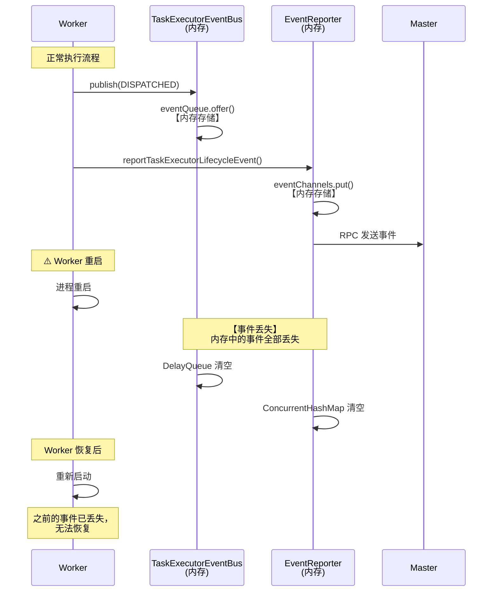

**场景2：Master 和 Worker 同时故障导致状态不一致**

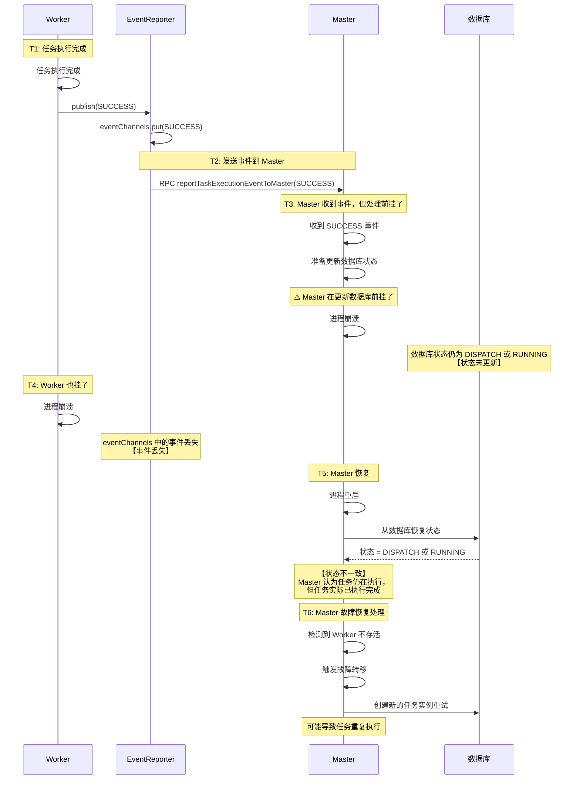

**场景3：Master 收到事件但更新数据库前故障**

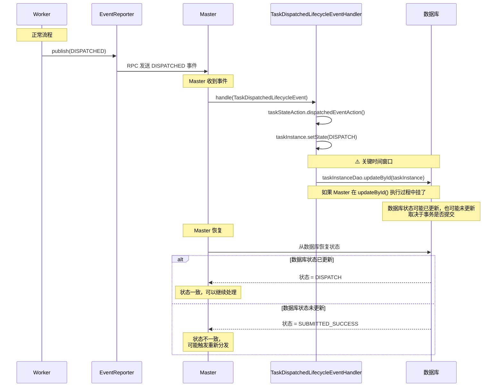

**场景4：事件存储位置与持久化对比**

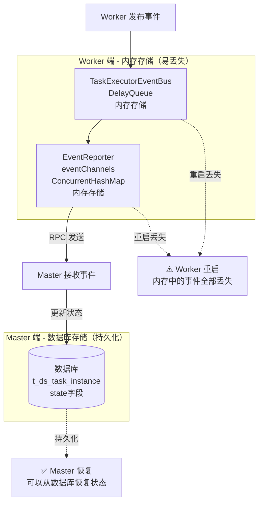

**关键代码位置**：

- **事件存储（内存）**：
  - `TaskExecutorEventBus`: [TaskExecutorEventBus.java](../../../../dolphinscheduler-task-executor/src/main/java/org/apache/dolphinscheduler/task/executor/eventbus/TaskExecutorEventBus.java)
  - `TaskExecutorLifecycleEventRemoteReporter.eventChannels`: [TaskExecutorLifecycleEventRemoteReporter.java:49-50](../../../../dolphinscheduler-task-executor/src/main/java/org/apache/dolphinscheduler/task/executor/eventbus/TaskExecutorLifecycleEventRemoteReporter.java#L49-L50)

- **状态持久化（数据库）**：
  - `AbstractTaskStateAction.dispatchedEventAction()`: [AbstractTaskStateAction.java:97-104](../../../../dolphinscheduler-master/src/main/java/org/apache/dolphinscheduler/server/master/engine/task/statemachine/AbstractTaskStateAction.java#L97-L104)
  - `AbstractTaskStateAction.persistentTaskInstanceStartedEventToDB()`: [AbstractTaskStateAction.java:117-124](../../../../dolphinscheduler-master/src/main/java/org/apache/dolphinscheduler/server/master/engine/task/statemachine/AbstractTaskStateAction.java#L117-L124)
  - `AbstractTaskStateAction.persistentTaskInstanceSuccessEventToDB()`: [AbstractTaskStateAction.java:211-218](../../../../dolphinscheduler-master/src/main/java/org/apache/dolphinscheduler/server/master/engine/task/statemachine/AbstractTaskStateAction.java#L211-L218)

- **故障恢复机制**：
  - `FailoverCoordinator.globalMasterFailover()`: [FailoverCoordinator.java:112-147](../../../../dolphinscheduler-master/src/main/java/org/apache/dolphinscheduler/server/master/failover/FailoverCoordinator.java#L112-L147)
  - `WorkflowFailover.failoverWorkflow()`: [WorkflowFailover.java:45-68](../../../../dolphinscheduler-master/src/main/java/org/apache/dolphinscheduler/server/master/failover/WorkflowFailover.java#L45-L68)

### 2.3 事件状态转换图

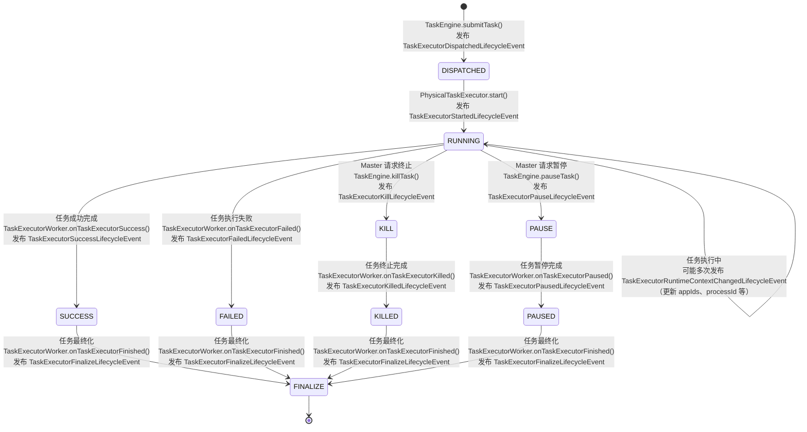

### 2.4 事件发布位置详细分析

#### 2.4.1 DISPATCHED 事件

**发布位置**: `TaskEngine.submitTask()` [TaskEngine.java:79](../../../../dolphinscheduler-task-executor/src/main/java/org/apache/dolphinscheduler/task/executor/TaskEngine.java#L79)

**触发时机**: 任务执行器提交到任务引擎后，分发到容器并存储到仓库后

**事件内容**:
- `taskInstanceId`: 任务实例ID
- `workflowInstanceId`: 工作流实例ID
- `taskInstanceHost`: 任务实例主机
- `workflowInstanceHost`: 工作流实例主机

**代码**:
```java
taskExecutor.getTaskExecutorEventBus().publish(TaskExecutorDispatchedLifecycleEvent.of(taskExecutor));
```

#### 2.4.2 RUNNING 事件

**发布位置**: `AbstractTaskExecutor.publishTaskRunningEvent()` [AbstractTaskExecutor.java:133-136](../../../../dolphinscheduler-task-executor/src/main/java/org/apache/dolphinscheduler/task/executor/AbstractTaskExecutor.java#L133-L136)

**触发时机**: 任务执行器启动时，初始化任务上下文后

**事件内容**:
- `taskInstanceId`: 任务实例ID
- `workflowInstanceId`: 工作流实例ID
- `taskInstanceHost`: 任务实例主机
- `workflowInstanceHost`: 工作流实例主机
- `startTime`: 开始时间
- `logPath`: 日志路径
- `executePath`: 执行路径

**代码**:
```java
private void publishTaskRunningEvent() {
    transitTaskExecutorState(TaskExecutorState.RUNNING);
    taskExecutorEventBus.publish(TaskExecutorStartedLifecycleEvent.of(this));
}
```

#### 2.4.3 RUNTIME_CONTEXT_CHANGE 事件

**发布位置**: `PhysicalTaskExecutor.doTriggerTaskPlugin()` 中的 `TaskCallBack` [PhysicalTaskExecutor.java:80,85](../../../src/main/java/org/apache/dolphinscheduler/server/worker/executor/PhysicalTaskExecutor.java#L80-L85)

**触发时机**: 任务执行过程中，运行时上下文发生变化时（如更新 appIds、processId 等）

**事件内容**:
- `taskInstanceId`: 任务实例ID
- `workflowInstanceId`: 工作流实例ID
- `taskInstanceHost`: 任务实例主机
- `workflowInstanceHost`: 工作流实例主机
- `appIds`: 应用ID（如 Yarn ApplicationId）
- `processId`: 进程ID（已废弃）

**代码**:
```java
physicalTask.handle(new TaskCallBack() {
    @Override
    public void updateRemoteApplicationInfo(final int taskInstanceId, final ApplicationInfo applicationInfo) {
        taskExecutionContext.setAppIds(applicationInfo.getAppIds());
        taskExecutorEventBus.publish(TaskExecutorRuntimeContextChangedLifecycleEvent.of(taskExecutor));
    }

    @Override
    public void updateTaskInstanceInfo(final int taskInstanceId) {
        taskExecutorEventBus.publish(TaskExecutorRuntimeContextChangedLifecycleEvent.of(taskExecutor));
    }
});
```

#### 2.4.4 PAUSE 事件（操作事件）

**发布位置**: `TaskEngine.pauseTask()` [TaskEngine.java:90-95](../../../../dolphinscheduler-task-executor/src/main/java/org/apache/dolphinscheduler/task/executor/TaskEngine.java#L90-L95)

**触发时机**: Master 请求暂停任务时

**事件内容**:
- `taskInstanceId`: 任务实例ID

**代码**:
```java
@Override
public void pauseTask(final int taskExecutorId) throws TaskExecutorNotFoundException {
    final ITaskExecutor taskExecutor = getTaskExecutor(taskExecutorId);
    try (final TaskExecutorMDCUtils.MDCAutoClosable ignore = TaskExecutorMDCUtils.logWithMDC(taskExecutor)) {
        taskExecutor.getTaskExecutorEventBus().publish(TaskExecutorPauseLifecycleEvent.of(taskExecutor));
    }
}
```

#### 2.4.5 PAUSED 事件

**发布位置**: `AbstractTaskExecutorWorker.onTaskExecutorPaused()` [AbstractTaskExecutorWorker.java:74-78](../../../../dolphinscheduler-task-executor/src/main/java/org/apache/dolphinscheduler/task/executor/worker/AbstractTaskExecutorWorker.java#L74-L78)

**触发时机**: 任务状态跟踪检测到任务已暂停时

**事件内容**:
- `taskInstanceId`: 任务实例ID
- `workflowInstanceId`: 工作流实例ID
- `taskInstanceHost`: 任务实例主机
- `workflowInstanceHost`: 工作流实例主机
- `endTime`: 结束时间

**代码**:
```java
protected void onTaskExecutorPaused(final ITaskExecutor taskExecutor) {
    taskExecutor.getTaskExecutionContext().setEndTime(System.currentTimeMillis());
    taskExecutor.getTaskExecutorEventBus().publish(TaskExecutorPausedLifecycleEvent.of(taskExecutor));
    onTaskExecutorFinished(taskExecutor);
}
```

#### 2.4.6 KILL 事件（操作事件）

**发布位置**: `TaskEngine.killTask()` [TaskEngine.java:98-103](../../../../dolphinscheduler-task-executor/src/main/java/org/apache/dolphinscheduler/task/executor/TaskEngine.java#L98-L103)

**触发时机**: Master 请求终止任务时

**事件内容**:
- `taskInstanceId`: 任务实例ID

**代码**:
```java
@Override
public void killTask(final int taskExecutorId) throws TaskExecutorNotFoundException {
    final ITaskExecutor taskExecutor = getTaskExecutor(taskExecutorId);
    try (final TaskExecutorMDCUtils.MDCAutoClosable ignore = TaskExecutorMDCUtils.logWithMDC(taskExecutor)) {
        taskExecutor.getTaskExecutorEventBus().publish(TaskExecutorKillLifecycleEvent.of(taskExecutor));
    }
}
```

#### 2.4.7 KILLED 事件

**发布位置**: `AbstractTaskExecutorWorker.onTaskExecutorKilled()` [AbstractTaskExecutorWorker.java:68-72](../../../../dolphinscheduler-task-executor/src/main/java/org/apache/dolphinscheduler/task/executor/worker/AbstractTaskExecutorWorker.java#L68-L72)

**触发时机**: 任务状态跟踪检测到任务已终止时

**事件内容**:
- `taskInstanceId`: 任务实例ID
- `workflowInstanceId`: 工作流实例ID
- `taskInstanceHost`: 任务实例主机
- `workflowInstanceHost`: 工作流实例主机
- `endTime`: 结束时间

**代码**:
```java
protected void onTaskExecutorKilled(final ITaskExecutor taskExecutor) {
    taskExecutor.getTaskExecutionContext().setEndTime(System.currentTimeMillis());
    taskExecutor.getTaskExecutorEventBus().publish(TaskExecutorKilledLifecycleEvent.of(taskExecutor));
    onTaskExecutorFinished(taskExecutor);
}
```

#### 2.4.8 SUCCESS 事件

**发布位置**: `AbstractTaskExecutorWorker.onTaskExecutorSuccess()` [AbstractTaskExecutorWorker.java:62-66](../../../../dolphinscheduler-task-executor/src/main/java/org/apache/dolphinscheduler/task/executor/worker/AbstractTaskExecutorWorker.java#L62-L66)

**触发时机**: 任务状态跟踪检测到任务成功完成时

**事件内容**:
- `taskInstanceId`: 任务实例ID
- `workflowInstanceId`: 工作流实例ID
- `taskInstanceHost`: 任务实例主机
- `workflowInstanceHost`: 工作流实例主机
- `endTime`: 结束时间
- `varPool`: 变量池（包含任务输出变量）

**代码**:
```java
protected void onTaskExecutorSuccess(final ITaskExecutor taskExecutor) {
    taskExecutor.getTaskExecutionContext().setEndTime(System.currentTimeMillis());
    taskExecutor.getTaskExecutorEventBus().publish(TaskExecutorSuccessLifecycleEvent.of(taskExecutor));
    onTaskExecutorFinished(taskExecutor);
}
```

#### 2.4.9 FAILED 事件

**发布位置**: `AbstractTaskExecutorWorker.onTaskExecutorFailed()` [AbstractTaskExecutorWorker.java:80-84](../../../../dolphinscheduler-task-executor/src/main/java/org/apache/dolphinscheduler/task/executor/worker/AbstractTaskExecutorWorker.java#L80-L84)

**触发时机**: 任务状态跟踪检测到任务执行失败时

**事件内容**:
- `taskInstanceId`: 任务实例ID
- `workflowInstanceId`: 工作流实例ID
- `taskInstanceHost`: 任务实例主机
- `workflowInstanceHost`: 工作流实例主机
- `appIds`: 应用ID
- `endTime`: 结束时间

**代码**:
```java
protected void onTaskExecutorFailed(final ITaskExecutor taskExecutor) {
    taskExecutor.getTaskExecutionContext().setEndTime(System.currentTimeMillis());
    taskExecutor.getTaskExecutorEventBus().publish(TaskExecutorFailedLifecycleEvent.of(taskExecutor));
    onTaskExecutorFinished(taskExecutor);
}
```

#### 2.4.10 FINALIZE 事件

**发布位置**: `AbstractTaskExecutorWorker.onTaskExecutorFinished()` [AbstractTaskExecutorWorker.java:86-89](../../../../dolphinscheduler-task-executor/src/main/java/org/apache/dolphinscheduler/task/executor/worker/AbstractTaskExecutorWorker.java#L86-L89)

**触发时机**: 任务完成（成功/失败/终止/暂停）后，进行最终化处理时

**事件内容**:
- `taskInstanceId`: 任务实例ID

**代码**:
```java
protected void onTaskExecutorFinished(final ITaskExecutor taskExecutor) {
    unFireTaskExecutor(taskExecutor);
    taskExecutor.getTaskExecutorEventBus().publish(TaskExecutorFinalizeLifecycleEvent.of(taskExecutor));
}
```

### 2.5 事件处理流程分析

#### 2.5.1 事件发布流程

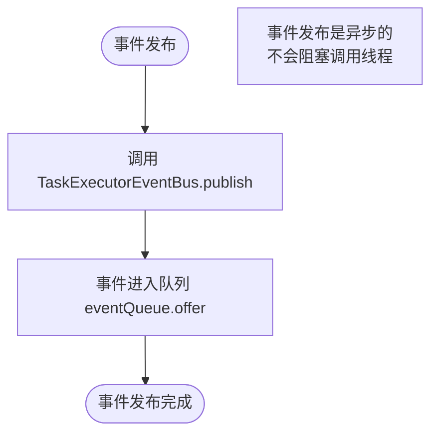

#### 2.5.2 事件处理流程

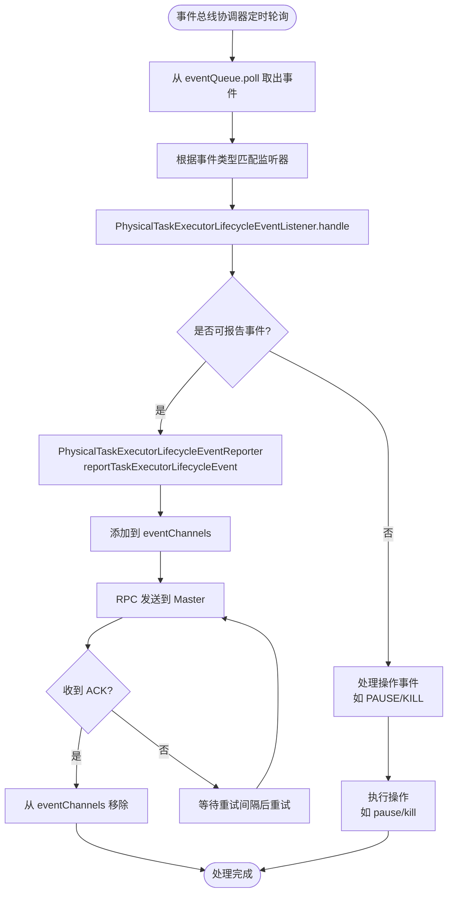

#### 2.5.3 事件报告流程

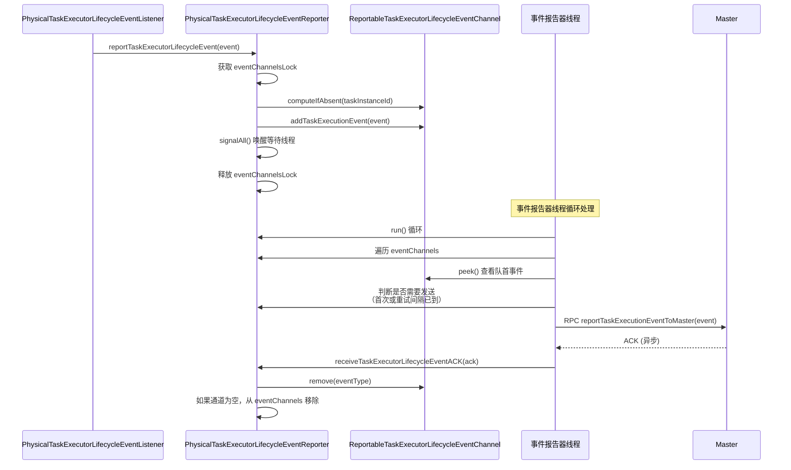

### 2.6 事件转换关键点分析

#### 2.6.1 正常执行流程事件转换

**流程**: DISPATCHED → RUNNING → [RUNTIME_CONTEXT_CHANGE]* → SUCCESS → FINALIZE

**说明**:
1. **DISPATCHED**: 任务提交到引擎后立即发布
2. **RUNNING**: 任务启动时发布
3. **RUNTIME_CONTEXT_CHANGE**: 任务执行过程中可能多次发布（更新 appIds、processId 等）
4. **SUCCESS**: 任务成功完成时发布
5. **FINALIZE**: 任务最终化时发布

#### 2.6.2 失败流程事件转换

**流程**: DISPATCHED → RUNNING → [RUNTIME_CONTEXT_CHANGE]* → FAILED → FINALIZE

**说明**:
- 失败流程与成功流程类似，只是最终状态为 FAILED 而不是 SUCCESS

#### 2.6.3 终止流程事件转换

**流程**: DISPATCHED → RUNNING → [RUNTIME_CONTEXT_CHANGE]* → KILL → KILLED → FINALIZE

**说明**:
1. **KILL**: Master 请求终止任务时发布（操作事件）
2. **KILLED**: 任务实际终止后发布（结果事件）

#### 2.6.4 暂停流程事件转换

**流程**: DISPATCHED → RUNNING → [RUNTIME_CONTEXT_CHANGE]* → PAUSE → PAUSED → FINALIZE

**说明**:
1. **PAUSE**: Master 请求暂停任务时发布（操作事件）
2. **PAUSED**: 任务实际暂停后发布（结果事件）

### 2.7 事件设计特点

#### 2.7.1 事件驱动架构

- **解耦**: 任务执行器通过事件总线发布事件，事件处理通过监听器异步处理
- **可靠性**: 可报告事件通过事件报告器异步报告给 Master，使用重试机制确保最终一致性
- **可扩展性**: 可以轻松添加新的事件类型和监听器

#### 2.7.2 事件分类

- **可报告事件** (`IReportableTaskExecutorLifecycleEvent`): 需要报告给 Master 的事件，包括 DISPATCHED, RUNNING, RUNTIME_CONTEXT_CHANGE, PAUSED, KILLED, SUCCESS, FAILED
- **操作事件** (`IOperableTaskExecutorLifecycleEvent`): 表示操作请求的事件，包括 PAUSE, KILL
- **内部事件**: 仅在 Worker 内部使用，不报告给 Master，如 FINALIZE

#### 2.7.3 事件顺序保证

- **FIFO 顺序**: 使用 `LinkedBlockingQueue` 保证同一任务执行器的事件按顺序处理
- **按任务分组**: 每个任务实例拥有独立的事件通道，确保事件处理的隔离性

### 2.8 关键代码链接

- **TaskExecutorDispatchedLifecycleEvent**: [TaskExecutorDispatchedLifecycleEvent.java](../../../../dolphinscheduler-task-executor/src/main/java/org/apache/dolphinscheduler/task/executor/events/TaskExecutorDispatchedLifecycleEvent.java)
- **TaskExecutorStartedLifecycleEvent**: [TaskExecutorStartedLifecycleEvent.java](../../../../dolphinscheduler-task-executor/src/main/java/org/apache/dolphinscheduler/task/executor/events/TaskExecutorStartedLifecycleEvent.java)
- **TaskExecutorRuntimeContextChangedLifecycleEvent**: [TaskExecutorRuntimeContextChangedLifecycleEvent.java](../../../../dolphinscheduler-task-executor/src/main/java/org/apache/dolphinscheduler/task/executor/events/TaskExecutorRuntimeContextChangedLifecycleEvent.java)
- **TaskExecutorSuccessLifecycleEvent**: [TaskExecutorSuccessLifecycleEvent.java](../../../../dolphinscheduler-task-executor/src/main/java/org/apache/dolphinscheduler/task/executor/events/TaskExecutorSuccessLifecycleEvent.java)
- **TaskExecutorFailedLifecycleEvent**: [TaskExecutorFailedLifecycleEvent.java](../../../../dolphinscheduler-task-executor/src/main/java/org/apache/dolphinscheduler/task/executor/events/TaskExecutorFailedLifecycleEvent.java)
- **TaskExecutorKillLifecycleEvent**: [TaskExecutorKillLifecycleEvent.java](../../../../dolphinscheduler-task-executor/src/main/java/org/apache/dolphinscheduler/task/executor/events/TaskExecutorKillLifecycleEvent.java)
- **TaskExecutorKilledLifecycleEvent**: [TaskExecutorKilledLifecycleEvent.java](../../../../dolphinscheduler-task-executor/src/main/java/org/apache/dolphinscheduler/task/executor/events/TaskExecutorKilledLifecycleEvent.java)
- **TaskExecutorPauseLifecycleEvent**: [TaskExecutorPauseLifecycleEvent.java](../../../../dolphinscheduler-task-executor/src/main/java/org/apache/dolphinscheduler/task/executor/events/TaskExecutorPauseLifecycleEvent.java)
- **TaskExecutorPausedLifecycleEvent**: [TaskExecutorPausedLifecycleEvent.java](../../../../dolphinscheduler-task-executor/src/main/java/org/apache/dolphinscheduler/task/executor/events/TaskExecutorPausedLifecycleEvent.java)
- **TaskExecutorFinalizeLifecycleEvent**: [TaskExecutorFinalizeLifecycleEvent.java](../../../../dolphinscheduler-task-executor/src/main/java/org/apache/dolphinscheduler/task/executor/events/TaskExecutorFinalizeLifecycleEvent.java)
- **TaskExecutorLifecycleEventType**: [TaskExecutorLifecycleEventType.java](../../../../dolphinscheduler-task-executor/src/main/java/org/apache/dolphinscheduler/task/executor/events/TaskExecutorLifecycleEventType.java)

## 3. 完整执行时序图

### 3.1 主流程时序图

```mermaid
sequenceDiagram
    participant Master as Master<br/>(RPC Client)
    participant WorkerRPC as PhysicalTaskExecutorOperatorImpl
    participant PTED as PhysicalTaskEngineDelegator
    participant PTEF as PhysicalTaskExecutorFactory
    participant TE as TaskEngine
    participant ETC as ExclusiveThreadTaskExecutorContainer
    participant TEW as TaskExecutorWorker
    participant TER as TaskExecutorRepository
    participant TEB as TaskExecutorEventBus
    participant PTE as PhysicalTaskExecutor
    participant TEC as TaskExecutorEventBusCoordinator
    participant PER as PhysicalTaskExecutorLifecycleEventReporter
    participant PTFactory as PhysicalTaskPluginFactory
    participant TaskPluginManager as TaskPluginManager
    participant SqlTaskChannel as SqlTaskChannel
    participant SqlTask as SqlTask

    Note over Master: Master 端通过 RPC 请求 Worker 执行任务
    Master->>WorkerRPC: dispatchTask(TaskExecutorDispatchRequest)
    
    Note over WorkerRPC: 1. RPC 接收阶段
    WorkerRPC->>WorkerRPC: 提取 TaskExecutionContext
    WorkerRPC->>PTED: dispatchLogicTask(taskExecutionContext)
    
    Note over PTEF: 2. 创建任务执行器阶段
    PTED->>PTEF: createTaskExecutor(taskExecutionContext)
    PTEF->>PTEF: assemblyTaskLogPath()<br/>设置 logPath = LogUtils.getTaskInstanceLogFullPath()
    PTEF->>PTE: new PhysicalTaskExecutor(builder)
    Note over PTE: 调用父类构造函数<br/>AbstractTaskExecutor(taskExecutionContext, eventBus)<br/>设置状态为 INITIALIZED
    PTEF-->>PTED: taskExecutor
    
    Note over TE: 3. 提交到任务引擎阶段
    PTED->>TE: submitTask(taskExecutor)
    
    Note over TE: 3.1 设置 MDC 上下文
    TE->>TE: TaskExecutorMDCUtils.logWithMDC(taskExecutor)<br/>设置 MDC[taskInstanceId] = taskId
    
    Note over ETC: 3.2 获取任务容器
    TE->>ETC: getExecutorContainer()
    ETC-->>TE: container (ExclusiveThreadTaskExecutorContainer)
    
    Note over ETC: 3.3 分发到容器
    TE->>ETC: dispatch(taskExecutor)
    ETC->>ETC: selectIdleWorker()<br/>选择空闲的 TaskExecutorWorker
    ETC->>TEW: registerTaskExecutor(taskExecutor)
    TEW->>TEW: registeredTaskExecutors.put(taskId, taskExecutor)
    ETC-->>TE: dispatched
    
    Note over TER: 3.4 存储到仓库
    TE->>TER: put(taskExecutor)
    TER->>TER: taskExecutorMap.put(taskId, taskExecutor)
    
    Note over TEB: 3.5 发布任务已分发事件
    TE->>TEB: publish(TaskExecutorDispatchedLifecycleEvent.of(taskExecutor))
    TEB->>TEB: eventQueue.offer(event)
    
    Note over ETC: 3.6 启动容器执行任务
    TE->>ETC: start(taskExecutor)
    ETC->>TEW: fireTaskExecutor(taskExecutor)
    TEW->>TEW: 唤醒等待的线程或直接执行
    
    Note over TEC: 4. 事件总线协调器处理（后台线程）
    Note over TEC: TaskExecutorEventBusCoordinator 在 TaskEngine.start() 时已启动
    TEC->>TEC: fireTaskExecutorEventBus()<br/>（定时任务，每 10 秒执行一次）
    TEC->>TER: getAll()
    TER-->>TEC: Collection<ITaskExecutor>
    loop 遍历所有 taskExecutor
        TEC->>TEB: taskExecutor.getTaskExecutorEventBus()
        TEB-->>TEC: eventBus
        TEC->>TEC: doFireTaskExecutorEventBus(eventBus, taskExecutor)
        loop 处理事件队列中的所有事件
            TEC->>TEB: poll()
            TEB-->>TEC: event
            TEC->>TEC: 根据事件类型匹配监听器<br/>（PhysicalTaskExecutorLifecycleEventListener）
            TEC->>PER: listener.handle(event)
            PER->>PER: reportTaskExecutorLifecycleEvent(event)
        end
    end
    
    Note over PER: 5. 事件报告器处理（后台线程）
    Note over PER: PhysicalTaskExecutorLifecycleEventReporter 在 PhysicalTaskEngineDelegator.start() 时已启动
    PER->>PER: run()<br/>（守护线程循环）
    PER->>PER: 遍历 eventChannels
    PER->>PER: handleTaskExecutionEventChannel(channel)
    PER->>PER: peek() 查看队首事件
    PER->>PER: 判断是否需要发送（首次或重试间隔已到）
    PER->>Master: reportTaskExecutionEventToMaster(event)<br/>（RPC 调用）
    Master-->>PER: ACK (异步)
    PER->>PER: receiveTaskExecutorLifecycleEventACK(ack)
    PER->>PER: eventChannel.remove(eventType)
    
    Note over TEW: 6. 任务执行工作线程启动任务
    TEW->>TEW: run()<br/>（工作线程主循环）
    TEW->>TEW: 从 registeredTaskExecutors 获取 taskExecutor
    TEW->>PTE: start()
    
    Note over PTE: 7. 任务执行器启动阶段
    PTE->>PTE: 检查 startFlag，防止重复启动
    PTE->>PTE: startFlag = true
    
    Note over PTE: 7.1 打印日志头
    PTE->>PTE: TaskInstanceLogHeader.printInitializeTaskContextHeader()
    
    Note over PTE: 7.2 初始化任务上下文
    PTE->>PTE: initializeTaskContext()
    PTE->>PTE: taskExecutionContext.setStartTime(System.currentTimeMillis())
    PTE->>PTE: taskExecutionContext.setTaskAppId(String.valueOf(taskInstanceId))
    PTE->>PTE: TenantUtils.getOrCreateActualTenant()<br/>设置 tenantCode
    PTE->>PTE: TaskExecutionContextUtils.createTaskInstanceWorkingDirectory()<br/>创建工作目录
    PTE->>PTE: TaskExecutionContextUtils.downloadResourcesIfNeeded()<br/>下载资源文件
    PTE->>PTE: TaskFilesTransferUtils.downloadUpstreamFiles()<br/>下载上游文件
    
    Note over PTE: 7.3 发布任务运行事件
    PTE->>PTE: publishTaskRunningEvent()
    PTE->>PTE: transitTaskExecutorState(TaskExecutorState.RUNNING)
    PTE->>TEB: publish(TaskExecutorStartedLifecycleEvent.of(this))
    TEB->>TEB: eventQueue.offer(event)
    
    Note over PTE: 7.4 打印日志头
    PTE->>PTE: TaskInstanceLogHeader.printLoadTaskInstancePluginHeader()
    
    Note over PTFactory: 7.5 初始化任务插件
    PTE->>PTE: initializeTaskPlugin()
    PTE->>PTFactory: createPhysicalTask(this)
    PTFactory->>PTFactory: getTaskChannel(taskExecutor)
    PTFactory->>TaskPluginManager: getTaskChannel(taskType)
    TaskPluginManager-->>PTFactory: TaskChannel (SqlTaskChannel)
    PTFactory->>SqlTaskChannel: createTask(taskExecutionContext)
    SqlTaskChannel->>SqlTask: new SqlTask(taskExecutionContext)
    SqlTask->>SqlTask: 解析 SqlParameters<br/>初始化 dbType、baseConnectionParam
    SqlTaskChannel-->>PTFactory: SqlTask
    PTFactory-->>PTE: physicalTask (SqlTask)
    PTE->>SqlTask: init()
    SqlTask->>SqlTask: 初始化任务参数
    PTE->>PTE: physicalTask.getParameters().setVarPool(varPool)
    
    Note over PTE: 7.6 打印日志头
    PTE->>PTE: TaskInstanceLogHeader.printExecuteTaskHeader()
    
    Note over PTE: 7.7 触发任务插件执行
    PTE->>PTE: doTriggerTaskPlugin()
    PTE->>SqlTask: handle(TaskCallBack)
    
    Note over SqlTask: 8. SQL 任务执行阶段
    SqlTask->>SqlTask: 解析 SQL 参数<br/>splitAndRemoveComment(sql)
    SqlTask->>SqlTask: 构建 SQL 语句和参数映射<br/>getSqlAndSqlParamsMap()
    SqlTask->>SqlTask: executeFuncAndSql()
    
    Note over SqlTask: 8.1 获取数据库连接
    SqlTask->>SqlTask: DataSourceClientProvider.getAdHocConnection(dbType, connectionParam)
    SqlTask-->>SqlTask: Connection
    
    Note over SqlTask: 8.2 执行前置 SQL
    SqlTask->>SqlTask: executeUpdate(connection, preStatementsBinds, "pre")
    
    Note over SqlTask: 8.3 执行主 SQL
    alt SQL 类型为 QUERY
        SqlTask->>SqlTask: executeQuery(connection, mainStatementsBinds, "main")
        SqlTask->>SqlTask: 将查询结果转换为 JsonArray
    else SQL 类型为 NON_QUERY
        SqlTask->>SqlTask: executeUpdate(connection, mainStatementsBinds, "main")
        SqlTask->>SqlTask: setNonQuerySqlReturn(updateResult, localParams)
    end
    
    Note over SqlTask: 8.4 处理输出参数
    SqlTask->>SqlTask: sqlParameters.dealOutParam(result)
    
    Note over SqlTask: 8.5 执行后置 SQL
    SqlTask->>SqlTask: executeUpdate(connection, postStatementsBinds, "post")
    
    Note over SqlTask: 8.6 设置退出状态码
    SqlTask->>SqlTask: setExitStatusCode(TaskConstants.EXIT_CODE_SUCCESS)
    
    Note over PTE: 8.7 任务执行完成
    SqlTask-->>PTE: handle() 返回
    PTE->>PTE: doTriggerTaskPlugin() 完成
    
    Note over TEC: 9. 状态跟踪（后台线程）
    TEC->>TEC: fireTaskExecutorEventBus()<br/>（定时任务，每 10 秒执行一次）
    TEC->>PTE: trackTaskExecutorState()
    PTE->>PTE: doTrackTaskPluginStatus()
    PTE->>SqlTask: getExitStatus()
    SqlTask-->>PTE: ExitStatus
    PTE->>PTE: TaskExecutorStateMappings.mapState(exitStatus)
    PTE-->>TEC: TaskExecutorState (SUCCEEDED/FAILED)
    
    Note over TEB: 10. 发布任务完成事件
    alt 任务成功
        PTE->>TEB: publish(TaskExecutorSuccessLifecycleEvent.of(this))
    else 任务失败
        PTE->>TEB: publish(TaskExecutorFailedLifecycleEvent.of(this))
    end
    TEB->>TEB: eventQueue.offer(event)
    
    Note over PER: 11. 事件报告器报告完成事件
    PER->>PER: reportTaskExecutorLifecycleEvent(event)
    PER->>Master: reportTaskExecutionEventToMaster(event)
    Master-->>PER: ACK
    PER->>PER: receiveTaskExecutorLifecycleEventACK(ack)
    PER->>PER: eventChannel.remove(eventType)
```

### 3.2 组件交互图

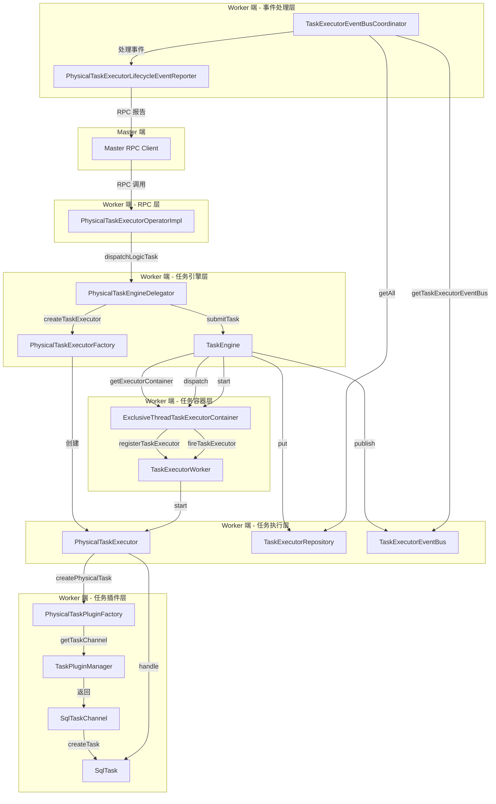

### 3.3 任务状态流转图

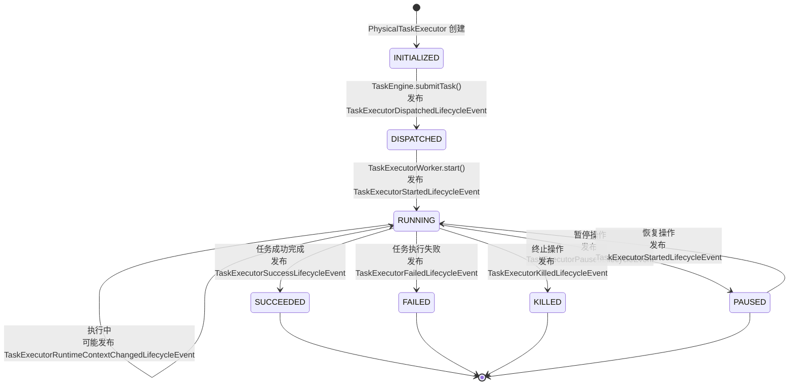

### 3.4 事件处理流程图

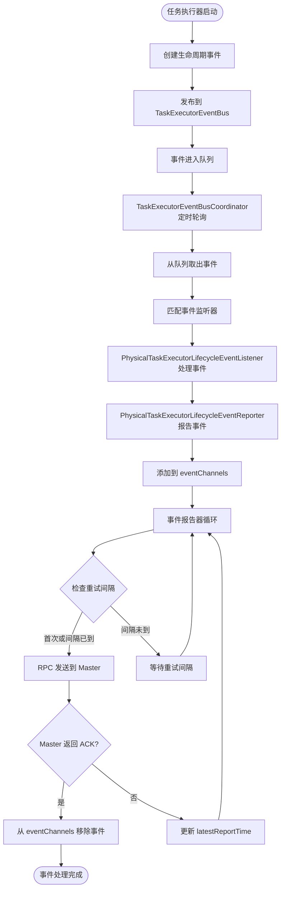

## 4. 关键代码链接

### 4.1 RPC 接收层

- **PhysicalTaskExecutorOperatorImpl.dispatchTask()**: [PhysicalTaskExecutorOperatorImpl.java:57-68](../../../src/main/java/org/apache/dolphinscheduler/server/worker/rpc/PhysicalTaskExecutorOperatorImpl.java#L57-L68)

### 4.2 任务引擎层

- **PhysicalTaskEngineDelegator.dispatchLogicTask()**: [PhysicalTaskEngineDelegator.java:79-82](../../../src/main/java/org/apache/dolphinscheduler/server/worker/executor/PhysicalTaskEngineDelegator.java#L79-L82)
- **PhysicalTaskExecutorFactory.createTaskExecutor()**: [PhysicalTaskExecutorFactory.java:50-60](../../../src/main/java/org/apache/dolphinscheduler/server/worker/executor/PhysicalTaskExecutorFactory.java#L50-L60)
- **TaskEngine.submitTask()**: [TaskEngine.java:67-87](../../../../dolphinscheduler-task-executor/src/main/java/org/apache/dolphinscheduler/task/executor/TaskEngine.java#L67-L87)

### 4.3 任务容器层

- **ExclusiveThreadTaskExecutorContainer.dispatch()**: [ExclusiveThreadTaskExecutorContainer.java](../../../../dolphinscheduler-task-executor/src/main/java/org/apache/dolphinscheduler/task/executor/container/ExclusiveThreadTaskExecutorContainer.java)
- **TaskExecutorWorker.fireTaskExecutor()**: [TaskExecutorWorker.java](../../../../dolphinscheduler-task-executor/src/main/java/org/apache/dolphinscheduler/task/executor/worker/TaskExecutorWorker.java)

### 4.4 任务执行层

- **AbstractTaskExecutor.start()**: [AbstractTaskExecutor.java:57-81](../../../../dolphinscheduler-task-executor/src/main/java/org/apache/dolphinscheduler/task/executor/AbstractTaskExecutor.java#L57-L81)
- **PhysicalTaskExecutor.initializeTaskContext()**: [PhysicalTaskExecutor.java:108-132](../../../src/main/java/org/apache/dolphinscheduler/server/worker/executor/PhysicalTaskExecutor.java#L108-L132)
- **PhysicalTaskExecutor.initializeTaskPlugin()**: [PhysicalTaskExecutor.java:61-70](../../../src/main/java/org/apache/dolphinscheduler/server/worker/executor/PhysicalTaskExecutor.java#L61-L70)
- **PhysicalTaskExecutor.doTriggerTaskPlugin()**: [PhysicalTaskExecutor.java:73-88](../../../src/main/java/org/apache/dolphinscheduler/server/worker/executor/PhysicalTaskExecutor.java#L73-L88)

### 4.5 任务插件层

- **PhysicalTaskPluginFactory.createPhysicalTask()**: [PhysicalTaskPluginFactory.java](../../../src/main/java/org/apache/dolphinscheduler/server/worker/executor/PhysicalTaskPluginFactory.java)
- **TaskPluginManager.getTaskChannel()**: [TaskPluginManager.java:63-70](../../../../dolphinscheduler-task-plugin/dolphinscheduler-task-api/src/main/java/org/apache/dolphinscheduler/plugin/task/api/TaskPluginManager.java#L63-L70)
- **SqlTaskChannel.createTask()**: [SqlTaskChannel.java:30-32](../../../../dolphinscheduler-task-plugin/dolphinscheduler-task-sql/src/main/java/org/apache/dolphinscheduler/plugin/task/sql/SqlTaskChannel.java#L30-L32)
- **SqlTask.handle()**: [SqlTask.java:113-160](../../../../dolphinscheduler-task-plugin/dolphinscheduler-task-sql/src/main/java/org/apache/dolphinscheduler/plugin/task/sql/SqlTask.java#L113-L160)

### 4.6 事件处理层

- **TaskExecutorEventBusCoordinator.start()**: [TaskExecutorEventBusCoordinator.java:82-95](../../../../dolphinscheduler-task-executor/src/main/java/org/apache/dolphinscheduler/task/executor/eventbus/TaskExecutorEventBusCoordinator.java#L82-L95)
- **TaskExecutorEventBusCoordinator.doFireTaskExecutorEventBus()**: [TaskExecutorEventBusCoordinator.java:474-576](../../../../dolphinscheduler-task-executor/src/main/java/org/apache/dolphinscheduler/task/executor/eventbus/TaskExecutorEventBusCoordinator.java#L474-L576)
- **PhysicalTaskExecutorLifecycleEventReporter.start()**: [TaskExecutorLifecycleEventRemoteReporter.java:82-95](../../../../dolphinscheduler-task-executor/src/main/java/org/apache/dolphinscheduler/task/executor/eventbus/TaskExecutorLifecycleEventRemoteReporter.java#L82-L95)
- **PhysicalTaskExecutorLifecycleEventReporter.run()**: [TaskExecutorLifecycleEventRemoteReporter.java:219-401](../../../../dolphinscheduler-task-executor/src/main/java/org/apache/dolphinscheduler/task/executor/eventbus/TaskExecutorLifecycleEventRemoteReporter.java#L219-L401)

## 5. 详细流程说明

### 5.1 RPC 接收阶段

**入口**: `PhysicalTaskExecutorOperatorImpl.dispatchTask()`

**流程**:
1. Master 通过 RPC 调用 Worker 的 `dispatchTask()` 方法
2. Worker 接收 `TaskExecutorDispatchRequest`，提取 `TaskExecutionContext`
3. 调用 `PhysicalTaskEngineDelegator.dispatchLogicTask()` 处理任务

**关键代码**:
```java
@Override
public TaskExecutorDispatchResponse dispatchTask(final TaskExecutorDispatchRequest taskExecutorDispatchRequest) {
    log.info("Receive TaskExecutorDispatchResponse: {}", taskExecutorDispatchRequest);
    final TaskExecutionContext taskExecutionContext = taskExecutorDispatchRequest.getTaskExecutionContext();
    try {
        physicalTaskEngineDelegator.dispatchLogicTask(taskExecutionContext);
        log.info("Handle TaskExecutorDispatchResponse: {} success", taskExecutorDispatchRequest);
        return TaskExecutorDispatchResponse.success();
    } catch (Throwable throwable) {
        log.error("Handle TaskExecutorDispatchResponse: {} failed", taskExecutorDispatchRequest, throwable);
        return TaskExecutorDispatchResponse.failed(ExceptionUtils.getMessage(throwable));
    }
}
```

### 5.2 任务执行器创建阶段

**入口**: `PhysicalTaskExecutorFactory.createTaskExecutor()`

**流程**:
1. 设置任务日志路径：`assemblyTaskLogPath()` → `LogUtils.getTaskInstanceLogFullPath()`
2. 构建 `PhysicalTaskExecutorBuilder`
3. 创建 `PhysicalTaskExecutor` 实例
4. 调用父类构造函数，初始化 `TaskExecutorEventBus`，设置状态为 `INITIALIZED`

**关键代码**:
```java
@Override
public ITaskExecutor createTaskExecutor(final TaskExecutionContext taskExecutionContext) {
    assemblyTaskLogPath(taskExecutionContext);
    
    final PhysicalTaskExecutorBuilder physicalTaskExecutorBuilder = PhysicalTaskExecutorBuilder.builder()
            .taskExecutionContext(taskExecutionContext)
            .workerConfig(workerConfig)
            .storageOperator(storageOperator)
            .physicalTaskPluginFactory(physicalTaskPluginFactory)
            .build();
    return new PhysicalTaskExecutor(physicalTaskExecutorBuilder);
}
```

### 5.3 任务引擎提交阶段

**入口**: `TaskEngine.submitTask()`

**流程**:
1. **设置 MDC 上下文**: 使用 `TaskExecutorMDCUtils.logWithMDC()` 设置日志上下文
2. **获取任务容器**: 调用 `taskExecutorContainerDelegator.getExecutorContainer()` 获取 `ExclusiveThreadTaskExecutorContainer`
3. **分发到容器**: 调用 `executorContainer.dispatch(taskExecutor)`
   - 容器选择空闲的 `TaskExecutorWorker`
   - 调用 `worker.registerTaskExecutor(taskExecutor)` 注册任务
4. **存储到仓库**: 调用 `taskExecutorRepository.put(taskExecutor)` 存储到共享 Map
5. **发布分发事件**: 调用 `taskExecutor.getTaskExecutorEventBus().publish(TaskExecutorDispatchedLifecycleEvent.of(taskExecutor))`
6. **启动容器**: 调用 `executorContainer.start(taskExecutor)` 唤醒工作线程执行任务

**关键代码**:
```java
@Override
public void submitTask(final ITaskExecutor taskExecutor) throws TaskExecutorRuntimeException {
    try (final TaskExecutorMDCUtils.MDCAutoClosable ignore = TaskExecutorMDCUtils.logWithMDC(taskExecutor)) {
        final ITaskExecutorContainer executorContainer = taskExecutorContainerDelegator.getExecutorContainer();
        // 注册taskExecutor
        executorContainer.dispatch(taskExecutor);
        // 放入共享Map
        taskExecutorRepository.put(taskExecutor);
        // 发布任务已分发事件
        taskExecutor.getTaskExecutorEventBus().publish(TaskExecutorDispatchedLifecycleEvent.of(taskExecutor));
        // 执行容器执行任务,唤醒taskExecutorWorker线程执行
        executorContainer.start(taskExecutor);
    }
}
```

### 5.4 任务执行器启动阶段

**入口**: `AbstractTaskExecutor.start()`

**流程**:
1. **检查启动标志**: 防止重复启动
2. **打印日志头**: `TaskInstanceLogHeader.printInitializeTaskContextHeader()`
3. **初始化任务上下文**: `initializeTaskContext()`
   - 设置开始时间
   - 设置任务应用ID
   - 设置租户代码
   - 创建任务工作目录
   - 下载资源文件
   - 下载上游文件
4. **发布运行事件**: `publishTaskRunningEvent()`
   - 转换状态为 `RUNNING`
   - 发布 `TaskExecutorStartedLifecycleEvent`
5. **打印日志头**: `TaskInstanceLogHeader.printLoadTaskInstancePluginHeader()`
6. **初始化任务插件**: `initializeTaskPlugin()`
   - 通过 `PhysicalTaskPluginFactory` 创建任务插件
   - 调用 `TaskPluginManager.getTaskChannel()` 获取任务通道
   - 调用 `TaskChannel.createTask()` 创建任务实例（如 `SqlTask`）
   - 调用 `physicalTask.init()` 初始化任务
   - 设置变量池
7. **打印日志头**: `TaskInstanceLogHeader.printExecuteTaskHeader()`
8. **触发任务插件**: `doTriggerTaskPlugin()`
   - 调用 `physicalTask.handle(TaskCallBack)` 执行任务

**关键代码**:
```java
@Override
public void start() {
    if (startFlag) {
        throw new TaskExecutorRuntimeException(this + " has already started");
    }
    startFlag = true;
    TaskInstanceLogHeader.printInitializeTaskContextHeader();
    initializeTaskContext();
    
    publishTaskRunningEvent();
    
    TaskInstanceLogHeader.printLoadTaskInstancePluginHeader();
    initializeTaskPlugin();
    
    TaskInstanceLogHeader.printExecuteTaskHeader();
    
    if (taskExecutionContext.getDryRun() == Flag.YES.getCode()) {
        log.info("The task: {} is dryRun model, skip the trigger stage.", taskExecutionContext.getTaskName());
        transitTaskExecutorState(TaskExecutorState.SUCCEEDED);
        return;
    }
    
    doTriggerTaskPlugin();
}
```

### 5.5 SQL 任务执行阶段

**入口**: `SqlTask.handle()`

**流程**:
1. **解析 SQL 参数**: 
   - 获取数据源连接参数
   - 分割 SQL 语句并移除注释
   - 构建主 SQL、前置 SQL、后置 SQL 的参数映射
2. **执行 SQL**:
   - 获取数据库连接
   - 执行前置 SQL
   - 根据 SQL 类型执行主 SQL（QUERY 或 NON_QUERY）
   - 处理输出参数
   - 执行后置 SQL
3. **设置退出状态码**: `setExitStatusCode(TaskConstants.EXIT_CODE_SUCCESS)`

**关键代码**:
```java
@Override
public void handle(TaskCallBack taskCallBack) throws TaskException {
    // 获取数据源
    baseConnectionParam = (BaseConnectionParam) DataSourceUtils.buildConnectionParams(dbType,
            sqlTaskExecutionContext.getConnectionParams());
    List<String> subSqls = DataSourceProcessorProvider.getDataSourceProcessor(dbType)
            .splitAndRemoveComment(sqlParameters.getSql());
    
    // 准备执行 SQL 和参数实体 Map
    List<SqlBinds> mainStatementSqlBinds = subSqls
            .stream()
            .map(this::getSqlAndSqlParamsMap)
            .collect(Collectors.toList());
    
    List<SqlBinds> preStatementSqlBinds = Optional.ofNullable(sqlParameters.getPreStatements())
            .orElse(new ArrayList<>())
            .stream()
            .map(this::getSqlAndSqlParamsMap)
            .collect(Collectors.toList());
    List<SqlBinds> postStatementSqlBinds = Optional.ofNullable(sqlParameters.getPostStatements())
            .orElse(new ArrayList<>())
            .stream()
            .map(this::getSqlAndSqlParamsMap)
            .collect(Collectors.toList());
    
    // 执行 sql 任务
    executeFuncAndSql(mainStatementSqlBinds, preStatementSqlBinds, postStatementSqlBinds);
    
    setExitStatusCode(TaskConstants.EXIT_CODE_SUCCESS);
}
```

### 5.6 事件总线协调器处理阶段

**入口**: `TaskExecutorEventBusCoordinator.start()`

**流程**:
1. **启动定时任务**: 使用 `ScheduledExecutorService` 每 10 秒执行一次 `fireTaskExecutorEventBus()`
2. **轮询所有任务执行器**: 从 `taskExecutorRepository.getAll()` 获取所有任务执行器
3. **处理事件队列**: 对每个任务执行器：
   - 获取 `TaskExecutorEventBus`
   - 循环从队列中取出事件
   - 根据事件类型匹配监听器（`PhysicalTaskExecutorLifecycleEventListener`）
   - 调用监听器处理事件
   - 监听器将事件报告给 `PhysicalTaskExecutorLifecycleEventReporter`

**关键代码**:
```java
@Override
public void start() {
    this.runningFlag = true;
    // 主线程池：定期轮询所有任务执行器的事件总线
    this.mainExecutorThreadPool = Executors.newScheduledThreadPool(1, r -> {
        Thread thread = new Thread(r, "TaskExecutorEventBusCoordinator-Main");
        thread.setDaemon(true);
        return thread;
    });
    // 工作线程池：异步处理事件
    this.workerExecutorThreadPool = Executors.newFixedThreadPool(workerThreadCount, r -> {
        Thread thread = new Thread(r, "TaskExecutorEventBusCoordinator-Worker");
        thread.setDaemon(true);
        return thread;
    });
    
    // 每 10 秒执行一次 fireTaskExecutorEventBus
    this.mainExecutorThreadPool.scheduleWithFixedDelay(
            this::fireTaskExecutorEventBus,
            0,
            DEFAULT_FIRE_INTERVAL,
            TimeUnit.MILLISECONDS
    );
    log.info("{} started", coordinatorName);
}
```

### 5.7 事件报告器处理阶段

**入口**: `PhysicalTaskExecutorLifecycleEventReporter.start()`

**流程**:
1. **启动守护线程**: 继承自 `BaseDaemonThread`，在 `run()` 方法中循环处理事件
2. **事件收集**: 通过 `reportTaskExecutorLifecycleEvent()` 接收事件，添加到 `eventChannels`
3. **事件处理循环**:
   - 遍历所有 `eventChannels`
   - 调用 `handleTaskExecutionEventChannel()` 处理每个通道
   - 使用 `peek()` 查看队首事件（不移除）
   - 判断是否需要发送（首次发送或重试间隔已到）
   - 通过 RPC 发送事件到 Master
   - 更新 `latestReportTime`
4. **等待机制**:
   - 如果所有通道为空，等待直到有新事件到达
   - 如果有事件但重试间隔未到，等待到最早可以重试的时间点
5. **ACK 处理**: 收到 Master 的 ACK 后，从 `eventChannels` 中移除对应事件

**关键代码**:
```java
@Override
public void run() {
    while (runningFlag) {
        try {
            // 遍历所有事件通道，处理需要发送的事件
            for (final ReportableTaskExecutorLifecycleEventChannel eventChannel : eventChannels.values()) {
                if (eventChannel.isEmpty()) {
                    continue;
                }
                // 处理当前通道中的事件（发送首次事件或重试间隔已到的事件）
                handleTaskExecutionEventChannel(eventChannel);
            }
            
            // 如果所有通道都为空，等待直到有新事件到达
            tryToWaitIfAllTaskExecutionEventChannelEmpty();
            
            // 如果任何任务执行事件通道重试间隔未过（未到），则等待
            waitIfAnyTaskExecutionEventChannelRetryIntervalPassed();
        } catch (InterruptedException e) {
            log.info("{} interrupted", reporterName);
            Thread.currentThread().interrupt();
            break;
        } catch (Exception ex) {
            log.error("Fire ReportableTaskExecutorLifecycleEventChannel error", ex);
        }
    }
    log.info("{} break loop", reporterName);
}
```

## 6. 关键设计点

### 6.1 事件驱动架构

- **解耦设计**: 任务执行器通过事件总线发布事件，事件处理通过监听器异步处理
- **可靠性**: 事件报告器使用重试机制，确保事件最终能够被 Master 接收
- **性能优化**: 使用 `peek()` 而不是 `poll()`，确保事件在确认前不会丢失

### 6.2 线程模型

- **独占线程容器**: 每个任务执行器分配一个独占的工作线程，确保任务隔离
- **事件处理线程池**: 使用主线程池轮询，工作线程池异步处理事件
- **守护线程**: 事件报告器使用守护线程，确保 JVM 关闭时能正常退出

### 6.3 资源管理

- **MDC 上下文**: 使用 `TaskExecutorMDCUtils.logWithMDC()` 自动管理日志上下文
- **资源下载**: 任务执行前自动下载所需的资源文件和上游文件
- **工作目录**: 为每个任务实例创建独立的工作目录

### 6.4 状态管理

- **状态转换**: 任务执行器状态从 `INITIALIZED` → `DISPATCHED` → `RUNNING` → `SUCCEEDED/FAILED`
- **状态跟踪**: 事件总线协调器定期跟踪任务状态，确保状态同步
- **状态持久化**: 通过事件报告器将状态变化报告给 Master，实现状态持久化

## 7. 总结

本文档详细描述了从 Master RPC 请求到 Worker 端最终执行任务的完整流程，包括：

1. **RPC 接收**: Master 通过 RPC 请求 Worker 执行任务
2. **任务创建**: Worker 创建任务执行器并设置日志路径
3. **任务提交**: 任务引擎将任务提交到容器，存储到仓库，发布分发事件
4. **任务启动**: 工作线程启动任务执行器，初始化上下文和插件
5. **任务执行**: 任务插件（如 SQL 任务）执行实际业务逻辑
6. **事件处理**: 事件总线协调器处理任务生命周期事件
7. **事件报告**: 事件报告器将事件异步报告给 Master，确保状态同步

整个流程采用事件驱动架构，实现了任务执行、事件处理、状态同步的完全解耦，确保了系统的可靠性和可扩展性。

