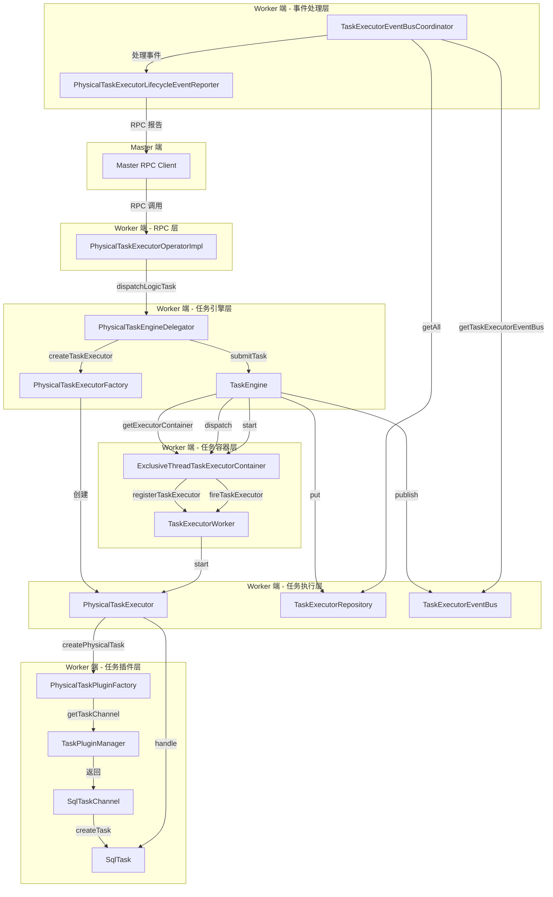
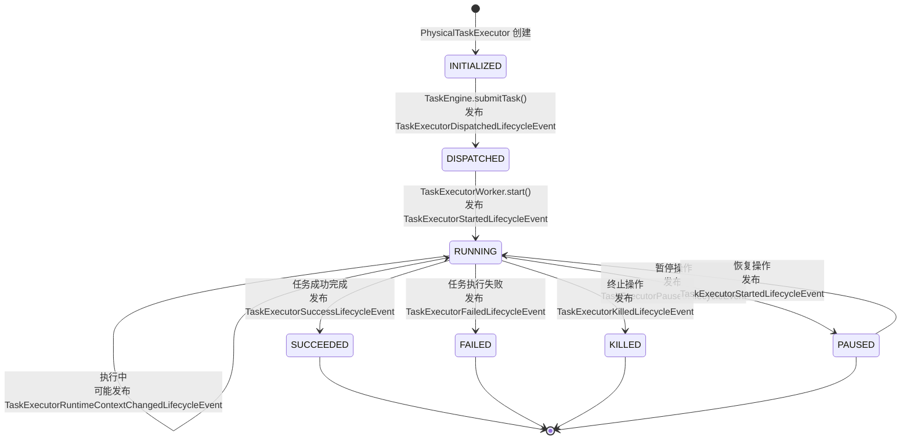

# Worker 服务任务执行完整流程汇总

## 1. 概述

本文档详细描述了从 Master 通过 RPC 请求 Worker 执行任务开始，到 Worker 端最终执行任务（以 SQL 任务为例）的完整执行流程。

**流程范围**：
- Master RPC 请求 → Worker RPC 接收
- 任务执行器创建 → 任务引擎提交
- 任务容器分发 → 任务执行器启动
- 事件总线协调 → 事件报告处理
- 任务插件初始化 → 任务实际执行（SQL 任务）

**关键组件**：
- `PhysicalTaskExecutorOperatorImpl`: Worker 端 RPC 服务实现
- `PhysicalTaskEngineDelegator`: 任务引擎委托器
- `TaskEngine`: 任务引擎核心
- `ExclusiveThreadTaskExecutorContainer`: 独占线程任务容器
- `TaskExecutorWorker`: 任务执行工作线程
- `PhysicalTaskExecutor`: 物理任务执行器
- `TaskExecutorEventBusCoordinator`: 事件总线协调器
- `PhysicalTaskExecutorLifecycleEventReporter`: 事件报告器
- `SqlTask`: SQL 任务插件

## 2. 完整执行时序图

### 2.1 主流程时序图

```mermaid
sequenceDiagram
    participant Master as Master<br/>(RPC Client)
    participant WorkerRPC as PhysicalTaskExecutorOperatorImpl
    participant PTED as PhysicalTaskEngineDelegator
    participant PTEF as PhysicalTaskExecutorFactory
    participant TE as TaskEngine
    participant ETC as ExclusiveThreadTaskExecutorContainer
    participant TEW as TaskExecutorWorker
    participant TER as TaskExecutorRepository
    participant TEB as TaskExecutorEventBus
    participant PTE as PhysicalTaskExecutor
    participant TEC as TaskExecutorEventBusCoordinator
    participant PER as PhysicalTaskExecutorLifecycleEventReporter
    participant PTFactory as PhysicalTaskPluginFactory
    participant TaskPluginManager as TaskPluginManager
    participant SqlTaskChannel as SqlTaskChannel
    participant SqlTask as SqlTask

    Note over Master: Master 端通过 RPC 请求 Worker 执行任务
    Master->>WorkerRPC: dispatchTask(TaskExecutorDispatchRequest)
    
    Note over WorkerRPC: 1. RPC 接收阶段
    WorkerRPC->>WorkerRPC: 提取 TaskExecutionContext
    WorkerRPC->>PTED: dispatchLogicTask(taskExecutionContext)
    
    Note over PTEF: 2. 创建任务执行器阶段
    PTED->>PTEF: createTaskExecutor(taskExecutionContext)
    PTEF->>PTEF: assemblyTaskLogPath()<br/>设置 logPath = LogUtils.getTaskInstanceLogFullPath()
    PTEF->>PTE: new PhysicalTaskExecutor(builder)
    Note over PTE: 调用父类构造函数<br/>AbstractTaskExecutor(taskExecutionContext, eventBus)<br/>设置状态为 INITIALIZED
    PTEF-->>PTED: taskExecutor
    
    Note over TE: 3. 提交到任务引擎阶段
    PTED->>TE: submitTask(taskExecutor)
    
    Note over TE: 3.1 设置 MDC 上下文
    TE->>TE: TaskExecutorMDCUtils.logWithMDC(taskExecutor)<br/>设置 MDC[taskInstanceId] = taskId
    
    Note over ETC: 3.2 获取任务容器
    TE->>ETC: getExecutorContainer()
    ETC-->>TE: container (ExclusiveThreadTaskExecutorContainer)
    
    Note over ETC: 3.3 分发到容器
    TE->>ETC: dispatch(taskExecutor)
    ETC->>ETC: selectIdleWorker()<br/>选择空闲的 TaskExecutorWorker
    ETC->>TEW: registerTaskExecutor(taskExecutor)
    TEW->>TEW: registeredTaskExecutors.put(taskId, taskExecutor)
    ETC-->>TE: dispatched
    
    Note over TER: 3.4 存储到仓库
    TE->>TER: put(taskExecutor)
    TER->>TER: taskExecutorMap.put(taskId, taskExecutor)
    
    Note over TEB: 3.5 发布任务已分发事件
    TE->>TEB: publish(TaskExecutorDispatchedLifecycleEvent.of(taskExecutor))
    TEB->>TEB: eventQueue.offer(event)
    
    Note over ETC: 3.6 启动容器执行任务
    TE->>ETC: start(taskExecutor)
    ETC->>TEW: fireTaskExecutor(taskExecutor)
    TEW->>TEW: 唤醒等待的线程或直接执行
    
    Note over TEC: 4. 事件总线协调器处理（后台线程）
    Note over TEC: TaskExecutorEventBusCoordinator 在 TaskEngine.start() 时已启动
    TEC->>TEC: fireTaskExecutorEventBus()<br/>（定时任务，每 10 秒执行一次）
    TEC->>TER: getAll()
    TER-->>TEC: Collection<ITaskExecutor>
    loop 遍历所有 taskExecutor
        TEC->>TEB: taskExecutor.getTaskExecutorEventBus()
        TEB-->>TEC: eventBus
        TEC->>TEC: doFireTaskExecutorEventBus(eventBus, taskExecutor)
        loop 处理事件队列中的所有事件
            TEC->>TEB: poll()
            TEB-->>TEC: event
            TEC->>TEC: 根据事件类型匹配监听器<br/>（PhysicalTaskExecutorLifecycleEventListener）
            TEC->>PER: listener.handle(event)
            PER->>PER: reportTaskExecutorLifecycleEvent(event)
        end
    end
    
    Note over PER: 5. 事件报告器处理（后台线程）
    Note over PER: PhysicalTaskExecutorLifecycleEventReporter 在 PhysicalTaskEngineDelegator.start() 时已启动
    PER->>PER: run()<br/>（守护线程循环）
    PER->>PER: 遍历 eventChannels
    PER->>PER: handleTaskExecutionEventChannel(channel)
    PER->>PER: peek() 查看队首事件
    PER->>PER: 判断是否需要发送（首次或重试间隔已到）
    PER->>Master: reportTaskExecutionEventToMaster(event)<br/>（RPC 调用）
    Master-->>PER: ACK (异步)
    PER->>PER: receiveTaskExecutorLifecycleEventACK(ack)
    PER->>PER: eventChannel.remove(eventType)
    
    Note over TEW: 6. 任务执行工作线程启动任务
    TEW->>TEW: run()<br/>（工作线程主循环）
    TEW->>TEW: 从 registeredTaskExecutors 获取 taskExecutor
    TEW->>PTE: start()
    
    Note over PTE: 7. 任务执行器启动阶段
    PTE->>PTE: 检查 startFlag，防止重复启动
    PTE->>PTE: startFlag = true
    
    Note over PTE: 7.1 打印日志头
    PTE->>PTE: TaskInstanceLogHeader.printInitializeTaskContextHeader()
    
    Note over PTE: 7.2 初始化任务上下文
    PTE->>PTE: initializeTaskContext()
    PTE->>PTE: taskExecutionContext.setStartTime(System.currentTimeMillis())
    PTE->>PTE: taskExecutionContext.setTaskAppId(String.valueOf(taskInstanceId))
    PTE->>PTE: TenantUtils.getOrCreateActualTenant()<br/>设置 tenantCode
    PTE->>PTE: TaskExecutionContextUtils.createTaskInstanceWorkingDirectory()<br/>创建工作目录
    PTE->>PTE: TaskExecutionContextUtils.downloadResourcesIfNeeded()<br/>下载资源文件
    PTE->>PTE: TaskFilesTransferUtils.downloadUpstreamFiles()<br/>下载上游文件
    
    Note over PTE: 7.3 发布任务运行事件
    PTE->>PTE: publishTaskRunningEvent()
    PTE->>PTE: transitTaskExecutorState(TaskExecutorState.RUNNING)
    PTE->>TEB: publish(TaskExecutorStartedLifecycleEvent.of(this))
    TEB->>TEB: eventQueue.offer(event)
    
    Note over PTE: 7.4 打印日志头
    PTE->>PTE: TaskInstanceLogHeader.printLoadTaskInstancePluginHeader()
    
    Note over PTFactory: 7.5 初始化任务插件
    PTE->>PTE: initializeTaskPlugin()
    PTE->>PTFactory: createPhysicalTask(this)
    PTFactory->>PTFactory: getTaskChannel(taskExecutor)
    PTFactory->>TaskPluginManager: getTaskChannel(taskType)
    TaskPluginManager-->>PTFactory: TaskChannel (SqlTaskChannel)
    PTFactory->>SqlTaskChannel: createTask(taskExecutionContext)
    SqlTaskChannel->>SqlTask: new SqlTask(taskExecutionContext)
    SqlTask->>SqlTask: 解析 SqlParameters<br/>初始化 dbType、baseConnectionParam
    SqlTaskChannel-->>PTFactory: SqlTask
    PTFactory-->>PTE: physicalTask (SqlTask)
    PTE->>SqlTask: init()
    SqlTask->>SqlTask: 初始化任务参数
    PTE->>PTE: physicalTask.getParameters().setVarPool(varPool)
    
    Note over PTE: 7.6 打印日志头
    PTE->>PTE: TaskInstanceLogHeader.printExecuteTaskHeader()
    
    Note over PTE: 7.7 触发任务插件执行
    PTE->>PTE: doTriggerTaskPlugin()
    PTE->>SqlTask: handle(TaskCallBack)
    
    Note over SqlTask: 8. SQL 任务执行阶段
    SqlTask->>SqlTask: 解析 SQL 参数<br/>splitAndRemoveComment(sql)
    SqlTask->>SqlTask: 构建 SQL 语句和参数映射<br/>getSqlAndSqlParamsMap()
    SqlTask->>SqlTask: executeFuncAndSql()
    
    Note over SqlTask: 8.1 获取数据库连接
    SqlTask->>SqlTask: DataSourceClientProvider.getAdHocConnection(dbType, connectionParam)
    SqlTask-->>SqlTask: Connection
    
    Note over SqlTask: 8.2 执行前置 SQL
    SqlTask->>SqlTask: executeUpdate(connection, preStatementsBinds, "pre")
    
    Note over SqlTask: 8.3 执行主 SQL
    alt SQL 类型为 QUERY
        SqlTask->>SqlTask: executeQuery(connection, mainStatementsBinds, "main")
        SqlTask->>SqlTask: 将查询结果转换为 JsonArray
    else SQL 类型为 NON_QUERY
        SqlTask->>SqlTask: executeUpdate(connection, mainStatementsBinds, "main")
        SqlTask->>SqlTask: setNonQuerySqlReturn(updateResult, localParams)
    end
    
    Note over SqlTask: 8.4 处理输出参数
    SqlTask->>SqlTask: sqlParameters.dealOutParam(result)
    
    Note over SqlTask: 8.5 执行后置 SQL
    SqlTask->>SqlTask: executeUpdate(connection, postStatementsBinds, "post")
    
    Note over SqlTask: 8.6 设置退出状态码
    SqlTask->>SqlTask: setExitStatusCode(TaskConstants.EXIT_CODE_SUCCESS)
    
    Note over PTE: 8.7 任务执行完成
    SqlTask-->>PTE: handle() 返回
    PTE->>PTE: doTriggerTaskPlugin() 完成
    
    Note over TEC: 9. 状态跟踪（后台线程）
    TEC->>TEC: fireTaskExecutorEventBus()<br/>（定时任务，每 10 秒执行一次）
    TEC->>PTE: trackTaskExecutorState()
    PTE->>PTE: doTrackTaskPluginStatus()
    PTE->>SqlTask: getExitStatus()
    SqlTask-->>PTE: ExitStatus
    PTE->>PTE: TaskExecutorStateMappings.mapState(exitStatus)
    PTE-->>TEC: TaskExecutorState (SUCCEEDED/FAILED)
    
    Note over TEB: 10. 发布任务完成事件
    alt 任务成功
        PTE->>TEB: publish(TaskExecutorSuccessLifecycleEvent.of(this))
    else 任务失败
        PTE->>TEB: publish(TaskExecutorFailedLifecycleEvent.of(this))
    end
    TEB->>TEB: eventQueue.offer(event)
    
    Note over PER: 11. 事件报告器报告完成事件
    PER->>PER: reportTaskExecutorLifecycleEvent(event)
    PER->>Master: reportTaskExecutionEventToMaster(event)
    Master-->>PER: ACK
    PER->>PER: receiveTaskExecutorLifecycleEventACK(ack)
    PER->>PER: eventChannel.remove(eventType)
```



### 2.2 组件交互图



### 2.3 任务状态流转图



### 2.4 事件处理流程图


## 3. 关键代码链接

### 3.1 RPC 接收层

- **PhysicalTaskExecutorOperatorImpl.dispatchTask()**: [PhysicalTaskExecutorOperatorImpl.java:57-68](../../../src/main/java/org/apache/dolphinscheduler/server/worker/rpc/PhysicalTaskExecutorOperatorImpl.java#L57-L68)

### 3.2 任务引擎层

- **PhysicalTaskEngineDelegator.dispatchLogicTask()**: [PhysicalTaskEngineDelegator.java:79-82](../../../src/main/java/org/apache/dolphinscheduler/server/worker/executor/PhysicalTaskEngineDelegator.java#L79-L82)
- **PhysicalTaskExecutorFactory.createTaskExecutor()**: [PhysicalTaskExecutorFactory.java:50-60](../../../src/main/java/org/apache/dolphinscheduler/server/worker/executor/PhysicalTaskExecutorFactory.java#L50-L60)
- **TaskEngine.submitTask()**: [TaskEngine.java:67-87](../../../../dolphinscheduler-task-executor/src/main/java/org/apache/dolphinscheduler/task/executor/TaskEngine.java#L67-L87)

### 3.3 任务容器层

- **ExclusiveThreadTaskExecutorContainer.dispatch()**: [ExclusiveThreadTaskExecutorContainer.java](../../../../dolphinscheduler-task-executor/src/main/java/org/apache/dolphinscheduler/task/executor/container/ExclusiveThreadTaskExecutorContainer.java)
- **TaskExecutorWorker.fireTaskExecutor()**: [TaskExecutorWorker.java](../../../../dolphinscheduler-task-executor/src/main/java/org/apache/dolphinscheduler/task/executor/worker/TaskExecutorWorker.java)

### 3.4 任务执行层

- **AbstractTaskExecutor.start()**: [AbstractTaskExecutor.java:57-81](../../../../dolphinscheduler-task-executor/src/main/java/org/apache/dolphinscheduler/task/executor/AbstractTaskExecutor.java#L57-L81)
- **PhysicalTaskExecutor.initializeTaskContext()**: [PhysicalTaskExecutor.java:108-132](../../../src/main/java/org/apache/dolphinscheduler/server/worker/executor/PhysicalTaskExecutor.java#L108-L132)
- **PhysicalTaskExecutor.initializeTaskPlugin()**: [PhysicalTaskExecutor.java:61-70](../../../src/main/java/org/apache/dolphinscheduler/server/worker/executor/PhysicalTaskExecutor.java#L61-L70)
- **PhysicalTaskExecutor.doTriggerTaskPlugin()**: [PhysicalTaskExecutor.java:73-88](../../../src/main/java/org/apache/dolphinscheduler/server/worker/executor/PhysicalTaskExecutor.java#L73-L88)

### 3.5 任务插件层

- **PhysicalTaskPluginFactory.createPhysicalTask()**: [PhysicalTaskPluginFactory.java](../../../src/main/java/org/apache/dolphinscheduler/server/worker/executor/PhysicalTaskPluginFactory.java)
- **TaskPluginManager.getTaskChannel()**: [TaskPluginManager.java:63-70](../../../../dolphinscheduler-task-plugin/dolphinscheduler-task-api/src/main/java/org/apache/dolphinscheduler/plugin/task/api/TaskPluginManager.java#L63-L70)
- **SqlTaskChannel.createTask()**: [SqlTaskChannel.java:30-32](../../../../dolphinscheduler-task-plugin/dolphinscheduler-task-sql/src/main/java/org/apache/dolphinscheduler/plugin/task/sql/SqlTaskChannel.java#L30-L32)
- **SqlTask.handle()**: [SqlTask.java:113-160](../../../../dolphinscheduler-task-plugin/dolphinscheduler-task-sql/src/main/java/org/apache/dolphinscheduler/plugin/task/sql/SqlTask.java#L113-L160)

### 3.6 事件处理层

- **TaskExecutorEventBusCoordinator.start()**: [TaskExecutorEventBusCoordinator.java:82-95](../../../../dolphinscheduler-task-executor/src/main/java/org/apache/dolphinscheduler/task/executor/eventbus/TaskExecutorEventBusCoordinator.java#L82-L95)
- **TaskExecutorEventBusCoordinator.doFireTaskExecutorEventBus()**: [TaskExecutorEventBusCoordinator.java:474-576](../../../../dolphinscheduler-task-executor/src/main/java/org/apache/dolphinscheduler/task/executor/eventbus/TaskExecutorEventBusCoordinator.java#L474-L576)
- **PhysicalTaskExecutorLifecycleEventReporter.start()**: [TaskExecutorLifecycleEventRemoteReporter.java:82-95](../../../../dolphinscheduler-task-executor/src/main/java/org/apache/dolphinscheduler/task/executor/eventbus/TaskExecutorLifecycleEventRemoteReporter.java#L82-L95)
- **PhysicalTaskExecutorLifecycleEventReporter.run()**: [TaskExecutorLifecycleEventRemoteReporter.java:219-401](../../../../dolphinscheduler-task-executor/src/main/java/org/apache/dolphinscheduler/task/executor/eventbus/TaskExecutorLifecycleEventRemoteReporter.java#L219-L401)

## 4. 详细流程说明

### 4.1 RPC 接收阶段

**入口**: `PhysicalTaskExecutorOperatorImpl.dispatchTask()`

**流程**:
1. Master 通过 RPC 调用 Worker 的 `dispatchTask()` 方法
2. Worker 接收 `TaskExecutorDispatchRequest`，提取 `TaskExecutionContext`
3. 调用 `PhysicalTaskEngineDelegator.dispatchLogicTask()` 处理任务

**关键代码**:
```java
@Override
public TaskExecutorDispatchResponse dispatchTask(final TaskExecutorDispatchRequest taskExecutorDispatchRequest) {
    log.info("Receive TaskExecutorDispatchResponse: {}", taskExecutorDispatchRequest);
    final TaskExecutionContext taskExecutionContext = taskExecutorDispatchRequest.getTaskExecutionContext();
    try {
        physicalTaskEngineDelegator.dispatchLogicTask(taskExecutionContext);
        log.info("Handle TaskExecutorDispatchResponse: {} success", taskExecutorDispatchRequest);
        return TaskExecutorDispatchResponse.success();
    } catch (Throwable throwable) {
        log.error("Handle TaskExecutorDispatchResponse: {} failed", taskExecutorDispatchRequest, throwable);
        return TaskExecutorDispatchResponse.failed(ExceptionUtils.getMessage(throwable));
    }
}
```

### 4.2 任务执行器创建阶段

**入口**: `PhysicalTaskExecutorFactory.createTaskExecutor()`

**流程**:
1. 设置任务日志路径：`assemblyTaskLogPath()` → `LogUtils.getTaskInstanceLogFullPath()`
2. 构建 `PhysicalTaskExecutorBuilder`
3. 创建 `PhysicalTaskExecutor` 实例
4. 调用父类构造函数，初始化 `TaskExecutorEventBus`，设置状态为 `INITIALIZED`

**关键代码**:
```java
@Override
public ITaskExecutor createTaskExecutor(final TaskExecutionContext taskExecutionContext) {
    assemblyTaskLogPath(taskExecutionContext);
    
    final PhysicalTaskExecutorBuilder physicalTaskExecutorBuilder = PhysicalTaskExecutorBuilder.builder()
            .taskExecutionContext(taskExecutionContext)
            .workerConfig(workerConfig)
            .storageOperator(storageOperator)
            .physicalTaskPluginFactory(physicalTaskPluginFactory)
            .build();
    return new PhysicalTaskExecutor(physicalTaskExecutorBuilder);
}
```

### 4.3 任务引擎提交阶段

**入口**: `TaskEngine.submitTask()`

**流程**:
1. **设置 MDC 上下文**: 使用 `TaskExecutorMDCUtils.logWithMDC()` 设置日志上下文
2. **获取任务容器**: 调用 `taskExecutorContainerDelegator.getExecutorContainer()` 获取 `ExclusiveThreadTaskExecutorContainer`
3. **分发到容器**: 调用 `executorContainer.dispatch(taskExecutor)`
   - 容器选择空闲的 `TaskExecutorWorker`
   - 调用 `worker.registerTaskExecutor(taskExecutor)` 注册任务
4. **存储到仓库**: 调用 `taskExecutorRepository.put(taskExecutor)` 存储到共享 Map
5. **发布分发事件**: 调用 `taskExecutor.getTaskExecutorEventBus().publish(TaskExecutorDispatchedLifecycleEvent.of(taskExecutor))`
6. **启动容器**: 调用 `executorContainer.start(taskExecutor)` 唤醒工作线程执行任务

**关键代码**:
```java
@Override
public void submitTask(final ITaskExecutor taskExecutor) throws TaskExecutorRuntimeException {
    try (final TaskExecutorMDCUtils.MDCAutoClosable ignore = TaskExecutorMDCUtils.logWithMDC(taskExecutor)) {
        final ITaskExecutorContainer executorContainer = taskExecutorContainerDelegator.getExecutorContainer();
        // 注册taskExecutor
        executorContainer.dispatch(taskExecutor);
        // 放入共享Map
        taskExecutorRepository.put(taskExecutor);
        // 发布任务已分发事件
        taskExecutor.getTaskExecutorEventBus().publish(TaskExecutorDispatchedLifecycleEvent.of(taskExecutor));
        // 执行容器执行任务,唤醒taskExecutorWorker线程执行
        executorContainer.start(taskExecutor);
    }
}
```

### 4.4 任务执行器启动阶段

**入口**: `AbstractTaskExecutor.start()`

**流程**:
1. **检查启动标志**: 防止重复启动
2. **打印日志头**: `TaskInstanceLogHeader.printInitializeTaskContextHeader()`
3. **初始化任务上下文**: `initializeTaskContext()`
   - 设置开始时间
   - 设置任务应用ID
   - 设置租户代码
   - 创建任务工作目录
   - 下载资源文件
   - 下载上游文件
4. **发布运行事件**: `publishTaskRunningEvent()`
   - 转换状态为 `RUNNING`
   - 发布 `TaskExecutorStartedLifecycleEvent`
5. **打印日志头**: `TaskInstanceLogHeader.printLoadTaskInstancePluginHeader()`
6. **初始化任务插件**: `initializeTaskPlugin()`
   - 通过 `PhysicalTaskPluginFactory` 创建任务插件
   - 调用 `TaskPluginManager.getTaskChannel()` 获取任务通道
   - 调用 `TaskChannel.createTask()` 创建任务实例（如 `SqlTask`）
   - 调用 `physicalTask.init()` 初始化任务
   - 设置变量池
7. **打印日志头**: `TaskInstanceLogHeader.printExecuteTaskHeader()`
8. **触发任务插件**: `doTriggerTaskPlugin()`
   - 调用 `physicalTask.handle(TaskCallBack)` 执行任务

**关键代码**:
```java
@Override
public void start() {
    if (startFlag) {
        throw new TaskExecutorRuntimeException(this + " has already started");
    }
    startFlag = true;
    TaskInstanceLogHeader.printInitializeTaskContextHeader();
    initializeTaskContext();
    
    publishTaskRunningEvent();
    
    TaskInstanceLogHeader.printLoadTaskInstancePluginHeader();
    initializeTaskPlugin();
    
    TaskInstanceLogHeader.printExecuteTaskHeader();
    
    if (taskExecutionContext.getDryRun() == Flag.YES.getCode()) {
        log.info("The task: {} is dryRun model, skip the trigger stage.", taskExecutionContext.getTaskName());
        transitTaskExecutorState(TaskExecutorState.SUCCEEDED);
        return;
    }
    
    doTriggerTaskPlugin();
}
```

### 4.5 SQL 任务执行阶段

**入口**: `SqlTask.handle()`

**流程**:
1. **解析 SQL 参数**: 
   - 获取数据源连接参数
   - 分割 SQL 语句并移除注释
   - 构建主 SQL、前置 SQL、后置 SQL 的参数映射
2. **执行 SQL**:
   - 获取数据库连接
   - 执行前置 SQL
   - 根据 SQL 类型执行主 SQL（QUERY 或 NON_QUERY）
   - 处理输出参数
   - 执行后置 SQL
3. **设置退出状态码**: `setExitStatusCode(TaskConstants.EXIT_CODE_SUCCESS)`

**关键代码**:
```java
@Override
public void handle(TaskCallBack taskCallBack) throws TaskException {
    // 获取数据源
    baseConnectionParam = (BaseConnectionParam) DataSourceUtils.buildConnectionParams(dbType,
            sqlTaskExecutionContext.getConnectionParams());
    List<String> subSqls = DataSourceProcessorProvider.getDataSourceProcessor(dbType)
            .splitAndRemoveComment(sqlParameters.getSql());
    
    // 准备执行 SQL 和参数实体 Map
    List<SqlBinds> mainStatementSqlBinds = subSqls
            .stream()
            .map(this::getSqlAndSqlParamsMap)
            .collect(Collectors.toList());
    
    List<SqlBinds> preStatementSqlBinds = Optional.ofNullable(sqlParameters.getPreStatements())
            .orElse(new ArrayList<>())
            .stream()
            .map(this::getSqlAndSqlParamsMap)
            .collect(Collectors.toList());
    List<SqlBinds> postStatementSqlBinds = Optional.ofNullable(sqlParameters.getPostStatements())
            .orElse(new ArrayList<>())
            .stream()
            .map(this::getSqlAndSqlParamsMap)
            .collect(Collectors.toList());
    
    // 执行 sql 任务
    executeFuncAndSql(mainStatementSqlBinds, preStatementSqlBinds, postStatementSqlBinds);
    
    setExitStatusCode(TaskConstants.EXIT_CODE_SUCCESS);
}
```

### 4.6 事件总线协调器处理阶段

**入口**: `TaskExecutorEventBusCoordinator.start()`

**流程**:
1. **启动定时任务**: 使用 `ScheduledExecutorService` 每 10 秒执行一次 `fireTaskExecutorEventBus()`
2. **轮询所有任务执行器**: 从 `taskExecutorRepository.getAll()` 获取所有任务执行器
3. **处理事件队列**: 对每个任务执行器：
   - 获取 `TaskExecutorEventBus`
   - 循环从队列中取出事件
   - 根据事件类型匹配监听器（`PhysicalTaskExecutorLifecycleEventListener`）
   - 调用监听器处理事件
   - 监听器将事件报告给 `PhysicalTaskExecutorLifecycleEventReporter`

**关键代码**:
```java
@Override
public void start() {
    this.runningFlag = true;
    // 主线程池：定期轮询所有任务执行器的事件总线
    this.mainExecutorThreadPool = Executors.newScheduledThreadPool(1, r -> {
        Thread thread = new Thread(r, "TaskExecutorEventBusCoordinator-Main");
        thread.setDaemon(true);
        return thread;
    });
    // 工作线程池：异步处理事件
    this.workerExecutorThreadPool = Executors.newFixedThreadPool(workerThreadCount, r -> {
        Thread thread = new Thread(r, "TaskExecutorEventBusCoordinator-Worker");
        thread.setDaemon(true);
        return thread;
    });
    
    // 每 10 秒执行一次 fireTaskExecutorEventBus
    this.mainExecutorThreadPool.scheduleWithFixedDelay(
            this::fireTaskExecutorEventBus,
            0,
            DEFAULT_FIRE_INTERVAL,
            TimeUnit.MILLISECONDS
    );
    log.info("{} started", coordinatorName);
}
```

### 4.7 事件报告器处理阶段

**入口**: `PhysicalTaskExecutorLifecycleEventReporter.start()`

**流程**:
1. **启动守护线程**: 继承自 `BaseDaemonThread`，在 `run()` 方法中循环处理事件
2. **事件收集**: 通过 `reportTaskExecutorLifecycleEvent()` 接收事件，添加到 `eventChannels`
3. **事件处理循环**:
   - 遍历所有 `eventChannels`
   - 调用 `handleTaskExecutionEventChannel()` 处理每个通道
   - 使用 `peek()` 查看队首事件（不移除）
   - 判断是否需要发送（首次发送或重试间隔已到）
   - 通过 RPC 发送事件到 Master
   - 更新 `latestReportTime`
4. **等待机制**:
   - 如果所有通道为空，等待直到有新事件到达
   - 如果有事件但重试间隔未到，等待到最早可以重试的时间点
5. **ACK 处理**: 收到 Master 的 ACK 后，从 `eventChannels` 中移除对应事件

**关键代码**:
```java
@Override
public void run() {
    while (runningFlag) {
        try {
            // 遍历所有事件通道，处理需要发送的事件
            for (final ReportableTaskExecutorLifecycleEventChannel eventChannel : eventChannels.values()) {
                if (eventChannel.isEmpty()) {
                    continue;
                }
                // 处理当前通道中的事件（发送首次事件或重试间隔已到的事件）
                handleTaskExecutionEventChannel(eventChannel);
            }
            
            // 如果所有通道都为空，等待直到有新事件到达
            tryToWaitIfAllTaskExecutionEventChannelEmpty();
            
            // 如果任何任务执行事件通道重试间隔未过（未到），则等待
            waitIfAnyTaskExecutionEventChannelRetryIntervalPassed();
        } catch (InterruptedException e) {
            log.info("{} interrupted", reporterName);
            Thread.currentThread().interrupt();
            break;
        } catch (Exception ex) {
            log.error("Fire ReportableTaskExecutorLifecycleEventChannel error", ex);
        }
    }
    log.info("{} break loop", reporterName);
}
```

## 5. 关键设计点

### 5.1 事件驱动架构

- **解耦设计**: 任务执行器通过事件总线发布事件，事件处理通过监听器异步处理
- **可靠性**: 事件报告器使用重试机制，确保事件最终能够被 Master 接收
- **性能优化**: 使用 `peek()` 而不是 `poll()`，确保事件在确认前不会丢失

### 5.2 线程模型

- **独占线程容器**: 每个任务执行器分配一个独占的工作线程，确保任务隔离
- **事件处理线程池**: 使用主线程池轮询，工作线程池异步处理事件
- **守护线程**: 事件报告器使用守护线程，确保 JVM 关闭时能正常退出

### 5.3 资源管理

- **MDC 上下文**: 使用 `TaskExecutorMDCUtils.logWithMDC()` 自动管理日志上下文
- **资源下载**: 任务执行前自动下载所需的资源文件和上游文件
- **工作目录**: 为每个任务实例创建独立的工作目录

### 5.4 状态管理

- **状态转换**: 任务执行器状态从 `INITIALIZED` → `DISPATCHED` → `RUNNING` → `SUCCEEDED/FAILED`
- **状态跟踪**: 事件总线协调器定期跟踪任务状态，确保状态同步
- **状态持久化**: 通过事件报告器将状态变化报告给 Master，实现状态持久化

## 6. 总结

本文档详细描述了从 Master RPC 请求到 Worker 端最终执行任务的完整流程，包括：

1. **RPC 接收**: Master 通过 RPC 请求 Worker 执行任务
2. **任务创建**: Worker 创建任务执行器并设置日志路径
3. **任务提交**: 任务引擎将任务提交到容器，存储到仓库，发布分发事件
4. **任务启动**: 工作线程启动任务执行器，初始化上下文和插件
5. **任务执行**: 任务插件（如 SQL 任务）执行实际业务逻辑
6. **事件处理**: 事件总线协调器处理任务生命周期事件
7. **事件报告**: 事件报告器将事件异步报告给 Master，确保状态同步

整个流程采用事件驱动架构，实现了任务执行、事件处理、状态同步的完全解耦，确保了系统的可靠性和可扩展性。

